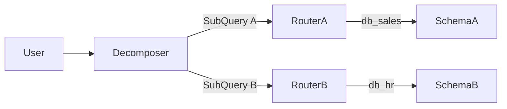
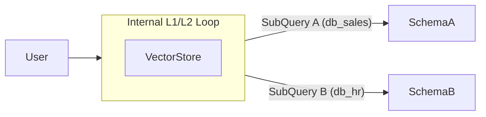

# Optimization: Decomposer-Router Unification (The Orchestrator Pattern)

## 1. Executive Summary

This document details the architectural transition from a **Map-Reduce (Decomposer + N Routers)** pattern to a **Unified Orchestrator** pattern.

By injecting Schema Awareness (via Vector Search) directly into the Decomposition phase, we eliminate the need for downstream Routers, reducing LLM calls by **50-80%** and preventing "Hallucinated Splits" (sub-queries for non-existent data).

---

## 2. The Problem: "Blind Split" & Latency Amplification

### 2.1 The "Blind Split" Phenomenon

The fundamental flaw in the current architecture is that the **Decomposer operates in a vacuum**. It attempts to split a natural language query based solely on *semantic intent* and *high-level descriptions*, without knowledge of the physical schema layout.

* **Scenario A (Hallucinated Boundaries)**:
  * *User Query*: "Show me sales for Apple products."
  * *Decomposer Logic*: "Apple" sounds like a company/entity. "Sales" sounds like transactions. I will split this into:
        1. "Get Apple entity info" (Routes to `db_crm`?)
        2. "Get Sales" (Routes to `db_sales`?)
  * *Reality*: "Apple" is just a string value in column `product_name` in the `orders` table.
  * *Result*: The first sub-query is nonsense. The Router for `db_crm` will fail (correctly) or hallucinate a match (worse).

* **Scenario B (Redundant Splits)**:
  * *User Query*: "List employees and their department locations."
  * *Decomposer Logic*: "Employees" is HR. "Locations" is Facilities. Split!
  * *Reality*: The `employees` table has a `department_location` column.
  * *Result*: Unnecessary split. We now execute two queries and try to join them in memory, which is slow and error-prone compared to a simple SQL join.

### 2.2 Latency Amplification (The N+1 Problem)

In a Map-Reduce agent system, every split incurs a massive penalty:

1. **Decomposition (Time T1)**: The first LLM call.
2. **Routing (Time T2)**: If we split into 3 sub-queries, we spawn 3 parallel Router agents.
    * Even with parallelism, the *system latency* is `T1 + max(T2_a, T2_b, T2_c)`.
    * Each Router has to read the schema index, think, and generate JSON.
3. **Serialization Overhead**: Passing state between these nodes (pickling/unpickling, network calls if distributed) adds milliseconds that pile up.

For a user waiting at a terminal, `1.5s (Decomp) + 1.5s (Router) = 3s` of just *thinking* before we even touch a database.

---

## 3. The Solution: Context-Aware Orchestration

We propose merging the **Decomposition** and **Routing** responsibilities into a single **Orchestrator Node**.

### 3.1 The "Hybrid Retrieval" Workflow

Instead of thinking *then* looking, the Orchestrator **looks *then* thinks**.

1. **Phase 1: Retrieval (L1 & L2)**
    * **Vector Search**: The node queries the `SchemaVectorStore` with the raw user query.
    * **Multi-Query**: If low confidence, it generates keyword variations to maximize recall.
    * *Output*: A set of **Candidate Tables** and their host **Datasources**.

2. **Phase 2: Reasoning (L3)**
    * The LLM is prompted not just with the query, but with the **Candidate Tables**.
    * **Prompt**: *"User wants 'X'. Usage context: I found table `orders` in `db_sales` and `employees` in `db_hr`."*

3. **Phase 3: Deep Output**
    * The Orchestrator outputs a structured plan:

        ```json
        [
          {
            "query": "Select * from orders...",
            "target_datasource": "db_sales",
            "relevant_tables": ["orders"]
          }
        ]
        ```

### 3.2 Key Innovation: "Pre-Routing"

Because the Decomposer already found the tables to justify the split, it can **Pre-Route** the sub-query. We no longer need a downstream Router to "rediscover" where the data lives.

---

## 4. Architecture Comparison

### Before: Map-Reduce



### After: Orchestrator



---

## 5. Benefits Analysis

### 5.1 Performance (Latency)

| Metric | Map-Reduce | Orchestrator | Improvement |
| :--- | :--- | :--- | :--- |
| **LLM Calls (N=3)** | 4 (1 Decomp + 3 Route) | **1** | **75% Reduction** |
| **Network RTT** | Serial + Parallel Wait | Single Pass | Significant |

### 5.2 Accuracy

* **Elimination of Hallucinated Splits**: The LLM won't split a query if it sees that all required columns exist in a single table.
* **Correct Datatypes**: Decomposition aligned with actual schema (e.g., knowing `date` vs `timestamp` early).

### 5.3 Cost

* Token usage drops linearly with the number of sub-queries avoiding the Router stage.

---

## 6. Fallback & Robustness

To ensure reliability, we implement a **Hybrid Strategy**:

* **Hit Case (Common)**: Vector store finds tables. We pass `["orders", "items"]` to the Schema Node.
  * *Gain*: Schema Node skips its own search. **Double Optimization**.
* **Miss Case (Rare)**: Vector store returns nothing (semantic gap). The LLM uses its general knowledge to pick a Datasource (L3).
  * *Fallback*: We pass `tables=None`. The Schema Node detects this and performs its standard deep search.

---

## 7. State Transition: Current vs Future

### 7.1 Current State (Map-Reduce)

* **Architecture**: `Decomposer` -> [ `Router A` -> `Schema A` ], [ `Router B` -> `Schema B` ]
* **Data Flow**: `Decomposer` outputs plain strings (`List[str]`). Routers receive strings and independently decide destination.
* **Inefficiency**: Disconnected logic. Decomposer splits without knowing if destination exists; Router routes without knowing global context.
* **Complexity**: High. Requires synchronizing multiple independent agents.

### 7.2 Future State (Unified Orchestrator)

* **Architecture**: `Orchestrator` -> [ `Schema A` ], [ `Schema B` ]
* **Data Flow**: `Orchestrator` outputs structured `SubQuery` objects containing (`query`, `datasource_id`, `candidate_tables`).
* **Efficiency**: Unified logic. Split and Route happens in one atomic decision.
* **Simplicity**: Linear execution branches. No conditional routing logic downstream.

This architecture provides the **speed of a search engine** with the **intelligence of an LLM**.
