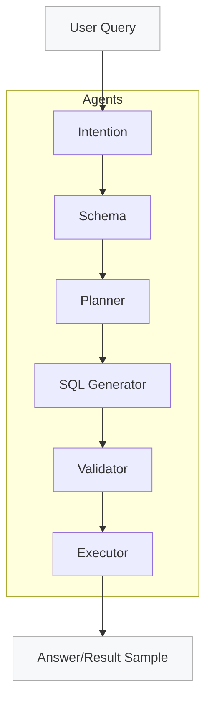

# NL2SQL

This project implements a LangGraph-based NL→SQL pipeline with pluggable LLMs and multi-engine support. It ships with a SQLite manufacturing dataset, structured planner/generator outputs, guardrails, and a CLI for interactive queries.

## Features
- LangGraph pipeline: intent → schema → planner → SQL generator → validator → executor.
- Structured outputs with Pydantic parsers; rejects wildcards and enforces limits/order when specified.
- Datasource profiles via SQLAlchemy (SQLite starter; Postgres profile example included).
- LLM registry with per-agent configs (OpenAI via LangChain) and `.env` support for keys.
- Guardrails: read-only, limit clamp, wildcard expansion, UNION/multi-statement blocking, ORDER BY enforcement.
- CLI with formatted output and optional stub LLM for offline testing.

## Setup
1) Install dependencies:
   ```bash
   pip install --upgrade pip
   pip install -r requirements.txt
   ```
2) Create the SQLite demo DB (already created if you ran the script):
   ```bash
   python scripts/setup_sqlite_manufacturing.py --db data/manufacturing.db
   ```
3) Set your OpenAI key (or add to `.env`):
   ```bash
   export OPENAI_API_KEY="sk-..."
   ```
4) Optional: install the package (for `nl2sql-cli`):
   ```bash
   pip install -e .
   ```

## Running the CLI
- From source:
  ```bash
  python -m src.cli --query "list products" --llm-config configs/llm.example.yaml
  ```
- After install:
  ```bash
  nl2sql-cli --query "list products" --llm-config configs/llm.example.yaml
  ```
Flags:
- `--config`: datasource YAML (default `configs/datasources.example.yaml`)
- `--id`: datasource id (default `manufacturing_sqlite`)
- `--llm-config`: per-agent LLM mapping (default example uses OpenAI)
- `--stub-llm`: run with a fixed stub plan (no live LLM)

## Datasource Profiles
Configure in `configs/datasources.example.yaml`:
- `engine`, `sqlalchemy_url/DSN`, `statement_timeout_ms`, `row_limit`, `max_bytes`
- Feature flags: `allow_generate_writes`, `supports_dry_run`, etc.
- SQLite starter uses `row_limit: 100`; Postgres example provided (update URL/auth).

## LLM Configuration
`configs/llm.example.yaml` shows per-agent mapping. The registry loads:
- `default` provider/model
- `agents.intent`, `agents.planner`, `agents.generator` (override)
Keys are taken from config or `OPENAI_API_KEY` (loaded via Pydantic settings with `.env` support).

## Testing
- Run goldens against SQLite:
  ```bash
  python -m pytest tests/test_goldens_sqlite.py
  ```

## Project Structure
- `src/`: core modules (`nodes`, `langgraph_pipeline`, `datasource_config`, `llm_registry`, `cli`, etc.)
- `configs/`: datasource and LLM example configs
- `scripts/`: utilities (`setup_sqlite_manufacturing.py`)
- `docs/`: plan and goldens
- `tests/`: pytest goldens

## Agents (LangGraph)
- **Intent**: normalizes the user query, extracts entities/filters/clarifications. Output: structured intent hints.
- **Schema**: introspects the datasource (via SQLAlchemy) to list tables/columns for grounding and wildcard expansion.
- **Planner**: produces a structured query plan (tables, joins, filters, aggregates, order_by, limit) via LLM with Pydantic validation.
- **SQL Generator**: renders engine-aware SQL from the plan, enforces limits, rejects wildcards, and adds ORDER BY when present.
- **Validator**: guards against DDL/DML, missing LIMIT, UNION/multi-statements, and missing ORDER BY when requested by the plan.
- **Executor**: runs the SQL read-only against the datasource, returning row count and a sample for verification.

## Flow (Mermaid)

## Notes
- Guardrails block DDL/DML, enforce LIMIT, reject UNION/multi-statements, and expand wildcards using schema metadata when possible.
- Execution is read-only; limits are clamped to datasource `row_limit`.
- To add another engine, create a profile and ensure the driver is installed; SQLAlchemy is used as the interface.
