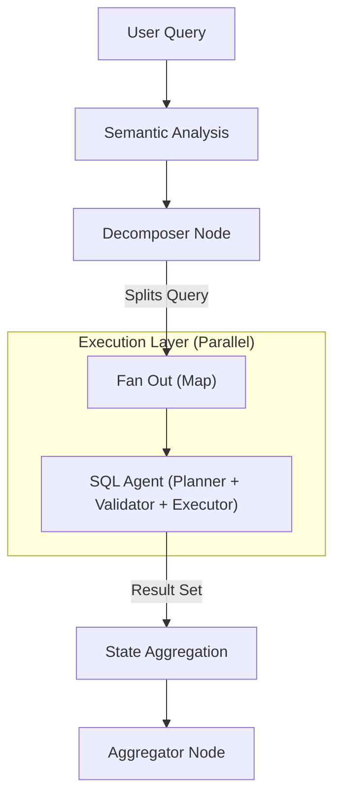

# NL2SQL Platform

**Production-Grade Natural Language to SQL Engine.**

[](docs/index.md)
[](https://opensource.org/licenses/MIT)

The **NL2SQL Platform** is a modular, agentic system designed to convert natural language questions into accurate, authorized SQL queries across multiple database engines (Postgres, MySQL, MSSQL, SQLite).

It features:

* **Defense-in-Depth Security**: RBAC and Read-Only enforcement at multiple layers.
* **Multi-Database Routing**: Federated queries across silos.
* **Agentic Reasoning**: Iterative planning, self-correction, and validation.

---

## 📚 Documentation

Detailed documentation is available in the `docs/` directory.

* [**Architecture**](docs/architecture/overview.md): Understand the SQL Agent, Map-Reduce routing, and Plugins.
* [**Guides**](docs/guides.md): Installation, Configuration, and Benchmarking.
* [**Reference**](docs/reference.md): CLI arguments and API specs.

---

## 🚀 Quick Start

### 1. Installation

The platform is a monorepo. Install the core engine:

```bash
# Core & SDK
pip install -e packages/adapter-sdk
pip install -e packages/core

# Database Adapters (install as needed)
pip install -e packages/adapters/postgres
```

### 2. Configuration

Create a `datasources.yaml` file defining your connections:

```yaml
- id: my_db
  engine: sqlite
  sqlalchemy_url: "sqlite:///./example.db"
```

### 3. Usage

**a. Indexing** (Required once)

```bash
python -m nl2sql.cli --index --config datasources.yaml
```

**b. Querying**

```bash
python -m nl2sql.cli --query "Show me the top 5 users by sales"
```

---

## 🏗️ Architecture

The system uses a directed graph of AI Agents (`Planner` -> `Validator` -> `Generator`).



[Read more in the Architecture Overview](docs/architecture/overview.md).

---

## 🤝 Contributing

See [Development Guide](docs/guides/development.md).
