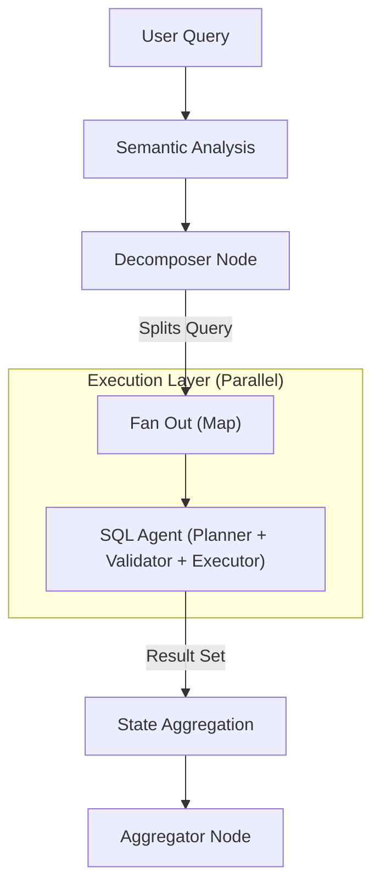

# NL2SQL Platform

**Production-Grade Natural Language to SQL Engine.**

[](docs/index.md)
[](https://opensource.org/licenses/MIT)

The **NL2SQL Platform** is a modular, agentic system designed to convert natural language questions into accurate, authorized SQL queries across multiple database engines (Postgres, MySQL, MSSQL, SQLite).

It features:

* **Defense-in-Depth Security**: RBAC and Read-Only enforcement at multiple layers. [Learn more](docs/architecture/security.md).
* **Multi-Database Routing**: Federated queries across silos.
* **Agentic Reasoning**: Iterative planning, self-correction, and validation.

---

## 📚 Documentation

Detailed documentation is available in the `docs/` directory.

* [**Architecture**](docs/architecture/overview.md): Understand the SQL Agent, Map-Reduce routing, and Plugins.
* [**Security**](docs/architecture/security.md): Authentication, RBAC, and Validation.
* [**Guides**](docs/guides.md): Installation, Configuration, and Benchmarking.
* [**Reference**](docs/reference.md): CLI arguments and API specs.

---

## 🚀 Quick Start

### 1. Installation

The platform is a monorepo. Install the CLI application:

```bash
# Core & SDK
pip install -e packages/adapter-sdk
pip install -e packages/cli  # Installs 'nl2sql' command

# Database Adapters (install as needed, or let setup wizard handle it)
# pip install -e packages/adapters/postgres
```

### 2. Setup

Run the interactive wizard to configure your database and LLM:

```bash
nl2sql setup
```

*This will create your configuration files and index your schema.*

### 3. Usage

**Querying**

```bash
nl2sql run "Show me the top 5 users by sales"
```

**Other Commands**

* `nl2sql doctor` - Diagnose environment issues.
* `nl2sql list-adapters` - Show installed database adapters.
* `nl2sql benchmark` - Run evaluation suite.

---

## 🏗️ Architecture

The system uses a directed graph of AI Agents (`Planner` -> `Validator` -> `Generator`).



[Read more in the Architecture Overview](docs/architecture/overview.md).

---

## 🤝 Contributing

See [Development Guide](docs/guides/development.md).
