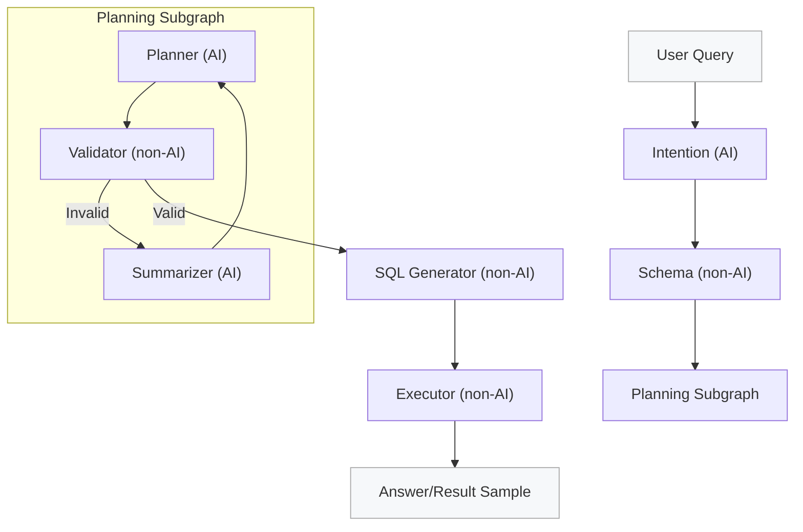

# NL2SQL

This project implements a LangGraph-based NL→SQL pipeline with pluggable LLMs and multi-engine support. It ships with a SQLite manufacturing dataset, structured planner/generator outputs, guardrails, and a CLI for interactive queries.

## Features

- LangGraph pipeline: intent → schema → planner → SQL generator → validator → executor.
- Structured outputs with Pydantic parsers; rejects wildcards and enforces limits/order when specified.
- Datasource profiles via SQLAlchemy (SQLite starter; Postgres profile example included).
- LLM registry with per-agent configs (OpenAI via LangChain) and `.env` support for keys.
- Guardrails: read-only, limit clamp, wildcard expansion, UNION/multi-statement blocking, ORDER BY enforcement.
- CLI with formatted output and optional stub LLM for offline testing.

## Token Efficiency

This pipeline is designed to be highly token-efficient by minimizing LLM usage:

- **Rule-Based Generation**: The **SQL Generator** uses `sqlglot` to deterministically compile the plan into SQL, costing **0 tokens**.
- **Logic-Based Validation**: The **Validator** uses Python logic to verify the plan against the schema, avoiding expensive LLM round-trips for syntax checking.
- **Strategic AI Use**: LLMs are used *only* where reasoning is required (Intent, Planner), while deterministic tasks are handled by code.

## Observability

Gain insight into the AI's decision-making process with the `--show-thoughts` flag. This displays:

- **Intent**: Reasoning for query classification and entity extraction.
- **Schema**: Tables retrieved via vector search.
- **Planner**: Step-by-step reasoning for table selection and query construction.
- **Validator**: Validation checks and any errors found.
- **Generator**: Rationale for the generated SQL.

Example output:

```text
[INTENT]
  Reasoning: User is asking for aggregate sales data...
  Classification: READ

[PLANNER]
  Reasoning: Selected 'sales' table and grouped by 'region'...
```

## Logging

By default, the CLI is **silent** (no logs). You can control logging with:

- `--log-level <LEVEL>`: Set explicit log level (e.g., `DEBUG`, `INFO`).
- `--json-logs`: Output logs in structured JSON format (ideal for ingestion).
- `--debug`: Shortcut for `--log-level DEBUG`.

Example structured log:

```json
{"timestamp": "2023-10-27 10:00:00,000", "level": "INFO", "name": "intent", "message": "Node intent completed", "node": "intent", "duration_ms": 120.5, "status": "success"}
```

## Setup

1) Install dependencies:

   ```bash
   pip install --upgrade pip
   pip install -r requirements.txt
   ```

2) Create the SQLite demo DB (already created if you ran the script):

   ```bash
   python scripts/setup_sqlite_manufacturing.py --db data/manufacturing.db
   ```

3) Set your OpenAI key (or add to `.env`):

   ```bash
   # Create a .env file
   OPENAI_API_KEY="sk-..."
   ```

4) Optional: install the package (for `nl2sql-cli`):

- `--config`: datasource YAML (default `configs/datasources.yaml` or `DATASOURCE_CONFIG`)
- `--id`: datasource id (default `manufacturing_sqlite`)
- `--llm-config`: per-agent LLM mapping (default `configs/llm.yaml` or `LLM_CONFIG`)
- `--vector-store`: path to vector store (default `./chroma_db` or `VECTOR_STORE`)
- `--index`: run schema indexing (use with `--vector-store`)
- `--stub-llm`: run with a fixed stub plan (no live LLM)
- `--debug`: show output of each node in the graph (streaming)
- `--show-thoughts`: show step-by-step reasoning from AI nodes and logs from non-AI nodes
- `--json-logs`: enable structured JSON logging (defaults to INFO level)
- `--log-level`: set logging level (DEBUG, INFO, WARNING, ERROR, CRITICAL). Default is silent (CRITICAL) unless flags are used.

## Examples

### 1. Indexing the Schema

Index the database schema into the vector store (default `./chroma_db`):

```bash
python -m src.nl2sql.cli --index
```

Specify a custom vector store path:

```bash
python -m src.nl2sql.cli --index --vector-store ./my_vector_store
```

### 2. Querying with Vector Store

Run a query using the indexed schema for context.
**Note:** You must run indexing (step 1) at least once before querying.

```bash
python -m src.nl2sql.cli --query "Show top 5 products" --vector-store ./chroma_db
```

### 3. Using Environment Variables

Set configuration via a `.env` file (or shell variables) to simplify commands.
Create a `.env` file:

```bash
OPENAI_API_KEY="sk-..."
VECTOR_STORE="./chroma_db"
```

Then run:

```bash
python -m src.nl2sql.cli --query "Show top 5 products"
```

### 4. Real-World Examples

**Query 1: Simple Listing**
> "List Products"

**SQL**:

```sql
SELECT t5.id AS id, t5.sku AS sku, t5.name AS name, t5.category AS category 
FROM products AS t5 
LIMIT 100
```

**Output**:

| id | sku | name | category |
|---|---|---|---|
| 1 | SKU-100 | Widget Alpha | Widgets |
| 2 | SKU-200 | Widget Beta | Widgets |
| 3 | SKU-300 | Gadget Gamma | Gadgets |

**Query 2: Complex Aggregation**
> "Average maintenance downtime per factory for events over 30 minutes"

**SQL**:

```sql
SELECT t2.name AS factory_name, AVG(t4.downtime_minutes) AS average_downtime 
FROM factories AS t2 
JOIN machines AS t3 ON t2.id = t3.factory_id 
JOIN maintenance_logs AS t4 ON t3.id = t4.machine_id 
WHERE t4.downtime_minutes > 30 
GROUP BY t2.id 
LIMIT 100
```

**Output**:

| factory_name | average_downtime |
|---|---|
| Plant A | 90.0 |
| Plant B | 90.0 |

### 5. Full Customization

- `DATASOURCE_CONFIG`: Path to datasource config YAML

## Benchmarking

Compare performance of different LLM configurations (latency, success rate, token usage).

1. **Create a benchmark suite config** (e.g., `configs/benchmark_suite.yaml`):

   ```yaml
   gpt-4o-setup:
     default:
       provider: openai
       model: gpt-4o
   
   gpt-3.5-setup:
     default:
       provider: openai
       model: gpt-3.5-turbo
   ```

2. **Run the benchmark**:

   ```bash
   python -m src.nl2sql.cli --query "List Products" --benchmark --bench-config configs/benchmark_suite.yaml --iterations 3
   ```

3. **View Results**:
   The CLI will output a comparison table:

   | Config | Success | Avg Latency | Avg Tokens |
   |---|---|---|---|
   | gpt-4o-mini-test | 100.0% | 7.54s | 3139.0 |
   | gpt-3.5-turbo-test | 100.0% | 5.14s | 6060.3 |

## LLM Configuration

`configs/llm.yaml` shows per-agent mapping. The registry loads:

- `default` provider/model
- `agents.intent`, `agents.planner`, `agents.generator` (override)
Keys are taken from config or `OPENAI_API_KEY`.

## Testing

- Run goldens against SQLite:

  ```bash
  python -m pytest tests/test_goldens_sqlite.py
  ```

## Project Structure

- `src/`: core modules (`nodes`, `langgraph_pipeline`, `datasource_config`, `llm_registry`, `cli`, etc.)
- `configs/`: datasource and LLM example configs
- `scripts/`: utilities (`setup_sqlite_manufacturing.py`)
- `docs/`: plan and goldens
- `tests/`: pytest goldens

## Agents (LangGraph)

- **Intent** (AI): normalizes the user query, extracts entities/filters/clarifications. Output: structured intent hints.
- **Schema** (non-AI): introspects the datasource (via SQLAlchemy) to list tables/columns and **assigns aliases** (e.g., `t1`, `t2`) for the planner.
- **Planner** (AI): produces a structured query plan (tables, joins, filters, aggregates, order_by, limit) via LLM with Pydantic validation. **Receives feedback** from Validator or Summarizer if the plan is invalid.
- **Validator** (non-AI): validates the **Plan** (tables, aliases, columns) against the schema. If invalid, triggers a retry loop to the Summarizer.
- **Summarizer** (AI): analyzes validation errors and the schema to provide **intelligent feedback** to the Planner, improving self-correction.
- **SQL Generator** (non-AI): deterministically renders engine-aware SQL from the valid plan using `sqlglot`. Enforces limits and dialect-specific syntax.
- **Executor** (non-AI): runs the SQL read-only against the datasource, returning row count and a sample for verification.

## Flow



## Notes

- Guardrails block DDL/DML, enforce LIMIT, reject UNION/multi-statements, and expand wildcards using schema metadata when possible.
- Execution is read-only; limits are clamped to datasource `row_limit`.
- To add another engine, create a profile and ensure the driver is installed; SQLAlchemy is used as the interface.
