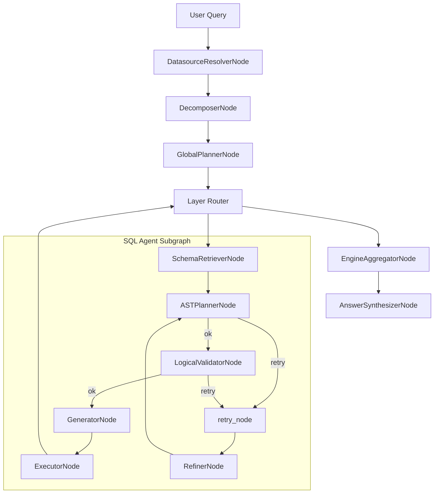

# NL2SQL Engine

> **Production-grade Natural Language → SQL runtime with deterministic orchestration.**

NL2SQL treats text-to-SQL as a **distributed systems** problem. The engine compiles a user query into a validated plan, executes via adapters, and aggregates results through a graph-based pipeline.

---

## 🧭 What you get

- Graph-based orchestration (`LangGraph`) with explicit state (`GraphState`)
- Deterministic planning and validation before SQL generation
- Adapter-based execution with sandbox isolation
- Observability hooks (metrics, logs, audit events)

## 🏗️ System Topology

The runtime is organized around a LangGraph orchestration pipeline and supporting registries. It is designed for fault isolation and deterministic execution.



### 1. The Control Plane (The Graph)

**Responsibility**: Reasoning, Planning, and Orchestration.

* **Agentic Graph**: Implemented as a Directed Cyclic Graph (LangGraph) to enable refinement loops. If a plan fails validation, the system self-corrects.
* **State Management**: Shared `GraphState` ensures auditability and reproducibility of every decision.

### 2. The Security Plane (The Firewall)

**Responsibility**: Invariants Enforcement.

* **Valid-by-Construction**: The LLM generates an **Abstract Syntax Tree (AST)** rather than executing SQL.
* **Static Analysis**: The [Logical Validator](docs/agents/nodes.md) enforces RBAC and schema constraints before SQL generation.

### 3. The Data Plane (The Sandbox)

**Responsibility**: Semantic Search and Execution.

* **Blast Radius Isolation**: SQL drivers run in a dedicated **[Sandboxed Process Pool](docs/adr/adr-001-sandboxed-execution.md)**. A segfault in a driver kills a disposable worker, not the Agent.
* **Partitioned Retrieval**: The [Schema Store + Retrieval](docs/schema/store.md) flow injects relevant schema context, preventing context window overflow.

### 4. The Reliability Plane (The Guard)

**Responsibility**: Fault Tolerance and Stability.

* **Layered Defense**: A combination of **[Circuit Breakers](docs/observability/error-handling.md)** and **[Sandboxing](docs/execution/sandbox.md)** keeps the system stable during outages.
* **Fail-Fast**: We stop processing immediately if a dependency is unresponsive, preserving resources.

### 5. The Observability Plane (The Watchtower)

**Responsibility**: Visibility, Forensics, and Compliance.

* **Full-Stack Telemetry**: Native [OpenTelemetry](docs/observability/stack.md) integration provides distributed tracing (Jaeger) and metrics (Prometheus) for every node execution.
* **Forensic Audit Logs**: A persistent [Audit Log](docs/observability/stack.md) records AI decisions for compliance and debugging.

---

## 📐 Architectural Invariants

| Invariant | Rationale | Mechanism |
| :--- | :--- | :--- |
| **No Unvalidated SQL** | Prevent hallucinations & data leaks | All plans pass through `LogicalValidator` (AST). `PhysicalValidator` exists but is not wired into the default SQL subgraph. |
| **Zero Shared State** | Crash Safety | Execution happens in isolated processes; no shared memory with the Control Plane. |
| **Fail-Fast** | Reliability | Circuit Breakers and Strict Timeouts prevent cascading failures (Retry Storms). |
| **Determinism** | Debuggability | Temperature-0 generation + Strict Typing (Pydantic) for all LLM outputs. |

---

## 🚀 Quick Start

### Prerequisites

* Python 3.10+
* A configured datasource (`configs/datasources.yaml`)
* A configured LLM (`configs/llm.yaml`)

### 1. Installation

```bash
# Install core only
pip install nl2sql-core

# Install core with selected adapters
pip install nl2sql-core[mysql,mssql]

# Install core with all adapters
pip install nl2sql-core[all]
```

For local development:

```bash
git clone https://github.com/nadeem4/nl2sql.git
cd nl2sql

# Set up environment
python -m venv venv
source venv/bin/activate

# Install core engine and adapter SDK
pip install -e packages/core
pip install -e packages/adapter-sdk
```

### 2. Run a query (Python API)

```python
from nl2sql.context import NL2SQLContext
from nl2sql.pipeline.runtime import run_with_graph

ctx = NL2SQLContext()
result = run_with_graph(ctx, "Top 5 customers by revenue last quarter?")

print(result.get("final_answer"))
```

## 🧪 Demo data (CLI-only)

Use the CLI to generate deterministic demo data and configs, then point the API at the generated files.

1. Generate demo data + configs:

```bash
nl2sql setup --demo --lite
```

2. Start the API with demo settings:

```bash
# Option A: load .env.demo via ENV
ENV=demo uvicorn nl2sql_api.main:app

# Option B: load a specific env file
ENV_FILE_PATH=.env.demo uvicorn nl2sql_api.main:app
```

The demo datasource file uses relative paths (e.g. `data/demo_lite/*.db`), so start the API from the repo root.

## 🔖 Versioning Policy

NL2SQL uses unified versioning across the monorepo. Core, adapters, API, and CLI
share the same version number and are released together. Internal dependencies
are pinned to the same version to avoid mismatches.

## 📚 Documentation

- **[System Architecture](docs/architecture/high-level.md)**: runtime topology and core flows
- **[Agent Nodes](docs/agents/nodes.md)**: node-by-node specs and responsibilities
- **[Schema Store + Retrieval](docs/schema/store.md)**: schema snapshots and vector retrieval
- **[Execution Sandbox](docs/execution/sandbox.md)**: process isolation and failures
- **[Observability](docs/observability/stack.md)**: metrics, logging, audit events
  

---

## 📦 Repository Structure

```text
packages/
├── core/               # The Engine (Graph, State, Logic)
├── adapter-sdk/        # Interface Contract for new Databases
└── adapters/           # Official Dialects (Postgres, MSSQL, MySQL)
configs/                # Runtime Configuration (Policies, Prompts)
docs/                   # Architecture & Operations Manual
```
