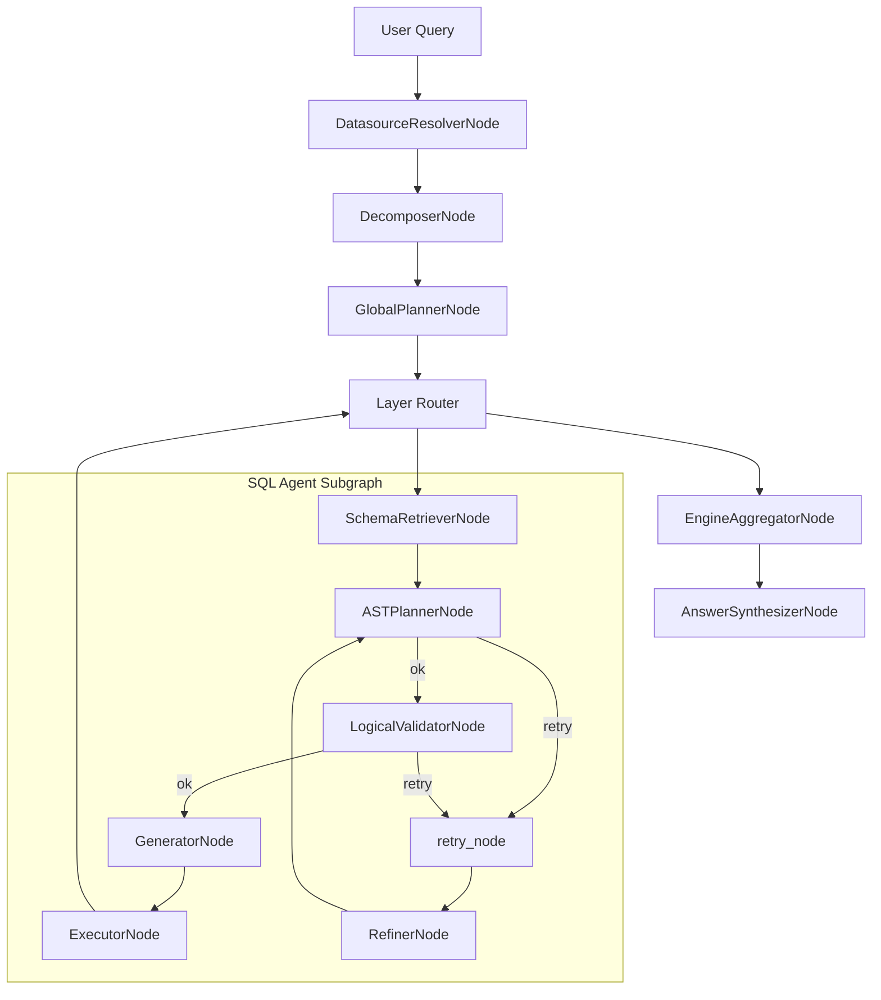

# NL2SQL Engine

> Ask a database questions in English. The model writes a **typed plan**, never
> SQL text; the plan is checked against the real schema and the caller's role
> before any SQL is generated.

NL2SQL is a LangGraph pipeline that decomposes a question, retrieves the schema
it needs, has the model emit an abstract syntax tree, validates that tree, and
only then renders SQL with `sqlglot` and runs it. The validation checks come
back in the result, so a UI can show *why* a query was refused rather than
printing a stack trace.

It is a young project. The [Known limitations](#known-limitations) section below
is not boilerplate — read it before you plan anything around this.

---

## Try it

```bash
pip install "nl2sql-engine[demo]"
nl2sql demo
```

That writes a demo project into `./nl2sql-demo`, copies in the
[Chinook](THIRD_PARTY_NOTICES.md) sample database (11 tables, real foreign
keys), indexes its schema on your machine, serves a playground on
<http://127.0.0.1:8765/> and opens your browser. Indexing needs no API key; the
first run downloads a ~79 MB ONNX embedding model.

The page opens on the **search index** the engine matches questions against
(entries by type, the schema version they were built from, and when), with a
**Rebuild** button, and on the indexed **schema** (every table, its row count,
columns, keys and the tables it refers to), so you see the database before you
ask anything. Each start checks what the index contains and rebuilds it when it
is empty or out of date with the schema; a rebuild writes the new entries
beside the current ones and switches only when they are complete, so questions
never meet an empty or half-built index. Each answer then reads top to bottom as one run: the **question**, the
**plan** the model produced, the **checks** the validator ran on it (pass or
refused, with a reason), the generated **SQL**, the **rows**, and what the
answer **cost**: LLM calls, tokens and time for the question. The **Debug**
toggle (on by default, remembered by the browser) adds a per-node breakdown in
execution order, code nodes included, so you can see where the time goes as
well as the tokens; a node the model was called on more than once is marked as
retried. In replay mode the token counts are placeholders from the recordings,
not real usage. A role selector switches between `admin`, `analyst` and
`viewer`: ask the `viewer` role about customers and the logical validator
refuses the plan with a `SECURITY_VIOLATION`, the generator never runs, and the
page says so at the checks, naming the tables the role may not read. That is the
engine's one real safety property, made visible.

### `nl2sql demo` options

| Flag | Default | What it does, and when you want it |
| --- | --- | --- |
| `--dir PATH` | `nl2sql-demo` | Where the demo project is written: the database, the `configs/*.demo.*` files, `.env.demo` and the vector store. Point it somewhere else to keep several demos side by side, to put it outside a git checkout, or to reuse one you already indexed — an existing project is not re-scaffolded, and it is re-indexed only when its index is empty or out of date with the schema. A folder written by an older engine version is not upgraded: the demo warns and suggests a new `--dir`. |
| `--host ADDR` | `127.0.0.1` | The bind address. The default binds **localhost only**, so nothing outside your machine can reach it. `0.0.0.0` is for containers and VMs, where localhost is not reachable from outside. The playground has **no authentication**: in live mode anyone who can reach the address can ask questions that spend your API credits. Bind it wide only on a network you trust. |
| `--port N` | `8765` | The port to serve on. Change it when 8765 is taken, or when you are running two demos at once. |
| `--no-browser` | off | Do not open a browser tab; just serve and print the URL. Use it over SSH and in containers, where there is no browser to open; in CI and scripts, where a browser would be noise or an error; when you are driving the HTTP API directly rather than the page; and on a demo you restart repeatedly, so each restart does not pile up another tab. |
| `--record` | off | Run the guided questions through your real provider, save the responses to `recordings.json` in the demo project, and exit without serving. A later `nl2sql demo` with no key on the same `--dir` replays from that file (it wins over any recordings packaged with the engine, and none ship today), so the guided questions answer without a key. A question outside the recording gets "No recorded answer for this question. Add an API key to ask it live." Needs an API key — a reachable Ollama is not enough, because there is nothing to proxy through. It needs an OpenAI or OpenRouter key: recordings capture the OpenAI wire format, so a Claude key is refused. This spends real API credits. |
| `--api-key KEY` | unset | The key for live mode, saved into the demo project's `.env.demo` so later runs from that directory stay live without passing it again. The provider follows the key's shape: `sk-ant-…` is Anthropic (Claude, needs the `anthropic` extra), `sk-or-…` is OpenRouter, anything else is OpenAI. A key on the command line is visible in your shell history and to `ps`, so exporting the environment variable, or pasting the key into the playground's **Settings** panel, is the more private route. |
| `--allow-settings` | off | Turn on the playground's **Settings** panel (API key, model per LLM step) when `--host` is not a loopback address. It is off there by default because the playground has no login: anyone who can reach the page could swap in their own key or run up costs on yours. On `127.0.0.1` / `localhost` the panel is always on. |

### What the demo needs, honestly

**Answering a question needs a model.** Pass one on the command line:

```bash
nl2sql demo --api-key sk-...
```

The key is written into the demo project's `.env.demo`, so later runs from that
directory are live without passing it again. `.env.demo` is covered by
`.gitignore`.

Or start the demo without a key and paste one into the playground: **Settings**
(top right) takes the key, writes it to the same `.env.demo` and switches the
running demo from replay to live without a restart. The page never shows the key
again, only a masked form such as `sk-...4f2a`. The same panel picks a model for
each LLM step (answerability check, question splitter, query planner, plan
repair, answer writer) from
a short list of OpenAI or Claude models checked against the engine's parameters, and
writes the choice to the demo's `configs/llm.demo.yaml`, the file the CLI reads.
Settings work only when the playground is bound to localhost unless you pass
`--allow-settings`; see [the demo guide](docs/getting_started/demo.md#the-settings-panel).

Without the flag the demo looks for a key in a fixed order, highest first:

1. `--api-key`
2. `OPENAI_API_KEY`, `OPENROUTER_API_KEY` or `ANTHROPIC_API_KEY` in the environment
3. whichever of those is already in the demo project's `.env.demo`
4. an Ollama daemon answering on `localhost:11434`
5. replay

The first four run live. The demo's model is `gpt-5.4`, set in
`configs/llm.demo.yaml`. With an Anthropic key live mode switches it to
`claude-opus-5` (with `temperature: null`); otherwise it switches the provider
to match the key but leaves the model name alone, so with an OpenRouter key or
Ollama, edit `model` to one that provider serves. Models that reject `temperature: 0` (such as
`gpt-5.5`) need `temperature: null`; see
[LLM configuration](docs/configuration/llm.md#temperature).

With none of them it falls back to *replay* mode, which answers only from
recorded model responses: the demo project's own `recordings.json` (written by
`--record`), else recordings packaged with the engine — **and none ship**. So
out of the box the key-free path cannot answer anything. The console and the
playground's mode line say so ("replay mode has no recorded answers") and ask
for a key, and a question gets "No recorded answer for this question. Add an
API key to ask it live." When a recording is loaded, both say how many of the
guided questions it covers. Set a key (or point it at Ollama) if you want the
demo to produce an answer; the schema view and the playground itself work
either way.

---

## Use it from Python

Prerequisites: **Python 3.12+**, and an LLM key to run a query.

```bash
pip install nl2sql-engine        # add [postgres], [mysql], [mssql], [duckdb] as needed
nl2sql setup --demo              # writes the Chinook demo project and indexes it
export OPENAI_API_KEY=sk-...
```

```python
from nl2sql import NL2SQL

engine = NL2SQL(env="demo")
result = engine.run_query("How many customers are there?")

for sq in result.sub_queries:
    print(sq.sql)
    print([c.name for c in sq.validation if c.passed])
    print(sq.rows.rows[:5] if sq.rows else "plan only")
print(result.final_answer["summary"])
```

The same script is in [`examples/01_quickstart_sqlite.py`](examples/01_quickstart_sqlite.py).

`QueryResult` carries, per sub-query, the plan, the validation checks, a capped
row sample with the true total, the SQL, a status and a retry count; and per
run, an overall status, per-node timings and `result.usage`: LLM calls and
input/cached/output/reasoning tokens per node and for the whole question (cost
too, if you set `LLM_PRICES`). `result.errors` holds ERROR and
CRITICAL entries only; warnings live in `result.warnings`.

When a run fails or has to retry, the engine also writes a **run trace** to
`traces/` (`TRACE_MODE=on_failure` by default; the demo uses `always`): every
node's inputs and outputs and every LLM prompt and raw response, with secrets
redacted. `result.trace_path` says where it went. `nl2sql trace show <file>`
prints its timeline and `nl2sql trace replay <file>` re-runs the pipeline on the
recorded model answers without calling the model. See
[Debugging a Run](docs/observability/debugging.md).

Asking the same question again reuses the plan that already validated and
executed (the **plan cache**, keyed on the sub-query's intent, datasource and
schema version), so the repeat gives the same SQL and rows with no planner
call. The cached plan is validated again every time, so roles and policy
changes still apply. `sq.plan_source` says `"cache"` or `"llm"`;
`PLAN_CACHE_ENABLED=false` turns it off and `nl2sql cache clear` empties it.
See [Determinism](docs/architecture/determinism.md#the-plan-cache-determinism-from-the-architecture).

Install the drivers you need as extras:

```bash
pip install "nl2sql-engine[postgres]"
pip install "nl2sql-engine[mysql,mssql]"
pip install "nl2sql-engine[all]"     # every database driver -- adapters only,
                                     # not [demo], [aws], [azure] or [hashicorp]
```

SQLite needs no extra: its driver is in the standard library.

### LLM providers

`configs/llm.yaml` picks the provider per agent:

| provider | key | notes |
| --- | --- | --- |
| `openai` | `OPENAI_API_KEY` | the default; `gpt-5.4` |
| `anthropic` | `ANTHROPIC_API_KEY` | Claude on Anthropic's own API: `pip install "nl2sql-engine[anthropic]"`; `claude-opus-5` with `temperature: null` |
| `openrouter` | `OPENROUTER_API_KEY` | OpenAI-compatible gateway to other vendors' models |
| `ollama` | none | local models; small ones struggle with the recursive plan schema |

Claude runs through `langchain-anthropic`'s native client, not an
OpenAI-compatible shim, so the planner, refiner and decomposer system prompts
are prompt-cached (a `cache_control` breakpoint on the system message) and cache
reads and writes show up in `result.usage`. See
[LLM configuration](docs/configuration/llm.md#anthropic-claude).

---

## How it works


```mermaid
flowchart TD
    User[User Query] --> Resolver[DatasourceResolverNode]
    Resolver --> Decomposer[DecomposerNode]
    Decomposer --> Planner[GlobalPlannerNode]
    Planner --> Router[Layer Router]

    subgraph SQLAgent["SQL Agent Subgraph"]
        Schema[SchemaRetrieverNode] --> AST[ASTPlannerNode]
        AST -->|ok| Logical[LogicalValidatorNode]
        AST -->|retry| Retry[retry_node]
        Logical -->|ok| Generator[GeneratorNode]
        Logical -->|retry| Retry
        Generator --> Executor[ExecutorNode]
        Retry --> Refiner[RefinerNode]
        Refiner --> AST
    end

    Router --> Schema
    Executor --> Router
    Router --> Aggregator[EngineAggregatorNode]
    Aggregator --> Synthesizer[AnswerSynthesizerNode]
```

### The AST is the point

The model's output target is a Pydantic `PlanModel`, not a string of SQL. That
plan goes to `LogicalValidatorNode`, which resolves every column against the
schema snapshot retrieved for this question using `sqlglot.optimizer.qualify`,
checks joins against the declared foreign keys, and checks every table against
the caller's role policy. Only a plan that passes reaches `GeneratorNode`, which
renders it with `sqlglot` starting from `exp.select()`.

Two consequences are worth stating precisely:

* **Unvalidated SQL is never generated, so it is never executed.** A refused
  plan ends the sub-query; there is no SQL string to leak into a log or a retry.
* **Only SELECTs can be produced.** `query_type` is `Literal["READ"]` and the
  generator builds a select expression. This is structural, not a gate: the
  executor does not inspect the SQL, and **connections are not opened read-only
  on any dialect**. Give the engine a read-only database user.

### Refinement

If validation fails with a retryable error the plan goes back through
`RefinerNode` with the failure attached, up to `sql_agent_max_retries`. A
`SECURITY_VIOLATION` is not retryable — a denial is final. Warnings
(`COLUMN_NOT_FOUND` when `LOGICAL_VALIDATOR_STRICT_COLUMNS` is off, the
default) also go to the refiner while retries remain, but never block: once
the retries are spent the plan proceeds to generation. A sub-query's status
is its final attempt's: SQL (and rows, if executed) is `success`, anything
else is `error`.

### What bounds a run

* `GLOBAL_TIMEOUT_SEC` (default 60) bounds **how long the caller waits**, not
  how long the work runs. On expiry you get a `PIPELINE_TIMEOUT` error within
  about a second; the worker thread winds down in the background.
* A per-run `CancellationToken` lets a caller unwind cooperatively. A node
  blocked inside a driver call does not abandon it.
* `VECTOR_BREAKER` (`fail_max=5`, `reset_timeout=30`) is the only circuit
  breaker. It guards vector retrieval and nothing else; LLM and SQL failures
  surface as structured errors in state.
* The graph runs **in one process**, on a one-worker thread pool per run. There
  is no sandbox: a driver-level segfault takes the process with it. See
  [Execution Isolation](docs/execution/isolation.md).

### Authorization

RBAC is a per-role allowlist of datasources and `datasource.table` strings, read
from `configs/policies.json` and enforced by the validator. There is no column
masking and no row-level security.

A question that needs a table the role cannot read is **refused**, never
answered from the tables the role can see. The planner still sees every table's
structure (so the plan can name the forbidden table and be refused), but the
sample values and column statistics of a forbidden table are stripped, so they
never reach the model, the provider or the run trace. The caller is told only
"You do not have permission to see the data this question requires."; the table
and role go to the log and the trace (`RBAC_REFUSAL_NAMES_TABLES=true`, which
the demo sets, names them in the message too). An unknown role, or none, is
refused the same way.

**The role is supplied by the caller** — `--role` on the CLI (default `admin`),
`user_context` in the REST payload — and there is no authentication in this
project. Anything you expose must sit behind your own auth, with the role
derived from that. See [Security Model](docs/security/model.md).

---

## Known limitations

These are current facts about the code, not a roadmap.

* **Querying needs an LLM key.** Only indexing is key-free (`EMBEDDING_PROVIDER=local`
  runs an ONNX embedder on your machine). Every question costs at least one
  provider call, and typically several.
* **The key-free demo answers nothing out of the box.** Replay mode needs recorded
  model responses and none ship; `nl2sql demo --record` (with a key) writes them
  into your demo project. See [above](#what-the-demo-needs-honestly).
* **The S3 and ADLS artifact backends have never been verified against a real
  service.** Their URI construction is unit-tested with the parquet read/write
  calls monkeypatched. No test has ever talked to S3 or ADLS, real or emulated.
  Local filesystem is the only backend exercised end to end.
* **Small local models often handle the AST poorly.** `PlanModel` is a recursive
  structured-output target (`Expr` references itself). Ollama is supported at the
  transport level; whether a given local model can fill that schema is another
  matter, and small ones frequently cannot. Expect malformed plans and repeated
  refiner loops. See [LLM configuration](docs/configuration/llm.md).
* **`max_bytes` is not enforced.** It is configured, stored and reported, and
  nothing compares it to anything. `row_limit` *is* enforced — the generator
  bakes it into the SQL.
* **Audit events are CLI-only.** The audit log records `llm_interaction` events
  and only when the CLI's monitor callback is attached; the Python and REST APIs
  emit none.
* **There is no distributed tracing.** OpenTelemetry *metrics* (node duration,
  token usage) exist behind `OBSERVABILITY_EXPORTER`, which defaults to `none`.
  No spans are started anywhere, and there is no Jaeger or Prometheus exporter.
* **Determinism is structural only.** Stable sub-query and DAG ids, sorted layer
  order, fixed topology, validation before generation. `temperature=0` (unless
  an agent sets `temperature: null`, which models such as `gpt-5.5` require) and
  `seed=42` are pinned, but the seed is best-effort on OpenAI and ignored
  elsewhere: **the model's output is not reproducible.** See
  [Determinism](docs/architecture/determinism.md).

---

## Demo data and the CLI

```bash
nl2sql setup --demo
```

That copies the vendored Chinook database to `data/chinook.sqlite`, writes the
`configs/*.demo.*` files and `.env.demo`, then indexes the schema. Indexing
needs no API key: `.env.demo` sets `EMBEDDING_PROVIDER=local`, and the LLM
enrichment pass over the schema is optional and simply skipped without one. A
key is needed to *query* the demo, so pass one with `--api-key` or fill in
`OPENAI_API_KEY` in `.env.demo` first. `setup --api-key` and `demo --api-key`
read the key the same way: the provider follows the key's shape, an `sk-or-`
key is stored as `OPENROUTER_API_KEY` with `provider: openrouter`, and an
`sk-ant-` key as `ANTHROPIC_API_KEY` with `provider: anthropic`.

Chinook is the only demo dataset. `--lite` and `--docker` chose between a
generated manufacturing dataset and the same data in a Compose stack; both are
gone. The Postgres, MySQL and MSSQL **adapters** are unaffected — they are
product features, configured like any other datasource.

```bash
# Re-index after editing the demo configs (each datasource is rebuilt beside
# its current entries; a failure keeps them). --datasource X rebuilds only X;
# --full rebuilds every datasource, needed after changing the embedding model.
nl2sql --env demo index

# Ask a question
nl2sql --env demo run "How many customers do we have, by country?"

# Plan and validate without touching a database
nl2sql --env demo run --no-exec "Which artist has the most albums?"

# Ask as a role that is not allowed the answer
nl2sql --env demo run --role viewer "Who are the top 5 customers by total spend?"

# Check the environment: Python, installed drivers, datasource connectivity, LLM key,
# and the index (entries by type, schema version vs the latest snapshot)
nl2sql doctor
```

`--env <name>` loads `.env.<name>`; `--env-file <path>` loads an exact file and
takes precedence over `--env`. The file's variables also go into the process
environment, so `doctor` and `run` find an `OPENAI_API_KEY` kept only in the
file; a variable already exported in your shell wins over the file.
`nl2sql --version` prints the installed
`nl2sql-engine` version. On a failed `run`, only the error message prints by
default; pass `--verbose`/`-v` for the full traceback. `run` exits 1 when the
run ends with an ERROR or CRITICAL error (the result's status is `error`), an
RBAC refusal included; warnings alone still exit 0.

### The REST API

```bash
ENV=demo uvicorn nl2sql_api.main:app
# or
ENV_FILE_PATH=.env.demo uvicorn nl2sql_api.main:app
```

The demo datasource file uses a relative path (`data/chinook.sqlite`), so start
the API from the directory holding it. The service has **no
authentication**; see [Security Model](docs/security/model.md).

---

## Versioning

`nl2sql-adapter-sdk`, `nl2sql-engine` and `nl2sql-api` share one version number
and are released together. Internal dependencies use a compatible-release
constraint (`~=0.1`) rather than an exact pin, so a patch or minor release never
forces an unresolvable install while a mismatched major is still rejected.

See [Releasing](docs/development/releasing.md).

## Documentation

- **[System Architecture](docs/architecture/overview.md)**: runtime topology and core flows
- **[Agent Nodes](docs/architecture/nodes/index.md)**: node-by-node specs and responsibilities
- **[Determinism](docs/architecture/determinism.md)**: what is reproducible and what is not
- **[Schema Store + Retrieval](docs/schema/store.md)**: schema snapshots and vector retrieval
- **[Execution Isolation + Concurrency](docs/execution/isolation.md)**: what the runtime does and does not bound
- **[Security Model](docs/security/model.md)**: RBAC, and what it is not
- **[Observability](docs/observability/stack.md)**: metrics, logging, audit events
- **[Contributing](CONTRIBUTING.md)**: local setup and the test markers

## Repository structure

```text
packages/
├── nl2sql/             # Engine, CLI and adapters (Postgres, MySQL, MSSQL, SQLite, DuckDB)
├── adapter-sdk/        # Interface contract for new databases
└── api/                # REST API service (nl2sql-api)
web/playground/         # React source for the `nl2sql demo` page
examples/               # Runnable scripts
configs/                # Runtime configuration (policies, prompts)
docs/                   # Architecture and operations manual
```
