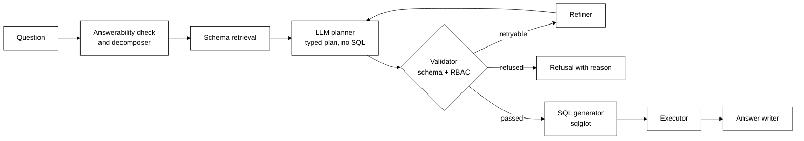

# NL2SQL Engine

Ask a database questions in English. The model writes a typed query plan, never
SQL text; the plan is checked against the real schema and the caller's role
before any SQL is generated.

[](https://github.com/nadeem4/nl2sql/actions/workflows/test.yml)
[](https://pypi.org/project/nl2sql-engine/)
[](LICENSE)


## Contents

- [How it works](#how-it-works)
- [Latest benchmark results](#latest-benchmark-results)
- [Quickstart: the demo](#quickstart-the-demo)
- [Screenshots](#screenshots)
- [CLI reference](#cli-reference)
- [REST API](#rest-api)
- [Python SDK](#python-sdk)
- [Configuration](#configuration)
- [Security and what is sent to the model](#security-and-what-is-sent-to-the-model)
- [Evaluation and quality](#evaluation-and-quality)
- [Project status, limitations and roadmap](#project-status-limitations-and-roadmap)
- [Contributing and license](#contributing-and-license)

## How it works

- The question is checked for answerability, split into sub-queries, and each
  sub-query gets the part of the schema it needs (vector search over an index of
  tables, columns and relationships, or the whole schema when it is small).
- The model returns a **typed plan** (a Pydantic `PlanModel`: tables, joins,
  select items, filters), never a SQL string.
- The **logical validator** resolves every table and column against the schema,
  checks joins against the declared foreign keys, and checks every table against
  the caller's role (RBAC). A refused plan never becomes SQL.
- Only a plan that passes reaches the **generator**, which renders SQL
  deterministically with `sqlglot`. The executor runs it and the answer writer
  summarises the rows.
- A retryable validation failure goes back to the planner through a refiner, up
  to `SQL_AGENT_MAX_RETRIES` (default 3). A security refusal is final.


```mermaid
%%{init: {'theme':'base','themeVariables':{'primaryColor':'#ffffff','primaryTextColor':'#000000','primaryBorderColor':'#000000','lineColor':'#000000'}}}%%
flowchart LR
    Q[Question] --> R[Answerability check<br/>and decomposer]
    R --> S[Schema retrieval]
    S --> P[LLM planner<br/>typed plan, no SQL]
    P --> V{Validator<br/>schema + RBAC}
    V -->|retryable| F[Refiner] --> P
    V -->|refused| X[Refusal with reason]
    V -->|passed| G[SQL generator<br/>sqlglot]
    G --> E[Executor] --> A[Answer writer]
```

Architecture detail: [System Architecture](docs/architecture/overview.md),
[Agent Nodes](docs/architecture/nodes/index.md),
[Determinism](docs/architecture/determinism.md).

## Latest benchmark results

Generated by `nl2sql benchmark publish` from the records in
[`benchmarks/`](benchmarks/README.md). Every run, with models, tokens, latency
and determinism: [docs/benchmarks.md](docs/benchmarks.md).

<!-- BENCHMARKS:START -->
### Tier 2: English questions answered correctly

The real model end to end on the Chinook gold questions. Accuracy is the strict share whose rows match the gold answer exactly, or that are refused where the gold set expects a refusal; lenient allows extra and reordered columns and date labels; faithfulness is the share of written answers whose numbers and names come from the rows.

| Config | Database | Date (UTC) | Commit | Accuracy (strict) | Accuracy (lenient) | Faithfulness | $/question | Δ vs previous |
| --- | --- | --- | --- | --- | --- | --- | --- | --- |
| gpt-5.4 | chinook | 2026-09-23 | de42c40 | 79.1% [64.8-88.6] | 79.1% | 86.8% | $0.0194 | new series (dataset changed) |

### Retrieval recall

The share of each answerable gold question's needed tables and columns that schema retrieval sends the planner, with no LLM involved.

| Database | Date (UTC) | Commit | Table recall | Column recall | Δ vs previous |
| --- | --- | --- | --- | --- | --- |
| chinook | 2026-09-22 | 571cd16 | 98.5% | 72.6% | first run |

Full history: [docs/benchmarks.md](docs/benchmarks.md)
<!-- BENCHMARKS:END -->

## Quickstart: the demo

Requires Python 3.12 or newer.

```bash
pip install "nl2sql-engine[demo]"
nl2sql demo
```

> The `demo` command, the `[demo]` extra and most of what this README describes
> are on `main` and not yet in a PyPI release (the latest is 0.1.2). Until the
> next release, install from a clone:
> `pip install -e packages/adapter-sdk -e "packages/nl2sql[demo]"`
> (add `-e packages/api` for the REST server).

`nl2sql demo` writes a demo project into `./nl2sql-demo`, copies in three
SQLite databases and indexes their schemas on your machine, serves the
playground on <http://127.0.0.1:8765/> and opens your browser. The databases
are the [Chinook](THIRD_PARTY_NOTICES.md) sample database (11 tables, real
foreign keys), `support`, a help desk (4 tables), and `webanalytics`, website
traffic (5 tables); the last two are synthetic, generated by this repository
from a fixed seed, and share Chinook's customer identities. All three declare
their foreign keys. Indexing needs no API key; the first run downloads a ~79 MB
ONNX embedding model.

**Answering a question needs a model.** The demo looks for one in this order:

1. `--api-key KEY` (saved to the project's `.env.demo`, so later runs stay live)
2. `OPENAI_API_KEY`, `OPENROUTER_API_KEY` or `ANTHROPIC_API_KEY` in the environment
3. a key already saved in `.env.demo`
4. an Ollama daemon on `localhost:11434`
5. replay mode

The provider follows the key's shape: `sk-ant-...` is Anthropic, `sk-or-...` is
OpenRouter, anything else is OpenAI. Claude needs the extra:
`pip install "nl2sql-engine[demo,anthropic]"`. You can also start without a key
and paste one into the playground's **Settings** page, which switches the
running demo to live mode without a restart and picks a model per step.

**Without a key**, the demo runs in replay mode, which answers only from
recorded model responses. None ship with the engine, so the console and the page
say "replay mode has no recorded answers" and a question gets "No recorded
answer for this question. Add an API key to ask it live." The schema, the index
and the Retrieval inspector still work. `nl2sql demo --record` (with an OpenAI
or OpenRouter key) records the guided questions into the project's
`recordings.json`, and later key-free runs of that folder replay them.

In the playground, pick one of the twenty guided questions -- twelve on
Chinook, four on `support`, four on `webanalytics` -- or type one, and choose a
role: `admin` and `analyst` can read the customer tables, `viewer` cannot, so
asking as `viewer` about customers shows the validator refusing the plan before
any SQL exists. With three databases registered, every question is routed
first: the resolver picks the one it is about, a step a single-database demo
never reached. A question that spans two of them is not answerable yet -- each
sub-query is planned against one datasource, so the engine cannot join across
databases, and the shared customer identities are groundwork for when it can.

The playground has no login. It binds to `127.0.0.1` by default; Settings,
Rebuild, the Retrieval inspector and answer ratings are off on any other
address unless you pass `--allow-settings`. Full guide:
[Demo](docs/getting_started/demo.md).

`nl2sql demo --hosted` is a third state, for a public demo of the sample
databases: the server holds no API key, each visitor pastes their own into the
page, the browser keeps it and sends it with each question, and it is used in
memory for that question only. The Ask page says so on arrival and keeps the
question box closed until a key is saved, so nobody discovers the requirement
by asking. Settings, Rebuild, answer ratings and `--record`
are refused there, the sample databases are opened read-only, and questions are
rate limited per visitor and capped per session. `deploy/huggingface/` is that
demo as a Hugging Face Space, deployed from `main` by the **Publish Space**
workflow. See [Hosted demo](docs/deployment/hosted-demo.md).

## Screenshots

Captured from the playground on the demo project, asking about Chinook, with
recorded model responses (so token counts are placeholders).

**An answer:** the question, the plan the model wrote, the validator's checks,
the generated SQL and the rows.


**Debug:** LLM calls, tokens and time per node in execution order. Open a node
to see what it read and returned, the retrieval it ran, and each prompt and raw
model response.


**Settings:** save an API key per provider and choose a provider and model for
each LLM step. Written to the demo project's `.env.demo` and
`configs/llm.demo.yaml`.


**Retrieval inspector:** run the engine's vector search for any text against the
live index, with k, lambda, entry types and datasource as knobs, and see what
MMR picked and what it dropped. No LLM call.


**Feedback:** rate an answer right or wrong, with an optional note. Stored in the
project with the question, role and SQL, never the rows;
`nl2sql feedback stats` reports the rates.


## CLI reference

Global options: `--env NAME` loads `.env.NAME`, `--env-file PATH` loads that
file instead (and wins over `--env`), `--version` prints the installed version.
Variables already exported in your shell win over the file. The demo project's
configs use relative paths, so run `--env demo` commands from inside the demo
folder (`cd nl2sql-demo`). Every command has `--help`.

| Command | Purpose | Key options |
| --- | --- | --- |
| `nl2sql demo` | Scaffold, index and serve the three-database playground | `--dir` (default `nl2sql-demo`), `--host` (default `127.0.0.1`), `--port` (default 8765), `--no-browser`, `--api-key`, `--record`, `--allow-settings`, `--hosted` |
| `nl2sql setup` | Interactive wizard: writes `.env.dev`, `configs/datasources.yaml`, `configs/llm.yaml`, `configs/policies.json`, checks connectivity, offers to index | `--demo` (write the demo project, all three sample databases, in the current folder and index it, no wizard), `--api-key` |
| `nl2sql run "QUESTION"` | Ask a question and print the plan, checks, SQL, rows and answer | `--role` (default `admin`), `--no-exec` (plan and validate only), `--ds-id`, `--verbose`/`-v`, `--show-perf`, `--config`, `--llm-config`, `--policies-config`, `--secrets-config`, `--vector-store` |
| `nl2sql index` | Index datasource schemas into the vector store, one datasource at a time | `--datasource`/`-d ID` (repeatable), `--full` (rebuild all, needed after changing the embedding model) |
| `nl2sql doctor` | Check Python, installed drivers, datasource connectivity, the LLM key and the index | |
| `nl2sql list-adapters` | List the installed datasource adapters | |
| `nl2sql install NAME` | pip-install the driver extra for an adapter (e.g. `postgresql`, `mysql`), after a confirmation | |
| `nl2sql policy validate` | Validate `policies.json` and check it against the configured datasources | `--policies`, `--config`, `--secrets` |
| `nl2sql trace show TARGET` | Print a run trace's timeline: nodes, attempts, durations, tokens, errors | a trace file, or a trace id in `TRACE_DIR` |
| `nl2sql trace replay TARGET` | Re-run a traced question on its recorded LLM responses, with no model calls | `--config`, `--llm-config`, `--policies-config`, `--secrets-config`, `--vector-store` |
| `nl2sql cache clear` | Empty the plan cache; schema snapshots are kept | |
| `nl2sql feedback list` | Playground ratings, newest first | `--limit` (default 50) |
| `nl2sql feedback stats` | Ratings plus guardrail rates: refusals, refiner retries, validator rejections, errors, plan-cache hits | `--json`, `--traces DIR` |
| `nl2sql feedback export --good` | Write thumbs-up runs as draft gold entries to a separate YAML for review | `--out` (default `feedback_gold_drafts.yaml`) |
| `nl2sql feedback clear` | Delete every rating | `--yes` |
| `nl2sql benchmark --tier 1` | Tier 1: the hand-written gold plans through the validator, generator and executor, with a local fake LLM (no key) | `--role`, `--include-ids`, `--export-path` |
| `nl2sql benchmark --tier 2` | Tier 2: the real model end to end on the gold questions, per config, under a cost cap | `--max-cost USD` (required), `--model` (repeatable), `--llm PRESET\|PATH` (repeatable), `--passes`, `--questions`, `--note`, `--baseline`, `--max-regressions`, `--max-accuracy-drop` (deprecated), `--max-cost-increase`, `--results-dir` |
| `nl2sql benchmark` | Without `--tier`: the gold questions through the full pipeline with the configured LLM | `--iterations` (default 3), `--bench-config-path`, `--role`, `--include-ids` |
| `nl2sql benchmark retrieval` | Table and column recall of schema retrieval on the gold questions; no key, no LLM | `--record`, `--note`, `--baseline`, `--questions`, `--results-dir` |
| `nl2sql benchmark presets` | List the built-in tier 2 LLM configs (`gpt-5.4`, `gpt-5.4-mini-helpers`, `claude-planner`) | |
| `nl2sql benchmark publish` | Rebuild `docs/benchmarks.md` and the README results block from `benchmarks/`; run from the repo root | `--from DEMO_FOLDER` (repeatable: copy that folder's records in first) |

Examples, from the demo folder:

```bash
nl2sql --env demo run "How many customers do we have, by country?"
nl2sql --env demo run --role viewer "Who are the top 5 customers by total spend?"   # refused
nl2sql --env demo run --no-exec "Which artist has the most albums?"                 # plan only
nl2sql --env demo benchmark --tier 2 --model gpt-5.4 --max-cost 5
nl2sql --env demo feedback stats
```

`run` exits 1 when the run ends with an ERROR or CRITICAL error (a refusal
included). More: [Demo guide](docs/getting_started/demo.md),
[Debugging a Run](docs/observability/debugging.md),
[Feedback and Signals](docs/observability/feedback.md),
[Evaluation](docs/testing/evaluation-dataset.md).

## REST API

The `nl2sql-api` package serves the engine over HTTP with FastAPI. It builds one
`NL2SQL` engine at startup from the same env file and configs as the CLI.

```bash
pip install nl2sql-api
cd nl2sql-demo                               # the configs use relative paths
ENV=demo NL2SQL_API_ROLE=admin nl2sql-api --host 127.0.0.1 --port 8000
# or: ENV=demo NL2SQL_API_ROLE=admin uvicorn nl2sql_api.main:app --port 8000
```

Full interactive docs at `http://localhost:8000/docs` (Swagger UI), with ReDoc
at `/redoc` and the schema at `/openapi.json`. Browser access from other origins
is off unless listed in `NL2SQL_API_CORS_ORIGINS`.

The API does not authenticate callers itself, and it never takes the RBAC role
from the request body. The role comes from one of these settings, first match
wins:

| Setting | Role source |
| --- | --- |
| `NL2SQL_API_ROLE_HEADER=X-NL2SQL-Role` | A header set by a trusted proxy that authenticates the caller. Comma-separated values are several roles. |
| `NL2SQL_API_ROLE=admin` | One static role for every request. |
| `NL2SQL_API_TRUST_BODY_ROLE=true` | Dev only: `user_context` in the body. Any client can pick any role, so the server logs a warning at startup. |

With none of them, `/api/v1/query` answers HTTP 401.

| Method | Path | Purpose |
| --- | --- | --- |
| `POST` | `/api/v1/query` | Ask a question; returns the plan, checks, SQL, rows, answer, errors and usage |
| `GET` | `/api/v1/health` | Liveness check |
| `GET` | `/api/v1/ready` | Readiness check (does not yet check datasources or the LLM) |
| `POST` | `/api/v1/datasource` | Register a datasource in the running process |
| `GET` | `/api/v1/datasource` | List registered datasource ids |
| `GET` | `/api/v1/datasource/{datasource_id}` | Check that a datasource is registered |
| `DELETE` | `/api/v1/datasource/{datasource_id}` | Not supported yet: always answers `success: false` |
| `POST` | `/api/v1/llm` | Configure an LLM in the running process |
| `GET` | `/api/v1/llm` | List configured LLMs |
| `GET` | `/api/v1/llm/{llm_name}` | Get one configured LLM |
| `POST` | `/api/v1/index/{datasource_id}` | Index one datasource's schema |
| `POST` | `/api/v1/index-all` | Index every registered datasource |
| `DELETE` | `/api/v1/index` | Clear the vector store |
| `GET` | `/api/v1/index/status` | Index health: status, entries by type, embedding model and problems per datasource |

```bash
curl -X POST http://localhost:8000/api/v1/query \
  -H "Content-Type: application/json" \
  -d '{"natural_language": "How many customers are there?"}'
```

The response has `status`, `sub_queries` (each with `plan`, `validation`, `sql`,
`rows`, `status` and `plan_source`), `final_answer`, `errors`, `warnings`,
`timings`, `usage` and `trace_path`. A pipeline failure, a refusal included,
comes back as HTTP 200 with `status: "error"` and the reason in `errors`.
Reference: [REST API](docs/api/rest/index.md).

## Python SDK

```python
from nl2sql import NL2SQL, UserContext

engine = NL2SQL(env="demo")          # loads .env.demo from the working directory
result = engine.run_query(
    "How many customers are there?",
    user_context=UserContext(roles=["admin"]),
)

print(result.status)                  # "success", "error" or "plan_only"
for sq in result.sub_queries:
    print(sq.sql)
    print([c.name for c in sq.validation if c.passed])
    print(sq.rows.rows[:5] if sq.rows else "plan only")
print(result.final_answer["summary"] if result.final_answer else result.errors)
```

Run it from the demo folder. `run_query` also takes `datasource_id` and
`execute=False` (plan and validate only). Pass a `user_context` with a role: with
none the call currently raises a validation error, and a role the policy does
not know is refused. `QueryResult` carries per sub-query the plan, checks, SQL,
a capped row sample with the true total, status and retry count, and per run
the status, errors, warnings, per-node timings, `usage` (LLM calls and tokens,
and cost when `LLM_PRICES` is set) and `trace_path`. Asking the same question
again reuses the validated plan from the plan cache (`sq.plan_source == "cache"`),
still validated for the caller's role.

`NL2SQL` also exposes `engine.query`, `engine.datasource`, `engine.llm`,
`engine.indexing`, `engine.auth`, `engine.policy`, `engine.settings`
and `engine.benchmark`. See
[the public facade](docs/api/core/public-facade.md) and
[`examples/`](examples/).

## Configuration

| File | What it holds |
| --- | --- |
| `configs/datasources.yaml` | Datasources and connections: PostgreSQL, MySQL, SQL Server, SQLite, DuckDB ([Datasources](docs/configuration/datasources.md)) |
| `configs/llm.yaml` | A `default` agent and optional per-node agents ([LLM](docs/configuration/llm.md)) |
| `configs/policies.json` | Roles: allowed datasources and `datasource.table` entries ([Policies](docs/configuration/policies.md)) |
| `configs/secrets.yaml` | Secret providers for `${provider:key}` references ([Secrets](docs/configuration/secrets.md)) |

**LLM providers.** `openai` (default model `gpt-5.4`), `anthropic` (Claude,
`pip install "nl2sql-engine[anthropic]"`, `claude-opus-5` with
`temperature: null`), `openrouter` (OpenAI-compatible gateway) and `ollama`
(local; small models often cannot fill the recursive plan schema). Each LLM
step can have its own provider and model under `agents`: `datasourceresolver`,
`decomposer`, `astplanner`, `refiner`, `answersynthesizer`, and
`indexing_enrichment` for optional schema descriptions during indexing.

**Key environment variables** ([System configuration](docs/configuration/system.md)):

| Variable | Default | Purpose |
| --- | --- | --- |
| `OPENAI_API_KEY`, `ANTHROPIC_API_KEY`, `OPENROUTER_API_KEY` | unset | Provider keys |
| `DATASOURCE_CONFIG`, `LLM_CONFIG`, `POLICIES_CONFIG`, `SECRETS_CONFIG` | `configs/...` | Config file paths |
| `VECTOR_STORE` | `./chroma_db` | Vector store directory |
| `EMBEDDING_PROVIDER` | `openai` | `local` runs an ONNX embedder with no key (the demo sets it) |
| `GLOBAL_TIMEOUT_SEC` | 60 | How long the caller waits for a run (the demo sets 300) |
| `SQL_AGENT_MAX_RETRIES` | 3 | Refiner retries per sub-query |
| `SCHEMA_RETRIEVAL_FULL_SNAPSHOT_MAX_TABLES` | 15 | Send the whole schema, skipping vector search, up to this many tables |
| `PLAN_CACHE_ENABLED` | `true` | Reuse validated plans for repeated questions |
| `TRACE_MODE`, `TRACE_DIR` | `on_failure`, `traces` | Run traces: every node's inputs, outputs, prompts and responses |
| `RBAC_REFUSAL_NAMES_TABLES` | `false` | Name the denied table in the refusal message |
| `LLM_PRICES` | unset | Per-model prices, so `usage` reports cost |
| `FEEDBACK_ENABLED` | `true` | Accept playground ratings |

## Security and what is sent to the model

- **What reaches the LLM provider:** the question; the schema the planner needs
  (table and column names, types, keys, relationships, descriptions); **sample
  column values** for tables the role may read; and the **result rows**, which
  the answer writer summarises. With `TRACE_MODE` on, run traces store prompts,
  responses and sample rows on disk.
- **RBAC is strict.** A plan that touches a table the role may not read is
  refused before any SQL exists, never answered from the tables the role can
  see. Sample values and statistics of forbidden tables are stripped from the
  prompt and the trace. An unknown role grants nothing. There is no column
  masking and no row-level security.
- **Read-only is not enforced by the executor.** The plan type only allows
  `SELECT` and the generator only builds one, but the executor does not inspect
  the SQL and connections are not opened read-only on any dialect. **Give the
  engine a read-only database user.**
- **No authentication** in the CLI, playground or REST API. The CLI and
  playground take the role from the caller. The REST API takes it from a trusted
  proxy header or a static setting, never from the body unless a dev flag is
  on; put your own auth in the proxy and derive the role from it.
- `GLOBAL_TIMEOUT_SEC` bounds how long the caller waits, not how long the work
  runs; the graph runs in-process with no sandbox.

Details: [Security Model](docs/security/model.md),
[Execution Isolation](docs/execution/isolation.md).

## Evaluation and quality

- **Gold set:** 43 Chinook questions with expected results per role, including
  refusals and unanswerable questions.
- **Tier 1** (no key, runs in CI): the hand-written gold plans through the
  validator, generator and executor with a fake LLM, so a failure is a bug in
  code, not the model.
- **Tier 2** (real model, costs money): end to end per config, with accuracy,
  answerability precision and recall, cost, latency, determinism and answer
  faithfulness (whether the answer's numbers and names come from the rows).
  Stops before spend could pass `--max-cost`. `--baseline` pairs each run's
  questions with the baseline's and fails when more than `--max-regressions`
  (default 2) flip from pass to fail, or when a smaller drop is significant by
  McNemar's test; the old flat-threshold `--max-accuracy-drop` gate still
  works if passed explicitly, but is deprecated in favor of `--max-regressions`.
- **Retrieval recall** (no key): the share of each question's needed tables and
  columns that schema retrieval sends the planner.
- **Feedback:** playground ratings and guardrail rates via `nl2sql feedback stats`;
  `feedback export --good` drafts new gold entries for review.

Recorded runs are published with `nl2sql benchmark publish` to the block above
and [docs/benchmarks.md](docs/benchmarks.md). Details:
[Evaluation](docs/testing/evaluation-dataset.md),
[Feedback and Signals](docs/observability/feedback.md).

## Project status, limitations and roadmap

The engine is at **0.1.x**. `nl2sql-adapter-sdk`, `nl2sql-engine` and
`nl2sql-api` share one version and are released together
([Releasing](docs/development/releasing.md)). Unreleased changes are on `main`;
see the [changelog](CHANGELOG.md) for what is released.

Known limitations:

- Every question needs an LLM; only indexing is key-free. The key-free demo
  answers nothing until you record answers or add a key.
- Small local models often fail to produce a valid plan.
- A question cannot span two databases: every sub-query is planned against one
  datasource, so the demo's three cannot be joined, however much their data
  lines up.
- The executor does not enforce read-only (see above). `max_bytes` is not
  enforced; `row_limit` is, in the generated SQL.
- The model's output is not reproducible; determinism is structural (fixed
  topology, validation before generation, plan cache) ([Determinism](docs/architecture/determinism.md)).
- The S3 and ADLS result backends have not been verified against a real service.
- No distributed tracing: OpenTelemetry metrics only, off by default. Audit
  events are emitted only by the CLI.
- The REST API does not authenticate callers: it takes the role from a trusted
  proxy header or a static setting. `run_query` without a `user_context` raises
  instead of refusing.

Roadmap: using the engine on your own database (bring-your-own-database setup
beyond the bundled demo databases) is planned. The `setup` wizard and the
adapters exist, but that path is not yet documented or supported end to end.

## Contributing and license

See [CONTRIBUTING.md](CONTRIBUTING.md) for local setup and test markers
(`pytest -m "not integration"` runs without a database or key).

Repository layout: `packages/nl2sql` (engine, CLI, adapters),
`packages/api` (REST API), `packages/adapter-sdk` (adapter contract),
`web/playground` (the playground's React source), `docs/` (MkDocs site),
`benchmarks/` (recorded benchmark runs), `examples/`.

MIT licensed ([LICENSE](LICENSE)). The Chinook sample database and other
third-party material: [THIRD_PARTY_NOTICES.md](THIRD_PARTY_NOTICES.md).
