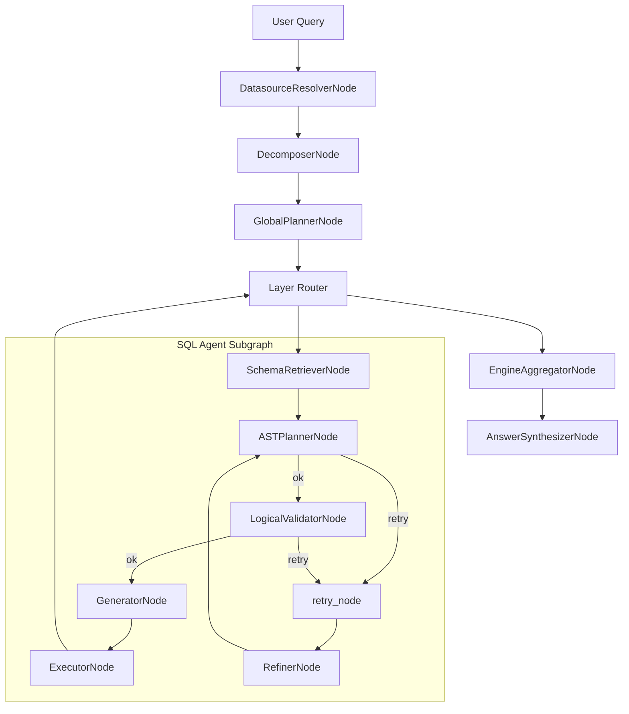

# NL2SQL Engine

> **Production-grade Natural Language → SQL runtime with deterministic orchestration.**

NL2SQL treats text-to-SQL as a **distributed systems** problem. The engine compiles a user query into a validated plan, executes via adapters, and aggregates results through a graph-based pipeline.

---

## 🧭 What you get

- Graph-based orchestration (`LangGraph`) with explicit state (`GraphState`)
- Deterministic planning and validation before SQL generation
- Adapter-based execution with per-run cancellation and a global timeout
- Observability hooks (metrics, logs, audit events)

## 🏗️ System Topology

The runtime is organized around a LangGraph orchestration pipeline and supporting registries. It is designed for deterministic execution and structured, inspectable failure.


```mermaid
flowchart TD
    User[User Query] --> Resolver[DatasourceResolverNode]
    Resolver --> Decomposer[DecomposerNode]
    Decomposer --> Planner[GlobalPlannerNode]
    Planner --> Router[Layer Router]

    subgraph SQLAgent["SQL Agent Subgraph"]
        Schema[SchemaRetrieverNode] --> AST[ASTPlannerNode]
        AST -->|ok| Logical[LogicalValidatorNode]
        AST -->|retry| Retry[retry_node]
        Logical -->|ok| Generator[GeneratorNode]
        Logical -->|retry| Retry
        Generator --> Executor[ExecutorNode]
        Retry --> Refiner[RefinerNode]
        Refiner --> AST
    end

    Router --> Schema
    Executor --> Router
    Router --> Aggregator[EngineAggregatorNode]
    Aggregator --> Synthesizer[AnswerSynthesizerNode]
```

### 1. The Control Plane (The Graph)

**Responsibility**: Reasoning, Planning, and Orchestration.

* **Agentic Graph**: Implemented as a Directed Cyclic Graph (LangGraph) to enable refinement loops. If a plan fails validation, the system self-corrects.
* **State Management**: Shared `GraphState` ensures auditability and reproducibility of every decision.

### 2. The Security Plane (The Firewall)

**Responsibility**: Invariants Enforcement.

* **Valid-by-Construction**: The LLM generates an **Abstract Syntax Tree (AST)** rather than executing SQL.
* **Static Analysis**: The [Logical Validator](docs/architecture/nodes/logical_validator_node.md) enforces RBAC and schema constraints before SQL generation, resolving every column against the retrieved schema with `sqlglot`'s optimizer.

### 3. The Data Plane (Retrieval and Execution)

**Responsibility**: Semantic Search and Execution.

* **In-Process Execution**: The graph runs on a thread pool (`settings.sandbox_exec_workers`) inside the host process. There is **no process sandbox**: a driver-level crash takes the process with it. See [Execution Isolation + Concurrency](docs/execution/isolation.md) for the exact boundaries.
* **Partitioned Retrieval**: The [Schema Store + Retrieval](docs/schema/store.md) flow injects relevant schema context, preventing context window overflow.

### 4. The Reliability Plane (The Guard)

**Responsibility**: Fault Tolerance and Stability.

* **Bounded Runs**: A [global timeout](docs/execution/isolation.md) caps every invocation, and a per-run `CancellationToken` lets a caller unwind a run cooperatively.
* **Fail-Fast Retrieval**: A single [circuit breaker](docs/observability/error-handling.md) (`VECTOR_BREAKER`) trips the vector store out of the path when retrieval is failing. LLM and SQL calls are not breaker-guarded; their failures surface as structured errors in state.

### 5. The Observability Plane (The Watchtower)

**Responsibility**: Visibility, Forensics, and Compliance.

* **Full-Stack Telemetry**: Native [OpenTelemetry](docs/observability/stack.md) integration provides distributed tracing (Jaeger) and metrics (Prometheus) for every node execution.
* **Forensic Audit Logs**: A persistent [Audit Log](docs/observability/stack.md) records AI decisions for compliance and debugging.

---

## 📐 Architectural Invariants

| Invariant | Rationale | Mechanism |
| :--- | :--- | :--- |
| **No Unvalidated SQL** | Prevent hallucinations & data leaks | All plans pass through `LogicalValidator` (AST), whose column resolution is delegated to `sqlglot.optimizer.qualify`. |
| **Bounded Runs** | Reliability | `GLOBAL_TIMEOUT_SEC` caps every invocation and a per-run `CancellationToken` unwinds it on demand (`pipeline/runtime.py`, `common/cancellation.py`). |
| **Fail-Fast Retrieval** | Availability | `VECTOR_BREAKER` fast-fails vector retrieval during an outage (`common/resilience.py`). |
| **Determinism** | Debuggability | Temperature-0 generation + Strict Typing (Pydantic) for all LLM outputs. |

---

## 🚀 Quick Start

### Prerequisites

* Python 3.9+
* A configured datasource (`configs/datasources.yaml`)
* A configured LLM (`configs/llm.yaml`)

### 1. Installation

```bash
# Install core only
pip install nl2sql

# Install core with selected adapters
pip install nl2sql[mysql,mssql]

# Install core with all adapters
pip install nl2sql[all]
```

For local development:

```bash
git clone https://github.com/nadeem4/nl2sql.git
cd nl2sql

# Set up environment
python -m venv venv
source venv/bin/activate

# Install the adapter SDK and the engine (with every driver extra)
pip install -e packages/adapter-sdk
pip install -e "packages/nl2sql[all]"
```

### 2. Run a query (Python API)

```python
from nl2sql.context import NL2SQLContext
from nl2sql.pipeline.runtime import run_with_graph

ctx = NL2SQLContext()
result = run_with_graph(ctx, "Top 5 customers by revenue last quarter?")

print(result.get("final_answer"))
```

## 🧪 Demo data (CLI-only)

Use the CLI to generate deterministic demo data and configs, then point the API at the generated files.

1. Generate demo data + configs, and index them:

```bash
# SQLite files, no containers (default)
nl2sql setup --demo --lite

# Or full fidelity: Postgres/MySQL/MSSQL in Docker
nl2sql setup --demo --docker
```

`--lite` and `--docker` are mutually exclusive. The lite run writes
`data/demo_lite/*.db`, the `configs/*.demo.*` files and `.env.demo`, then indexes
the generated schemas. That needs no API key: `.env.demo` sets
`EMBEDDING_PROVIDER=local`, and the LLM enrichment pass over the schema is
optional and simply skipped without one. A key is needed to *query* the demo, so
pass one with `--api-key` or fill in `OPENAI_API_KEY` in `.env.demo` first.

2. Use the demo environment from the CLI:

```bash
# Re-index after editing the demo configs
nl2sql --env demo index

# Ask a question
nl2sql --env demo run "Show me broken machines in Austin"
```

`--env <name>` loads `.env.<name>`; `--env-file <path>` loads an exact file and
takes precedence over `--env`.

3. Start the API with demo settings:

```bash
# Option A: load .env.demo via ENV
ENV=demo uvicorn nl2sql_api.main:app

# Option B: load a specific env file
ENV_FILE_PATH=.env.demo uvicorn nl2sql_api.main:app
```

The demo datasource file uses relative paths (e.g. `data/demo_lite/*.db`), so start the API from the repo root.

## 🔖 Versioning Policy

NL2SQL uses unified versioning across the monorepo. Core, adapters, API, and CLI
share the same version number and are released together. Internal dependencies
use a compatible-release constraint (`~=0.1`) rather than an exact pin, so a
patch or minor release never forces users into an unresolvable install while a
mismatched major is still rejected.

See [Releasing](docs/development/releasing.md) for the release checklist.

## 📚 Documentation

- **[System Architecture](docs/architecture/overview.md)**: runtime topology and core flows
- **[Agent Nodes](docs/architecture/nodes/index.md)**: node-by-node specs and responsibilities
- **[Schema Store + Retrieval](docs/schema/store.md)**: schema snapshots and vector retrieval
- **[Execution Isolation + Concurrency](docs/execution/isolation.md)**: what the runtime does and does not bound
- **[Observability](docs/observability/stack.md)**: metrics, logging, audit events
  

---

## 📦 Repository Structure

```text
packages/
├── nl2sql/             # Engine, CLI and adapters (Postgres, MySQL, MSSQL, SQLite, DuckDB)
├── adapter-sdk/        # Interface Contract for new Databases
└── api/                # REST API service (nl2sql-api)
configs/                # Runtime Configuration (Policies, Prompts)
docs/                   # Architecture & Operations Manual
```
