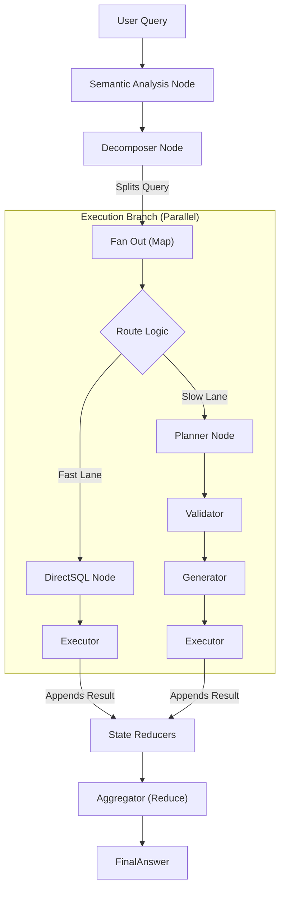

# NL2SQL

## Overview

This repository contains the `nl2sql` platform, a modular natural language to SQL engine designed with a pluggable adapter architecture.

## Packages

### Core

- **[nl2sql-core](packages/core)**: The main orchestration engine, CLI, and LangGraph nodes.
- **[nl2sql-adapter-sdk](packages/adapter-sdk)**: The public interface contract for database adapters.
- **[nl2sql-adapter-sqlalchemy](packages/adapter-sqlalchemy)**: Base implementation for SQL-based adapters.

### Adapters

- **[nl2sql-postgres](packages/adapters/postgres)**: Adapter for PostgreSQL (uses `psycopg2`).
- **[nl2sql-mysql](packages/adapters/mysql)**: Adapter for MySQL (uses `pymysql`).
- **[nl2sql-mssql](packages/adapters/mssql)**: Adapter for Microsoft SQL Server (uses `pyodbc`).
- **[nl2sql-sqlite](packages/adapters/sqlite)**: Adapter for SQLite (built-in).

## Development

### Installation

To install the core engine and specific adapters in editable mode:

```bash
# Core & SDK
pip install -e packages/adapter-sdk
pip install -e packages/adapter-sqlalchemy
pip install -e packages/core

# Adapters (Install as needed)
pip install -e packages/adapters/postgres
pip install -e packages/adapters/mysql
pip install -e packages/adapters/mssql
pip install -e packages/adapters/sqlite
```

### Running Tests

#### Unit Tests (Core)

```bash
python -m pytest packages/core/tests/unit
```

#### Integration Tests (Docker)

We usage Docker Compose to spin up real database instances for verification.

1. Start containers:

   ```bash
   docker compose up -d
   ```

2. Run the integration test suite (Windows PowerShell):

   ```powershell
   powershell -File scripts/test_integration.ps1
   ```

## Usage

### 1. Adapter Management

Check which adapters are installed and active:

```bash
python -m nl2sql.cli --list-adapters
```

### 2. Indexing (Vector Store)

Before running queries, you must index your datasources definitions. This populates the vector store with schema metadata and few-shot examples.

```bash
python -m nl2sql.cli --index --config configs/datasources.yaml
```

**Note**: Re-run this command whenever `configs/datasources.yaml` changes.

### 2. Running Queries

Execute a natural language query against the pipeline:

```bash
# Auto-route to the best datasource
python -m nl2sql.cli --query "Show me all users"

# Force a specific datasource
python -m nl2sql.cli --id manufacturing_ops --query "List all machines"
```

## Architecture

The system uses a pluggable architecture where `core` interacts with databases solely through the `DatasourceAdapter` interface defined in `adapter-sdk`. Adapters are discovered dynamically at runtime via `importlib.metadata` entry points (`nl2sql.adapters`).

### Execution Flow



## Security & Authorization

The system implements a "Defense in Depth" strategy for RBAC (Role-Based Access Control):

1. **Metadata Filtering (Retrieval Layer)**:
    - The retrieval engine filters the vector search space based on the user's `allowed_datasources`.
    - *Result*: The LLM never sees schema tokens for unauthorized databases, preventing hallucinations.

2. **Policy Validation (Validator Node)**:
    - Fine-grained table-level access control.
    - The Validator checks every table in the generated plan against the user's `allowed_tables` whitelist.
    - *Result*: Even if a query is generated, execution is blocked if it touches restricted data.
