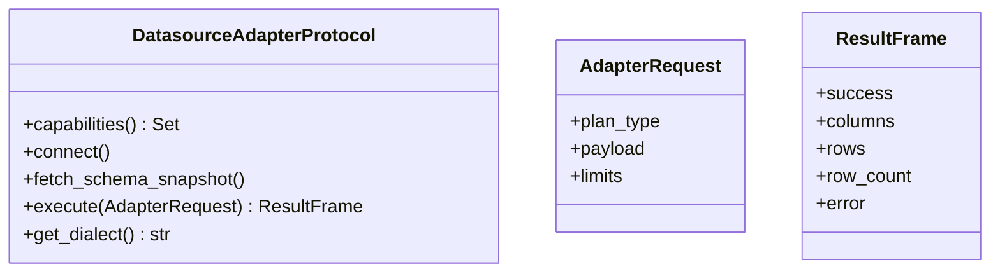

# Plugin / Adapter Architecture

Adapters integrate NL2SQL with external datasources. Each adapter implements a **protocol contract**, is discovered via **Python entry points**, and is registered in the `DatasourceRegistry`.

## Discovery and registration

```mermaid
flowchart TD
    Config[configs/datasources.yaml] --> Registry[DatasourceRegistry]
    Registry --> Discovery[discover_adapters()]
    Discovery --> EntryPoints[entry_points('nl2sql.adapters')]
    EntryPoints --> AdapterClass[Adapter Class]
    AdapterClass --> AdapterInstance[DatasourceAdapterProtocol instance]
```

## Core adapter contract



See `sdk.md` for the authoritative adapter interface reference and required fields/methods.

## Capability-driven routing

Adapters expose capabilities (e.g., `supports_sql`, `supports_schema_introspection`). These capabilities drive:

- **Subgraph selection** (`resolve_subgraph()` in routing).
- **Executor selection** (`ExecutorRegistry.get_executor()`).

```mermaid
flowchart TD
    Adapter[DatasourceAdapterProtocol] --> Caps[capabilities()]
    Caps --> Exec[ExecutorRegistry]
    Caps --> Subgraph[resolve_subgraph()]
    Exec --> Service[Executor Service]
    Subgraph --> Graph[Subgraph Selection]
```

## Multi-datasource routing

The control graph can resolve multiple datasources for a single user query. `DecomposerNode` produces sub-queries scoped to individual datasources. Each sub-query is then routed to a subgraph that matches its adapter capabilities.

## Extensibility model

To add a new adapter:

1. Implement `DatasourceAdapterProtocol` (or extend a base adapter).
2. Publish the adapter class as an `nl2sql.adapters` entry point.
3. Configure the datasource in `configs/datasources.yaml`.

## Source references

- Adapter protocol: `packages/adapter-sdk/src/nl2sql_adapter_sdk/protocols.py`
- Adapter discovery: `packages/core/src/nl2sql/datasources/discovery.py`
- Datasource registry: `packages/core/src/nl2sql/datasources/registry.py`
- Example adapter: `packages/adapter-sqlalchemy/src/nl2sql_sqlalchemy_adapter/adapter.py`
