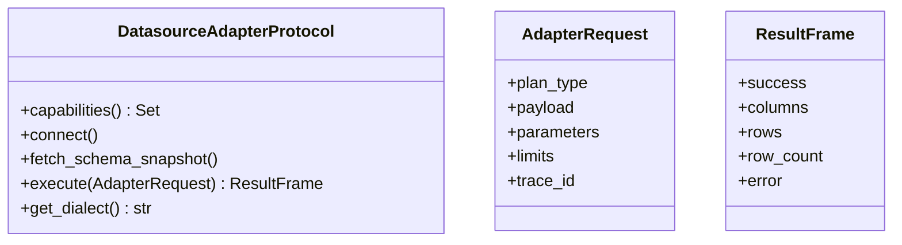

# Plugin / Adapter Architecture

Adapters are discovered via Python entry points (`nl2sql.adapters`) and registered in `DatasourceRegistry`. All adapters implement the `DatasourceAdapterProtocol` and return a standardized `ResultFrame`.

## Discovery and registration

```mermaid
flowchart TD
    Config[configs/datasources.yaml] --> Registry[DatasourceRegistry]
    Registry --> Discovery[discover_adapters()]
    Discovery --> EntryPoints[entry_points('nl2sql.adapters')]
    EntryPoints --> AdapterClass[Adapter Class]
    AdapterClass --> AdapterInstance[DatasourceAdapterProtocol instance]
```

## Core contracts



## Executor integration

Execution nodes resolve the executor via `ExecutorRegistry`, which maps datasource capabilities to executor implementations (e.g., `SqlExecutorService` for SQL).

## Source references

- Adapter protocol and contracts: `packages/adapter-sdk/src/nl2sql_adapter_sdk/protocols.py`, `packages/adapter-sdk/src/nl2sql_adapter_sdk/contracts.py`
- Adapter discovery: `packages/core/src/nl2sql/datasources/discovery.py`
- Datasource registry: `packages/core/src/nl2sql/datasources/registry.py`
- Executor registry: `packages/core/src/nl2sql/execution/executor/registry.py`
