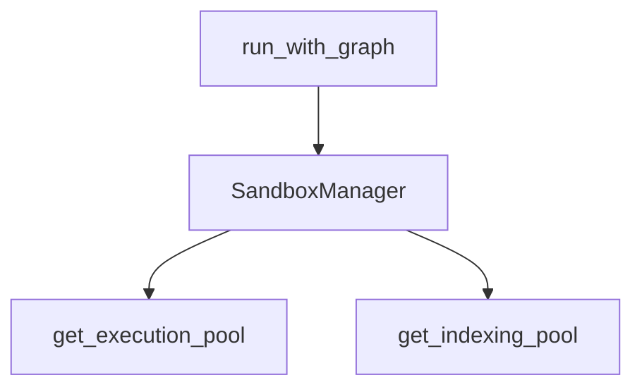

# ADR-001: Sandboxed Execution and Indexing

## Status

Accepted (implemented in `SandboxManager`).

## Context

SQL drivers and indexing operations can crash or block the main process. The runtime needs isolation between orchestration and execution.

## Decision

Use **ProcessPoolExecutor** pools managed by `SandboxManager`:

- `get_execution_pool()` for latency-sensitive SQL execution.
- `get_indexing_pool()` for background indexing tasks.

All sandbox calls are wrapped in `execute_in_sandbox()` to standardize timeouts and error handling.

## Consequences

- Worker crashes and timeouts are contained and converted into structured errors.
- Execution concurrency is bounded by settings (`sandbox_exec_workers`, `sandbox_index_workers`).

## Source references

- `packages/core/src/nl2sql/common/sandbox.py`
