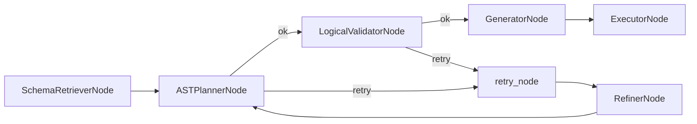

# Agent Architecture

NL2SQL implements agent behavior as **LangGraph subgraphs**. The primary subgraph today is the SQL agent, built by `build_sql_agent_graph()`. Each node is a class with a `__call__` method that consumes and returns Pydantic state models (`SubgraphExecutionState`).

## SQL Agent subgraph

The SQL agent subgraph is built in `nl2sql.pipeline.subgraphs.sql_agent.build_sql_agent_graph`. It orchestrates schema retrieval, planning, validation, generation, execution, and optional refinement.

### Node responsibilities

- `SchemaRetrieverNode`: retrieves schema context from `VectorStore` and `SchemaStore`.
- `ASTPlannerNode`: produces a structured plan (AST) for the sub-query.
- `LogicalValidatorNode`: enforces schema and policy constraints on the AST.
- `GeneratorNode`: renders SQL from the plan.
- `ExecutorNode`: dispatches SQL to `ExecutorRegistry` and stores artifacts.
- `RefinerNode`: refines the plan when validation fails.

## Subgraph execution state

`SubgraphExecutionState` tracks per-subgraph execution details including `sub_query`, `relevant_tables`, planner output, validator output, executor responses, errors, and retry counters.

## Source references

- SQL agent graph: `packages/core/src/nl2sql/pipeline/subgraphs/sql_agent.py`
- Node classes: `packages/core/src/nl2sql/pipeline/nodes/`
- Subgraph state: `packages/core/src/nl2sql/pipeline/state.py`
