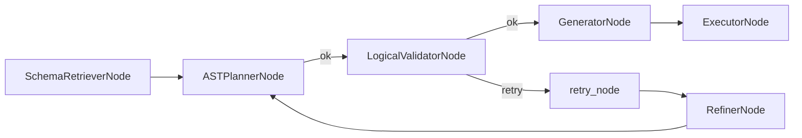

# Node-by-Node Specifications

This section enumerates **all pipeline nodes** and the **SQL agent subgraph nodes**, including their inputs, outputs, and failure modes. The node names reflect the graph registrations in `build_graph()` and `build_sql_agent_graph()`.

## Control graph nodes (main pipeline)

### `DatasourceResolverNode`

- **Class**: `nl2sql.pipeline.nodes.datasource_resolver.node.DatasourceResolverNode`
- **Inputs**: `GraphState.user_query`, optional `GraphState.datasource_id`, `GraphState.user_context`
- **Outputs**: `GraphState.datasource_resolver_response`, optional `GraphState.errors`
- **Behavior**:
  - If `datasource_id` is provided, validates existence and RBAC permissions.
  - Otherwise performs vector search via `VectorStore.retrieve_datasource_candidates`.
  - Applies `schema_version_mismatch_policy`.
- **Errors**: `SCHEMA_RETRIEVAL_FAILED`, `SECURITY_VIOLATION`, `INVALID_STATE`
- **Source**: `packages/core/src/nl2sql/pipeline/nodes/datasource_resolver/node.py`

### `DecomposerNode`

- **Class**: `nl2sql.pipeline.nodes.decomposer.node.DecomposerNode`
- **Inputs**: `GraphState.user_query`, `GraphState.datasource_resolver_response`
- **Outputs**: `GraphState.decomposer_response` (sub-queries, combine groups, post-combine ops)
- **Behavior**:
  - Uses LLM structured output (`DecomposerResponse`) to produce sub-queries.
  - Stabilizes sub-query and post-op IDs with deterministic hashes.
  - Filters unmapped/unauthorized datasource IDs into `unmapped_subqueries`.
- **Errors**: `ORCHESTRATOR_CRASH` on unexpected failures
- **Source**: `packages/core/src/nl2sql/pipeline/nodes/decomposer/node.py`

### `GlobalPlannerNode`

- **Class**: `nl2sql.pipeline.nodes.global_planner.node.GlobalPlannerNode`
- **Inputs**: `GraphState.decomposer_response`
- **Outputs**: `GraphState.global_planner_response` containing an `ExecutionDAG`
- **Behavior**:
  - Creates logical `scan` nodes from sub-queries.
  - Adds `combine` nodes and post-combine nodes (`post_filter`, `post_aggregate`, etc.).
  - Computes deterministic `ExecutionDAG.layers`.
- **Errors**: `PLANNER_FAILED` or `PLANNING_FAILURE` on DAG build errors
- **Source**: `packages/core/src/nl2sql/pipeline/nodes/global_planner/node.py`

### `EngineAggregatorNode`

- **Class**: `nl2sql.pipeline.nodes.aggregator.node.EngineAggregatorNode`
- **Inputs**: `GraphState.global_planner_response`, `GraphState.artifact_refs`
- **Outputs**: `GraphState.aggregator_response` with terminal results
- **Behavior**:
  - Executes the `ExecutionDAG` using `AggregationService(PolarsDuckdbEngine())`.
  - Loads scan artifacts and applies combine/post operations layer by layer.
- **Errors**: `AGGREGATOR_FAILED`
- **Source**: `packages/core/src/nl2sql/pipeline/nodes/aggregator/node.py`

### `AnswerSynthesizerNode`

- **Class**: `nl2sql.pipeline.nodes.answer_synthesizer.node.AnswerSynthesizerNode`
- **Inputs**: `GraphState.aggregator_response`, `GraphState.decomposer_response`
- **Outputs**: `GraphState.answer_synthesizer_response`
- **Behavior**:
  - Invokes LLM with `AggregatedResponse` schema to summarize results.
  - Includes `unmapped_subqueries` to explain partial answers.
- **Errors**: `INVALID_STATE` when no aggregated result, `AGGREGATOR_FAILED` on synthesis errors
- **Source**: `packages/core/src/nl2sql/pipeline/nodes/answer_synthesizer/node.py`

## SQL agent subgraph nodes

### `SchemaRetrieverNode`

- **Class**: `nl2sql.pipeline.nodes.schema_retriever.node.SchemaRetrieverNode`
- **Inputs**: `SubgraphExecutionState.sub_query`, optional `schema_version`
- **Outputs**: `SubgraphExecutionState.relevant_tables`
- **Behavior**:
  - Retrieves schema context from `VectorStore`.
  - Falls back to full schema snapshot from `SchemaStore` when retrieval yields no candidates.
- **Errors**: Non-fatal errors are captured in reasoning with an empty result set.
- **Source**: `packages/core/src/nl2sql/pipeline/nodes/schema_retriever/node.py`

### `ASTPlannerNode`

- **Class**: `nl2sql.pipeline.nodes.ast_planner.node.ASTPlannerNode`
- **Inputs**: `SubgraphExecutionState.relevant_tables`, `SubgraphExecutionState.sub_query`, `SubgraphExecutionState.errors`
- **Outputs**: `SubgraphExecutionState.ast_planner_response`
- **Behavior**:
  - Uses LLM structured output (`PlanModel`) to produce the deterministic AST.
  - Incorporates `expected_schema` and feedback from prior errors.
- **Errors**: `PLANNING_FAILURE` on LLM or parsing failures
- **Source**: `packages/core/src/nl2sql/pipeline/nodes/ast_planner/node.py`

### `LogicalValidatorNode`

- **Class**: `nl2sql.pipeline.nodes.validator.node.LogicalValidatorNode`
- **Inputs**: `SubgraphExecutionState.ast_planner_response`, `SubgraphExecutionState.relevant_tables`, `SubgraphExecutionState.user_context`
- **Outputs**: `SubgraphExecutionState.logical_validator_response`
- **Behavior**:
  - Validates AST structure (ordinals, aliases, joins).
  - Validates columns against schema and column stats.
  - Enforces RBAC policy with datasource namespacing.
- **Errors**: `MISSING_PLAN`, `SECURITY_VIOLATION`, `INVALID_PLAN_STRUCTURE`, `COLUMN_NOT_FOUND`
- **Source**: `packages/core/src/nl2sql/pipeline/nodes/validator/node.py`

### `PhysicalValidatorNode` (optional)

- **Class**: `nl2sql.pipeline.nodes.validator.physical_node.PhysicalValidatorNode`
- **Inputs**: `SubgraphExecutionState.generator_response`, `SubgraphExecutionState.sub_query`
- **Outputs**: `SubgraphExecutionState.physical_validator_response`
- **Behavior**:
  - Executes `dry_run` and `cost_estimate` through sandboxed processes.
  - Uses `DB_BREAKER` to fail fast on DB failures.
- **Status**: Implemented but **not wired** in `build_sql_agent_graph()` (currently generator → executor).
- **Errors**: `EXECUTION_ERROR`, `EXECUTOR_CRASH`, `PERFORMANCE_WARNING`
- **Source**: `packages/core/src/nl2sql/pipeline/nodes/validator/physical_node.py`

### `GeneratorNode`

- **Class**: `nl2sql.pipeline.nodes.generator.node.GeneratorNode`
- **Inputs**: `SubgraphExecutionState.ast_planner_response`, `SubgraphExecutionState.sub_query`
- **Outputs**: `SubgraphExecutionState.generator_response` with `sql_draft`
- **Behavior**:
  - Converts the AST to SQL using `sqlglot`.
  - Enforces row limit (`adapter.row_limit`) with a bounded `LIMIT`.
- **Errors**: `SQL_GEN_FAILED`
- **Source**: `packages/core/src/nl2sql/pipeline/nodes/generator/node.py`

### `ExecutorNode`

- **Class**: `nl2sql.pipeline.nodes.executor.node.ExecutorNode`
- **Inputs**: `SubgraphExecutionState.generator_response`, `SubgraphExecutionState.sub_query`, `SubgraphExecutionState.trace_id`
- **Outputs**: `SubgraphExecutionState.executor_response`
- **Behavior**:
  - Resolves an executor via `ExecutorRegistry`.
  - Executes SQL and creates artifacts via `ArtifactStore`.
- **Errors**: `MISSING_SQL`, `MISSING_DATASOURCE_ID`, `INVALID_STATE`, `EXECUTOR_CRASH`
- **Source**: `packages/core/src/nl2sql/pipeline/nodes/executor/node.py`

### `RefinerNode`

- **Class**: `nl2sql.pipeline.nodes.refiner.node.RefinerNode`
- **Inputs**: `SubgraphExecutionState.errors`, `SubgraphExecutionState.ast_planner_response`, `SubgraphExecutionState.relevant_tables`
- **Outputs**: `SubgraphExecutionState.refiner_response` with LLM feedback
- **Behavior**:
  - Synthesizes corrective feedback to guide the next planning attempt.
  - Adds a `PLAN_FEEDBACK` warning to drive retry logic.
- **Errors**: `MISSING_LLM`, `REFINER_FAILED`
- **Source**: `packages/core/src/nl2sql/pipeline/nodes/refiner/node.py`
