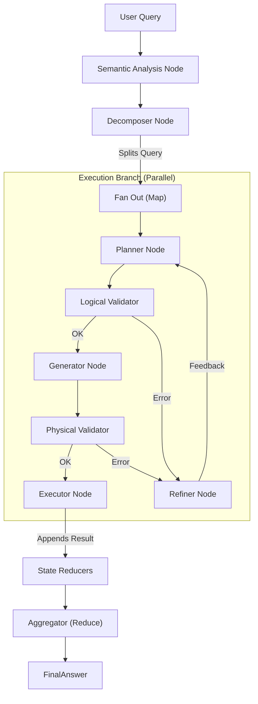

# NL2SQL System Architecture

This document provides a comprehensive technical overview of the NL2SQL system components, its pluggable adapter architecture, and the monorepo structure.

## 1. High-Level Architecture

The system operates on an **Semantic-Driven Map-Reduce** paradigm, now enhanced with a **modular plugin system** for database connectivity.



### Monorepo Structure

The codebase is organized into independently versioned packages:

| Package | Path | Responsibility |
| :--- | :--- | :--- |
| **nl2sql-core** | `packages/core` | The main orchestration engine, LangGraph nodes, CLI, and business logic. |
| **nl2sql-adapter-sdk** | `packages/adapter-sdk` | Defines the `DatasourceAdapter` interface and strictly typed Pydantic models (e.g., `Table`, `Scalar`). |
| **nl2sql-postgres** | `packages/adapters/postgres` | Implementation for PostgreSQL. |
| **nl2sql-mssql** | `packages/adapters/mssql` | Implementation for Microsoft SQL Server. |
| **nl2sql-mysql** | `packages/adapters/mysql` | Implementation for MySQL. |
| **nl2sql-sqlite** | `packages/adapters/sqlite` | Implementation for SQLite. |

---

## 2. Adapter Pattern (Database Connectivity)

Connectivity is decoupled from the Core engine. The Core knows *nothing* about specific SQL drivers.

### 2.1 The Contract (`nl2sql-adapter-sdk`)

Every adapter must implement the `DatasourceAdapter` interface:

```python
class DatasourceAdapter(ABC):
    @abstractmethod
    def capabilities(self) -> CapabilitySet: ...
    
    @abstractmethod
    def fetch_schema(self) -> SchemaMetadata: ...
    
    @abstractmethod
    def execute(self, sql: str) -> QueryResult: ...
    
    @abstractmethod
    def cost_estimate(self, sql: str) -> CostEstimate: ...
```

### 2.2 Discovery Mechanism

Adapters are discovered at runtime using Python's `importlib.metadata` entry points group `nl2sql.adapters`.

* **Registration**: Each adapter's `pyproject.toml` registers itself:

  ```toml
  [project.entry-points."nl2sql.adapters"]
  postgres = "nl2sql_postgres.adapter:PostgresAdapter"
  ```

* **Loading**: `DatasourceRegistry` in Core loads these entry points dynamically when a datasource profile requests a specific `type`.

---

## 3. Core Components (The Pipeline)

Each branch runs a dedicated LangGraph `StateMachine` inside `nl2sql-core`.

### 3.1 Nodes

| Node | Responsibility | Key Interactions |
| :--- | :--- | :--- |
| **SemanticAnalysisNode** | Canonicalizes query and extracts entities/synonyms. | Entry point. Enriches `state.semantic_analysis`. |
| **DecomposerNode** | Breaks down queries using Semantic Analysis and Vector Search. | Maps Names -> Table Objects. |
| **PlannerNode** | Hydrates schema context and creates a **Recursive AST Plan**. | Output: Nested `PlanModel` (AST). |
| **GeneratorNode** | Compiles AST to SQL using **Visitor Pattern**. | Deterministic compilation. |
| **PhysicalValidatorNode** | **Performance & Validity Check**. | Enforces Dry-Run (semantics) and Cost Estimation. |
| **ExecutorNode** | Executes SQL. | Calls `adapter.execute()` |
| **LogicalValidatorNode** | Static Analysis via **ValidatorVisitor**. | Checks validity via AST traversal. |
| **RefinerNode** | Analyzes validation errors. | Provides feedback loop to Planner. |

### 3.2 State Management

State is managed via `GraphState` (Pydantic), ensuring strictly typed context passing between nodes.

---

## 4. Observability

The system uses a "glass-box" callback system (`nl2sql.callbacks`) to provide visibility into the AI's decision-making.

* **PipelineMonitorCallback**: Traces execution.
* **TokenHandler**: Tracks LLM token usage/cost.
* **ConsolePresenter**: Renders rich UI in the CLI.

---

## 5. Validation & Guardrails

We employ a **Defense-in-Depth** strategy:

1. **Planner Constraints**: Prompt engineering ensures the LLM is aware of schema types.
2. **Validator Logic**: Checks column existence and types against the `SchemaMetadata` returned by the adapter.
3. **Adapter Capabilities**: The `GeneratorNode` respects `CapabilitySet` (e.g. `supports_limit_offset`), preventing generation of invalid SQL features for a given dialect.
