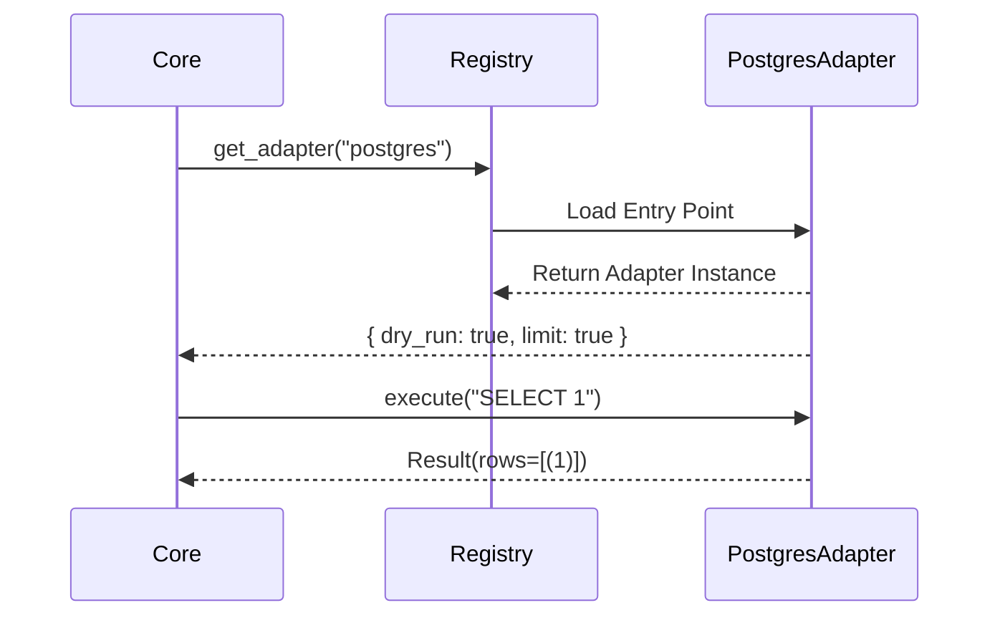

# Adapters (Plugins)

Connectivity is strictly decoupled from the Core engine. The Core knows *nothing* about specific SQL drivers, connection strings, or dialect quirks.

## The Architecture

We use Python's `importlib.metadata` entry points to discover and load adapters dynamically.



## The Interface

Every adapter adheres to the contract defined in `nl2sql-adapter-sdk`.

| Method | Purpose |
| :--- | :--- |

| `fetch_schema()` | Returns `SchemaMetadata` (Tables, Columns, Types). |
| `execute(sql)` | Runs the query and returns normalized `QueryResult`. |
| `cost_estimate(sql)` | Returns estimated rows/cost (optional). |

## Creating a New Adapter

1. Create a new python package (e.g. `nl2sql-oracle`).
2. Implement `DatasourceAdapter`.
3. Register the entry point in `pyproject.toml`:

```toml
[project.entry-points."nl2sql.adapters"]
oracle = "nl2sql_oracle.adapter:OracleAdapter"
```
