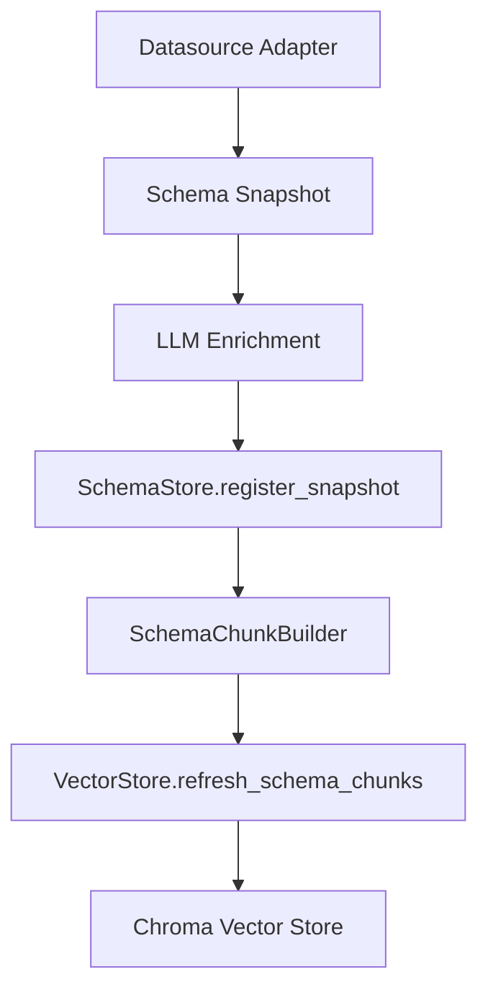

# Indexing, Chunking, and Retrieval Architecture

This document describes **current indexing behavior** as implemented in code. Indexing transforms **schema snapshots** into **typed chunks** that are embedded and stored in a Chroma vector store. Retrieval uses these chunks as candidates and then resolves authoritative schema details from `SchemaStore`.

## Indexing flow



## What is indexed today

Only schema-derived chunks are indexed. There is no symbolic index, behavioral index, or non-schema catalogs in the current implementation.

## Chunk types and contracts

Chunk types are defined in `nl2sql.indexing.models`:

- **DatasourceChunk** (`schema.datasource`): datasource description, domains, and example questions.
- **TableChunk** (`schema.table`): table name, PKs, column list, FK summaries, row counts.
- **ColumnChunk** (`schema.column`): column type, stats, synonyms, PII flags.
- **RelationshipChunk** (`schema.relationship`): FK relationships, columns, cardinality.
- **MetricChunk** (`schema.metric`): defined but **not emitted** by `SchemaChunkBuilder`.

Chunk models live in `nl2sql.indexing.models` and are Pydantic models. IDs are deterministic and include `schema_version`.

## Chunk → index mapping (actual)

All chunk types are embedded as `langchain_core.documents.Document` and stored in Chroma:

- `Document.page_content` = `chunk.get_page_content()`
- `Document.metadata` = `chunk.get_metadata()`

There is **one index** (Chroma collection) per `VectorStore` configuration.

## Chunking strategy (as implemented)

Chunking is aligned to planning intent:

- **Routing** uses datasource-level chunks.
- **Schema context** uses table/metric chunks.
- **Planning context** uses columns and relationships for specific tables.

If retrieval returns no candidates, the retriever falls back to full schema enumeration.

## Retrieval pipeline (staged, code-accurate)

```mermaid
flowchart TD
    SubQuery --> SemQuery[_build_semantic_query]
    SemQuery --> L1[retrieve_schema_context (tables/metrics)]
    L1 -->|no tables| L2[retrieve_column_candidates]
    L2 --> L3[retrieve_planning_context (columns/relationships)]
    L3 --> Snapshot[SchemaStore.get_snapshot]
    Snapshot --> Tables[relevant_tables for planner]
```

### Stages

1. **Schema context**: retrieves table/metric chunks.
2. **Column candidates**: fallback to column chunks when no table matches.
3. **Planning context**: retrieves columns/relationships for the selected tables.
4. **Authoritative resolution**: resolves tables/columns from `SchemaStore` snapshot.

## Authoritative vs semantic sources

- **Semantic candidates** come from Chroma (vector search over chunks).
- **Authoritative schema** is resolved from `SchemaStore` snapshots.
- Vector store content is **never** treated as authoritative.

## Metadata propagation

- `datasource_id` and `schema_version` are included in **all** chunk metadata.
- `TableChunk` includes `primary_key`, `columns`, `row_count`, and FK summaries.
- `ColumnChunk` includes `dtype`, `pii`, `description`, and stats when available.
- `RelationshipChunk` includes join column pairs and cardinality.

Metadata is consumed by `SchemaRetrieverNode` to construct `Table` objects for planning and by `LogicalValidatorNode` to validate joins and filters.

## Versioning and determinism

- Schema snapshots are fingerprinted and versioned (`YYYYMMDDhhmmss_<fp8>`).
- Chunk IDs embed `schema_version` for deterministic indexing.
- Retrieval uses the `SubQuery.schema_version` when available; otherwise latest snapshot.
- MMR ranking may introduce non-determinism in ordering for similar scores.

## Tenant isolation (current state)

Tenant scoping is **not implemented** in indexing:

- No `tenant_id` field exists in chunk metadata.
- Vector store queries do not filter by tenant.
- Schema store is global.

## Failure modes and fallbacks

Current failure behaviors:

- Vector store retrieval wrapped by `VECTOR_BREAKER`; failures fast‑fail.
- Vector retrieval errors in `SchemaRetrieverNode` return empty results with warnings.
- If no candidates are found, the retriever falls back to full schema snapshot.
- Enrichment failures return the original snapshot without enrichment.

## Performance characteristics (current)

- Embedding uses OpenAI embeddings via `EmbeddingService`.
- Vector search uses Chroma MMR (`lambda_mult=0.7`, `fetch_k = 4*k`).
- No caching or sharding layers are implemented.
- Index refresh is full reindex per schema snapshot.

## Observability hooks

- `VECTOR_BREAKER` logs breaker state changes.
- Indexing and retrieval log errors; no metrics are emitted in indexing code.

## Source references

- Chunk models: `packages/core/src/nl2sql/indexing/models.py`
- Chunk builder: `packages/core/src/nl2sql/indexing/chunk_builder.py`
- Vector store: `packages/core/src/nl2sql/indexing/vector_store.py`
- Schema retriever: `packages/core/src/nl2sql/pipeline/nodes/schema_retriever/node.py`
- Indexing orchestrator: `packages/core/src/nl2sql/indexing/orchestrator.py`
- Embeddings: `packages/core/src/nl2sql/indexing/embeddings.py`
