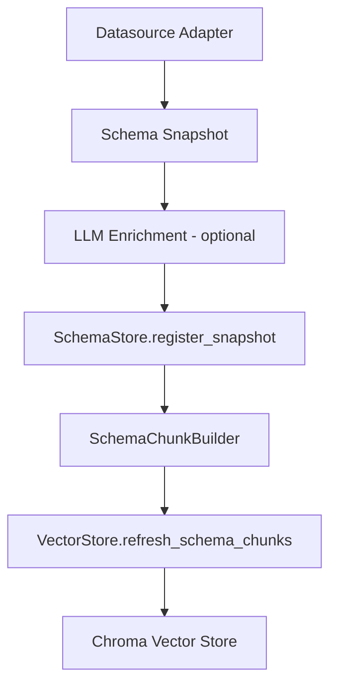
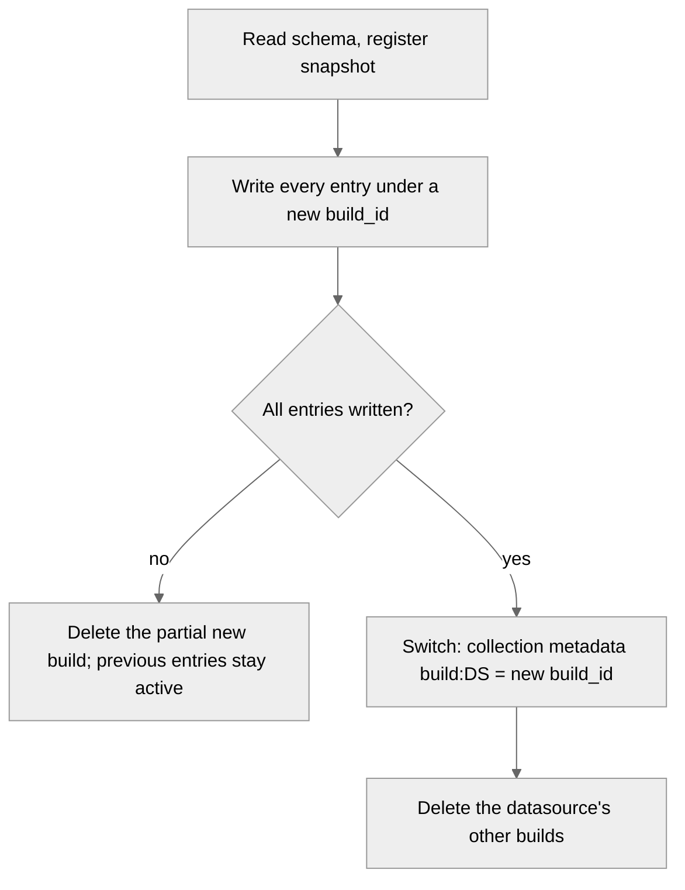

# Indexing, Chunking, and Retrieval Architecture

This document describes **current indexing behavior** as implemented in code. Indexing transforms **schema snapshots** into **typed chunks** that are embedded and stored in a Chroma vector store. Retrieval uses these chunks as candidates and then resolves authoritative schema details from `SchemaStore` (see `../schema/store.md` for schema contracts and store behavior).

## Indexing flow

```mermaid
flowchart TD
    Adapter[Datasource Adapter] --> Snapshot[Schema Snapshot]
    Snapshot --> Enrich[LLM Enrichment - optional]
    Enrich --> Register[SchemaStore.register_snapshot]
    Register --> Chunker[SchemaChunkBuilder]
    Chunker --> Refresh[VectorStore.refresh_schema_chunks]
    Refresh --> Store[Chroma Vector Store]
```

## What is indexed today

Only schema-derived chunks are indexed. There is no symbolic index, behavioral index, or non-schema catalogs in the current implementation.

## Chunk types and contracts

Chunk types are defined in `nl2sql.indexing.models`:

- **DatasourceChunk** (`schema.datasource`): datasource description, domains, and example questions. The description is the one in the datasources config (`description:`); it lives in the config rather than the database, so the orchestrator writes it into the snapshot's metadata, where it takes precedence over any description the adapter or enrichment produced. Example questions come from the `SAMPLE_QUESTIONS` file.
- **TableChunk** (`schema.table`): table name, PKs, column list, FK summaries, row counts.
- **ColumnChunk** (`schema.column`): column type, stats, synonyms, PII flags.
- **RelationshipChunk** (`schema.relationship`): FK relationships, columns, cardinality.
- **MetricChunk** (`schema.metric`): defined but **not emitted** by `SchemaChunkBuilder`.

Chunk models live in `nl2sql.indexing.models` and are Pydantic models. IDs are deterministic and include `schema_version`.

## Chunk → index mapping (actual)

All chunk types are embedded as `langchain_core.documents.Document` and stored in Chroma:

- `Document.page_content` = `chunk.get_page_content()`
- `Document.metadata` = `chunk.get_metadata()`

There is **one index** (Chroma collection) per `VectorStore` configuration, shared by
every datasource. Each entry also carries a `build_id` (see below); it is stripped
from retrieved documents, because the resolver prints a datasource entry's
metadata into the decomposer prompt.

## Rebuilding without an empty index

Re-indexing never deletes the collection first. Each datasource is rebuilt on its
own, inside the one collection (`VectorStore.refresh_schema_chunks`):

```mermaid
%%{init: {"theme": "neutral"}}%%
flowchart TD
    A[Read schema, register snapshot] --> B[Write every entry under a new build_id]
    B --> C{All entries written?}
    C -->|no| D[Delete the partial new build; previous entries stay active]
    C -->|yes| E[Switch: collection metadata build:DS = new build_id]
    E --> F[Delete the datasource's other builds]
```

- The collection's metadata names each datasource's **active build**
  (`build:<datasource_id>`) and when it was switched in (`built_at:<datasource_id>`).
  Every retrieval filters on the active builds, so while the old and new builds
  coexist a reader sees exactly one of them, never both and never a mix of schema
  versions. Entries written before builds existed have no `build_id` and are read
  as they are until their datasource is next re-indexed.
- **Other datasources are never read, deleted or rewritten** by a datasource's
  rebuild. `nl2sql index --datasource X` rebuilds only X; `nl2sql index` rebuilds
  each configured datasource in turn, and a failure keeps that datasource's
  previous entries active and exits `1`.
- Callers that serve questions can hold them back around the switch:
  `rebuild_index(..., switch_guard=...)`. The playground passes its `RunGate`, so
  questions in flight finish first.
- `nl2sql.indexing.rebuild.rebuild_index` is the one entry point for
  `nl2sql index`, the demo's startup repair and the playground's Rebuild.

### One embedding model per collection

A query is embedded once, in one space, so every datasource in a collection
must use the same embedding model. The collection records it
(`embedding_model`, e.g. `local/all-MiniLM-L6-v2`) on its first write. If the
configured model differs, retrieval and per-datasource re-indexing raise
`EmbeddingModelMismatchError`, which also catches two different models of the
same dimension that the dimension check cannot. A model change is the one case
that needs every datasource rebuilt at once: `nl2sql index --full` builds all of
them into a staging collection (`<name>__staging`) and swaps it in by renaming
only when all succeed; a failure discards the staging collection and leaves the
live one untouched. A collection written before models were recorded adopts the
configured model on its next write (the dimension check still applies).

## Index health

`nl2sql.indexing.health` judges an index by its **contents**, never by whether
its folder exists (the demo once had a `data/vector_store_demo` folder holding 0
entries). Only active builds are counted. Status, worst first: `missing` (no
folder or collection), `empty` (0 entries), `stale` (a configured datasource has
no entries, its entries were built from an older schema version than the latest
snapshot, or the configured embedding model differs), `ok`. It reports entry
counts by type, the schema version per datasource, when each was built and the
recorded embedding model. `nl2sql doctor` prints it under **Index**,
`nl2sql demo` rebuilds at startup when it is not `ok`, and the playground shows
it with a Rebuild button.

## Chunking strategy (as implemented)

Chunking is aligned to planning intent:

- **Routing** uses datasource-level chunks.
- **Schema context** uses table/metric chunks.
- **Planning context** uses columns and relationships for specific tables.

If retrieval returns no candidates, the retriever falls back to full schema enumeration.

## Retrieval pipeline (staged, code-accurate)

```mermaid
flowchart TD
    SubQuery --> SemQuery[_build_semantic_query]
    SemQuery --> L1[retrieve_schema_context (tables/metrics)]
    L1 -->|no tables| L2[retrieve_column_candidates]
    L2 --> L3[retrieve_planning_context (columns/relationships)]
    L3 --> Snapshot[SchemaStore.get_snapshot]
    Snapshot --> Tables[relevant_tables for planner]
```

### Stages

1. **Schema context**: retrieves table/metric chunks.
2. **Column candidates**: fallback to column chunks when no table matches.
3. **Planning context**: retrieves columns/relationships for the selected tables.
4. **Authoritative resolution**: resolves tables/columns from `SchemaStore` snapshot.

## Authoritative vs semantic sources

- **Semantic candidates** come from Chroma (vector search over chunks).
- **Authoritative schema** is resolved from `SchemaStore` snapshots.
- Vector store content is **never** treated as authoritative.

## Metadata propagation

- `datasource_id` and `schema_version` are included in **all** chunk metadata.
- `TableChunk` includes `primary_key`, `columns`, `row_count`, and FK summaries.
- `ColumnChunk` includes `dtype`, `pii`, `description`, and stats when available.
- `RelationshipChunk` includes join column pairs and cardinality.

Metadata is consumed by `SchemaRetrieverNode` to construct `Table` objects for planning and by `LogicalValidatorNode` to validate joins and filters.

## Versioning and determinism

- Schema snapshots are fingerprinted and versioned (`YYYYMMDDhhmmss_<fp8>`).
- Chunk IDs embed `schema_version` for deterministic indexing.
- Retrieval uses the `SubQuery.schema_version` when available; otherwise latest snapshot.
- MMR ranking may introduce non-determinism in ordering for similar scores.

## Tenant isolation (current state)

Tenant scoping is **not implemented** in indexing:

- No `tenant_id` field exists in chunk metadata.
- Vector store queries do not filter by tenant.
- Schema store is global.

## Failure modes and fallbacks

Current failure behaviors:

- Vector store retrieval wrapped by `VECTOR_BREAKER`; failures fast‑fail.
- Vector retrieval errors in `SchemaRetrieverNode` return empty results with warnings.
- If no candidates are found, the retriever falls back to full schema snapshot.
- Enrichment failures return the original snapshot without enrichment, and
  never fail indexing. `enrich_schema_snapshot` resolves its own LLM inside the
  guard, so a missing API key, an unreachable endpoint and a failed call all
  degrade the same way. A missing/unusable LLM logs at `INFO`; anything
  unexpected logs at `WARNING` with a stack trace.
- Retrieving from a vector store whose persisted vectors do not match the
  configured embedding provider raises `EmbeddingDimensionMismatchError`; a
  recorded embedding model that differs from the configured one raises
  `EmbeddingModelMismatchError`. Either is fixed with `nl2sql index --full`.
- When the resolver finds no datasource and the index is empty, its
  `SCHEMA_RETRIEVAL_FAILED` error says so and names `nl2sql index`, instead of
  "No datasource candidates resolved."
- A failed rebuild leaves the previous entries active (see above).

## Performance characteristics (current)

- Embedding uses `EmbeddingService`: OpenAI embeddings by default, or the local
  ONNX `all-MiniLM-L6-v2` model when `EMBEDDING_PROVIDER=local`.
- Vector search uses Chroma MMR (`lambda_mult=0.7`, `fetch_k = 4*k`).
- No caching or sharding layers are implemented.
- Index refresh re-embeds every entry of the datasource being re-indexed; other
  datasources are untouched.

## Observability hooks

- `VECTOR_BREAKER` logs breaker state changes.
- Indexing and retrieval log errors; no metrics are emitted in indexing code.

## Source references

- Chunk models: `packages/nl2sql/src/nl2sql/indexing/models.py`
- Chunk builder: `packages/nl2sql/src/nl2sql/indexing/chunk_builder.py`
- Vector store: `packages/nl2sql/src/nl2sql/indexing/vector_store.py`
- Schema retriever: `packages/nl2sql/src/nl2sql/pipeline/nodes/schema_retriever/node.py`
- Indexing orchestrator: `packages/nl2sql/src/nl2sql/indexing/orchestrator.py`
- Embeddings: `packages/nl2sql/src/nl2sql/indexing/embeddings.py`
