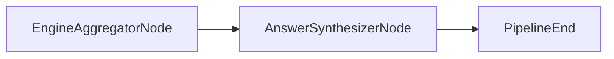

# AnswerSynthesizerNode

## Overview

- Summarizes aggregated results into a user‑facing response using an LLM.
- Exists to convert structured results into human‑readable output.
- Sits after `EngineAggregatorNode` at the end of the control graph.
- Class: `AnswerSynthesizerNode`
- Source: `packages/core/src/nl2sql/pipeline/nodes/answer_synthesizer/node.py`

---

## Responsibilities

- Serialize aggregated results for prompt input.
- Include unmapped sub‑queries in the response context.
- Invoke LLM with structured output schema.

---

## Position in Execution Graph

Upstream:
- `EngineAggregatorNode`

Downstream:
- Graph end.

Trigger conditions:
- Executed after aggregation completes.



---

## Inputs

From `GraphState`:

- `user_query` (required)
- `aggregator_response.terminal_results` (required)
- `decomposer_response.unmapped_subqueries` (optional)

Validation performed:

- If no aggregated result is available, emits `INVALID_STATE`.

---

## Outputs

Mutations to `GraphState`:

- `answer_synthesizer_response` (`AnswerSynthesizerResponse`)
- `reasoning` summary
- `errors` on failure

Side effects:

- LLM invocation.

---

## Internal Flow (Step-by-Step)

1. Resolve aggregated result from `aggregator_response`.
2. If missing, emit `INVALID_STATE` error and stop.
3. Serialize results to JSON.
4. Serialize unmapped sub‑queries to JSON.
5. Invoke LLM chain with structured output.
6. Return `AnswerSynthesizerResponse`.
7. On exception, emit `AGGREGATOR_FAILED`.

---

## Contracts & Interfaces

Implements a LangGraph node callable:

```
def __call__(self, state: GraphState) -> Dict[str, Any]
```

Key contracts:

- `AggregatedResponse`
- `AnswerSynthesizerResponse`

---

## Determinism Guarantees

- Non‑deterministic unless LLM configured deterministically.

---

## Error Handling

Emits `PipelineError` with:

- `INVALID_STATE` (no aggregated result)
- `AGGREGATOR_FAILED` (LLM failure)

Logs failures via `logger.error`.

---

## Retry + Idempotency

- No internal retry logic.
- Idempotency depends on LLM determinism.

---

## Performance Characteristics

- LLM call dominates latency and cost.
- Serialization of aggregated results is in‑memory.

---

## Observability

- Logger: `answer_synthesizer`
- Adds reasoning summary to state.

---

## Configuration

- LLM configuration for agent name `answer_synthesizer` via `llm.yaml`.

---

## Extension Points

- Modify `ANSWER_SYNTHESIZER_PROMPT`.
- Replace node in `build_graph()` for custom synthesis.

---

## Known Limitations

- No deterministic summarization guarantees without LLM configuration.
- No fallback response when LLM fails.

---

## Related Code

- `packages/core/src/nl2sql/pipeline/nodes/answer_synthesizer/node.py`
