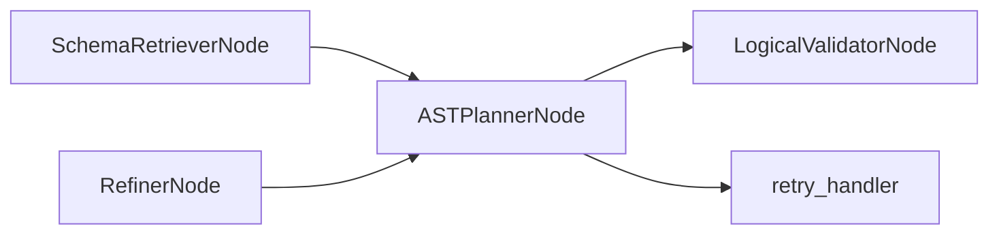

# ASTPlannerNode

## Overview

- Generates a structured SQL AST plan (`PlanModel`) using an LLM with structured output.
- Exists to translate natural language intent into a deterministic, machine‑verifiable plan.
- Sits after `SchemaRetrieverNode` in the SQL agent subgraph.
- Class: `ASTPlannerNode`
- Source: `packages/core/src/nl2sql/pipeline/nodes/ast_planner/node.py`

---

## Responsibilities

- Serialize `relevant_tables` into the planning prompt.
- Pass user intent, expected schema, and error feedback to the LLM.
- Return `ASTPlannerResponse` with the `PlanModel`.

---

## Position in Execution Graph

Upstream:
- `SchemaRetrieverNode`
- `RefinerNode` (retry loop)

Downstream:
- `LogicalValidatorNode` on success
- `retry_handler` on retryable failure

Trigger conditions:
- Executed after schema retrieval and during retry loops.



---

## Inputs

From `SubgraphExecutionState`:

- `sub_query.intent` (required)
- `sub_query.expected_schema` (optional)
- `relevant_tables` (required for schema grounding)
- `errors` (optional feedback for retries)

Validation performed:

- No explicit validation; relies on LLM structured output schema.

---

## Outputs

Mutations to `SubgraphExecutionState`:

- `ast_planner_response` (`ASTPlannerResponse`)
- `reasoning` with plan summary
- `errors` on planning failure

Side effects:

- LLM invocation via `llm_registry`.

---

## Internal Flow (Step-by-Step)

1. Serialize `relevant_tables` to JSON text.
2. Build feedback string from existing errors.
3. Build `expected_schema` payload from sub‑query.
4. Invoke the LLM chain with prompt + structured output (`PlanModel`).
5. Return `ASTPlannerResponse` with plan and reasoning.
6. On exception, emit `PLANNING_FAILURE` error and return `plan=None`.

---

## Contracts & Interfaces

Implements a LangGraph node callable:

```
def __call__(self, state: SubgraphExecutionState) -> Dict[str, Any]
```

Key contracts:

- `PlanModel`
- `ASTPlannerResponse`

---

## Determinism Guarantees

- Deterministic only if LLM is configured deterministically.
- Plan structure is validated downstream; ordering is not enforced here.

---

## Error Handling

Emits `PipelineError` with:

- `PLANNING_FAILURE` on LLM or parsing errors.

Logs failures via `logger.exception`.

---

## Retry + Idempotency

- Retries are orchestrated by the subgraph, not this node.
- Idempotency depends on LLM determinism.

---

## Performance Characteristics

- One LLM call per planning attempt.
- Cost is dominated by LLM latency and token usage.

---

## Observability

- Logger: `planner`
- Adds reasoning entries to subgraph state.

---

## Configuration

- LLM config under agent name `ast_planner` in `llm.yaml`.

---

## Extension Points

- Modify `PLANNER_PROMPT` and examples.
- Replace node in `build_sql_agent_graph()` to use alternate planning logic.

---

## Known Limitations

- No deterministic safeguards beyond structured output schema.
- No explicit timeout handling in the node itself.

---

## Related Code

- `packages/core/src/nl2sql/pipeline/nodes/ast_planner/node.py`
- `packages/core/src/nl2sql/pipeline/nodes/ast_planner/schemas.py`
