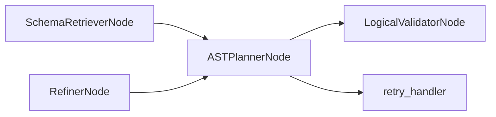

# ASTPlannerNode

## Overview

- Generates a structured SQL AST plan (`PlanModel`) using an LLM with structured output.
- Exists to translate natural language intent into a deterministic, machine‑verifiable plan.
- Sits after `SchemaRetrieverNode` in the SQL agent subgraph.
- Class: `ASTPlannerNode`
- Source: `packages/nl2sql/src/nl2sql/pipeline/nodes/ast_planner/node.py`

---

## Responsibilities

- Serve a pinned plan from the plan cache on a first attempt, without an LLM call.
- Serialize `relevant_tables` into the planning prompt.
- Pass user intent, expected schema, and error feedback to the LLM.
- Return `ASTPlannerResponse` with the `PlanModel` and its `plan_source` (`"llm"` or `"cache"`).

---

## Position in Execution Graph

Upstream:
- `SchemaRetrieverNode`
- `RefinerNode` (retry loop)

Downstream:
- `LogicalValidatorNode` on success
- `retry_handler` on retryable failure

Trigger conditions:
- Executed after schema retrieval and during retry loops.


```mermaid
flowchart LR
    SchemaRetriever[SchemaRetrieverNode] --> Planner[ASTPlannerNode] --> Validator[LogicalValidatorNode]
    Refiner[RefinerNode] --> Planner
    Planner --> RetryHandler[retry_handler]
```

---

## Inputs

From `SubgraphExecutionState`:

- `sub_query.intent` (required)
- `sub_query.expected_schema` (optional)
- `sub_query.metrics`, `filters`, `group_by`, `order_by`, `limit`: rendered by
  `semantic_context_of()` as compact JSON into `[SEMANTIC_CONTEXT]` (empty when
  the sub-query has none). The system message tells the model to apply all of
  it, filters on a metric as `having`, `order_by` as the plan's `order_by` and
  `limit` as the plan's `limit`, and that a most/least/top-N question needs an
  `order_by` on the ranked value and a `limit`; one example shows it.
- `relevant_tables` (required for schema grounding)
- `errors` (optional feedback for retries)

Validation performed:

- No explicit validation; relies on LLM structured output schema.

---

## Outputs

Mutations to `SubgraphExecutionState`:

- `ast_planner_response` (`ASTPlannerResponse`)
- `reasoning` with plan summary
- `errors` on planning failure

Side effects:

- LLM invocation via `llm_registry` (none on a plan cache hit).
- Reads the plan cache in the schema store. It never writes it: the sub-query
  wrapper stores a plan only after it validated and executed.

---

## Plan cache

The planner is the call that decides the SQL, so a plan that already passed
validation and executed is reused
([`pipeline/plan_cache.py`](https://github.com/nadeem4/nl2sql/blob/main/packages/nl2sql/src/nl2sql/pipeline/plan_cache.py)).

- **Key:** `(normalised sub_query.intent, sub_query.datasource_id, sub_query.schema_version)`.
  When the sub-query has an `order_by` or `limit`, they are appended to the
  intent part (`... | order_by=album_count desc | limit=1`), so a top-1 and a
  top-5 of the same intent are different entries while plain intents keep
  their existing keys.
  Normalisation case-folds, collapses whitespace and strips trailing `.?!,;:`;
  the match is exact. No `schema_version`, no caching.
- **Read:** only on a first attempt (`retry_count == 0` and no errors). A hit
  returns `ASTPlannerResponse(plan=<cached>, plan_source="cache")` and makes no
  LLM call; a retry after a rejected plan always asks the model.
- **Never trusted:** the logical validator, generator and executor run on a
  cached plan exactly as on a fresh one, so RBAC and policy changes apply.
- **Written** by `wrap_subgraph` (`pipeline/graph_utils.py`) only when the
  sub-query produced SQL and executed without a blocking error. Refused, failed
  and plan-only runs are not stored.
- **Controls:** `PLAN_CACHE_ENABLED` (default `true`) and `nl2sql cache clear`.

See [Determinism → The plan cache](../determinism.md#the-plan-cache-determinism-from-the-architecture).

---

## Internal Flow (Step-by-Step)

0. On a first attempt, look up the plan cache; on a hit, return the cached plan
   with `plan_source="cache"` and stop.
1. Render `relevant_tables` with `render_schema_for_prompt` (see below).
2. Build feedback string from existing errors (compact JSON).
3. Build `expected_schema` payload from sub‑query.
4. Invoke the LLM chain with prompt + structured output (`PlanModel`).
5. Return `ASTPlannerResponse` with plan and reasoning.
6. On exception, emit `PLANNING_FAILURE` error and return `plan=None`.

---

## Prompt layout and caching

The prompt is two messages, so providers can cache the stable part (OpenAI
caches a stable prefix of 1,024+ tokens automatically):

| Message | Content | Changes |
| --- | --- | --- |
| system (`PLANNER_SYSTEM_PROMPT`) | role, instructions, output contract, constraints, `PLANNER_EXAMPLES`, then `[RELEVANT_TABLES]` | only when the schema or the caller's role changes |
| human (`PLANNER_HUMAN_PROMPT`) | `[EXPECTED_SCHEMA]`, `[SEMANTIC_CONTEXT]`, `[FEEDBACK]`, `[USER_QUERY]` | every call |

The examples come before the schema so that the instructions and examples
(about 1,300 tokens) stay cacheable even when vector retrieval picks a
different set of tables per question. The system/human boundary is the single
cache seam: keep per-question content out of the system message.

The schema block (`render_schema_for_prompt` in
`schema_retriever/schema.py`) is one compact JSON object per table, tables
sorted by name and keys sorted, so the same snapshot and role render
byte-identically. It drops empty fields and `schema_version`. Of the column
statistics only `sample_values` is sent (it helps match literal filters such as
`'Rock'` or `'USA'`); `min_value`, `max_value`, `null_percentage` and
`distinct_count` stay in the snapshot.

Measured on Chinook with tiktoken `o200k_base`, its 12 demo questions, no LLM call
(`python scripts/measure_prompt_tokens.py`):

| | before | after |
| --- | --- | --- |
| planner prompt | 8,921 tokens | 3,495 tokens |
| schema block | 7,754 tokens | 2,324 tokens |
| prefix identical across questions | 8,122 tokens | 3,460 tokens |

---

## Contracts & Interfaces

Implements a LangGraph node callable:

```
def __call__(self, state: SubgraphExecutionState) -> Dict[str, Any]
```

Key contracts:

- `PlanModel`
- `ASTPlannerResponse`

DISTINCT in the plan language: `PlanModel.distinct: true` is `SELECT DISTINCT`,
and a `func` expr with `distinct: true` is a distinct aggregate such as
`COUNT(DISTINCT x)`. The system message's instructions and one of its examples
say so; a function named `DISTINCT` is rejected by the logical validator.

Dates in the plan language are two portable functions, described once in the
system message and the same for every database: `DATE_PART(unit, date)`, an
integer, and `DATE_TRUNC(unit, date)`, the period's first day as `YYYY-MM-DD`,
with the unit a string literal `year`, `quarter`, `month` or `day`. The prompt
names no database; each adapter renders the functions (see the generator).
Subqueries and window functions are not in the language; `offset` is accepted
but not rendered.

---

## Determinism Guarantees

- Deterministic only if LLM is configured deterministically.
- Plan structure is validated downstream; ordering is not enforced here.

---

## Error Handling

Emits `PipelineError` with:

- `PLANNING_FAILURE` on LLM or parsing errors.

Logs failures via `logger.exception`.

---

## Retry + Idempotency

- Retries are orchestrated by the subgraph, not this node.
- Idempotency depends on LLM determinism.

---

## Performance Characteristics

- One LLM call per planning attempt.
- Cost is dominated by LLM latency and token usage.

---

## Observability

- Logger: `planner`
- Adds reasoning entries to subgraph state.

---

## Configuration

- LLM config under agent name `ast_planner` in `llm.yaml`.

---

## Extension Points

- Modify `PLANNER_PROMPT` and examples.
- Replace node in `build_sql_agent_graph()` to use alternate planning logic.

---

## Known Limitations

- No deterministic safeguards beyond structured output schema.
- No explicit timeout handling in the node itself.

---

## Related Code

- `packages/nl2sql/src/nl2sql/pipeline/nodes/ast_planner/node.py`
- `packages/nl2sql/src/nl2sql/pipeline/nodes/ast_planner/schemas.py`
