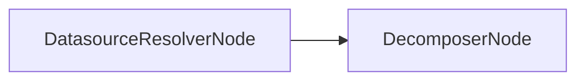

# DatasourceResolverNode

## Overview

- Resolves candidate datasources from the user query using vector search or an explicit datasource override.
- Enforces RBAC and schema version mismatch policy before planning.
- Sits at the entry of the control graph and gates the pipeline.
- Class: `DatasourceResolverNode`
- Source: `packages/core/src/nl2sql/pipeline/nodes/datasource_resolver/node.py`

---

## Responsibilities

- Resolve datasource candidates via `VectorStore.retrieve_datasource_candidates()`.
- Validate datasource IDs against the registered adapter list.
- Enforce RBAC datasource access.
- Detect schema version mismatches and apply configured policy.
- Populate `DatasourceResolverResponse` in `GraphState`.

---

## Position in Execution Graph

Upstream:
- Entry point (no upstream nodes).

Downstream:
- `DecomposerNode` if resolution succeeds.
- Terminates early if no allowed datasources.

Trigger conditions:
- Always executed as the control graph entry node.



---

## Inputs

From `GraphState`:

- `user_query` (str, required): used for vector retrieval when no override provided.
- `datasource_id` (Optional[str]): explicit override for datasource selection.
- `user_context` (`UserContext`, required): RBAC enforcement.

Context dependencies (`NL2SQLContext`):

- `vector_store` (optional): if missing, resolver returns empty response.
- `ds_registry`: adapter registry for supported IDs and capabilities.
- `schema_store`: used to look up latest schema versions.
- `rbac`: used to filter allowed datasources.

Validation performed:

- Datasource override must exist in registry.
- RBAC must allow datasource.
- Version mismatch policy enforced via `settings.schema_version_mismatch_policy`.

---

## Outputs

Mutations to `GraphState`:

- `datasource_resolver_response` (`DatasourceResolverResponse`)
- `errors` (list of `PipelineError`) on failure
- `reasoning` and `warnings` for diagnostics

Side effects:

- None beyond vector store retrieval and registry lookups.

---

## Internal Flow (Step-by-Step)

1. If `state.datasource_id` is set, validate that it exists in the registry.
2. If override is valid, check RBAC access; return error on violation.
3. If no override and `vector_store` is missing, return empty response with reasoning.
4. Retrieve datasource candidates with `VectorStore.retrieve_datasource_candidates()`.
5. Convert candidate documents into `ResolvedDatasource` entries.
6. Filter to allowed datasources using RBAC.
7. Apply schema version mismatch policy (`fail` or `warn`).
8. Return `DatasourceResolverResponse` with resolved, allowed, and unsupported IDs.
9. On exceptions, log and return `SCHEMA_RETRIEVAL_FAILED` error.

---

## Contracts & Interfaces

Implements a LangGraph node callable:

```
def __call__(self, state: GraphState) -> Dict[str, Any]
```

Key contracts:

- `DatasourceResolverResponse`
- `ResolvedDatasource`
- `PipelineError`

---

## Determinism Guarantees

- Deterministic for a fixed `datasource_id` override.
- Non-deterministic ranking may occur due to vector retrieval behavior.

---

## Error Handling

Emits `PipelineError` with:

- `INVALID_STATE` (missing/unknown datasource override)
- `SECURITY_VIOLATION` (RBAC denial)
- `SCHEMA_RETRIEVAL_FAILED` (no candidates or exceptions)

Exceptions are caught at the node boundary and logged with `logger.error`.

---

## Retry + Idempotency

- No internal retry logic.
- Idempotent for the same input state, except vector retrieval ranking may vary.

---

## Performance Characteristics

- External dependency on vector store retrieval (MMR search).
- RBAC checks are in-memory operations.
- Schema version lookups are store reads.

---

## Observability

- Logger: `datasource_resolver`
- Adds reasoning and warnings to `GraphState` for downstream diagnostics.
- Vector retrieval uses `VECTOR_BREAKER` at the vector store layer.

---

## Configuration

- `settings.schema_version_mismatch_policy` (`warn` or `fail`)

---

## Extension Points

- Replace this node in `build_graph()` to change resolution behavior.
- Extend retrieval by modifying the node or the vector store retrieval strategy.

---

## Known Limitations

- Vector store absence results in an empty resolver response (no fallback).
- Tenant scoping is not implemented in vector retrieval.
- Override path calls `_get_latest_schema_version`, which is not defined in this class (would raise if executed as-is).

---

## Related Code

- `packages/core/src/nl2sql/pipeline/nodes/datasource_resolver/node.py`
- `packages/core/src/nl2sql/pipeline/nodes/datasource_resolver/schemas.py`
