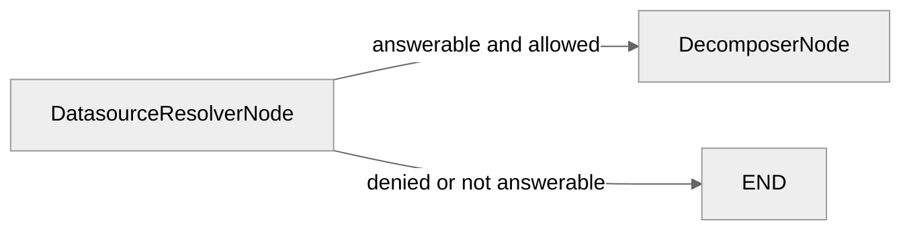

# DatasourceResolverNode

## Overview

- Picks the datasources a question goes to: an explicit override, the only registered datasource, or a vector search when more than one is registered.
- Enforces RBAC and the schema version mismatch policy before planning.
- Refuses a question no datasource can answer, with one small structured LLM call, before the decomposer runs.
- Sits at the entry of the control graph and gates the pipeline.
- Class: `DatasourceResolverNode`
- Source: `packages/nl2sql/src/nl2sql/pipeline/nodes/datasource_resolver/node.py`

---

## Responsibilities

- Choose candidate datasources:
    - an explicit `datasource_id` is used as given;
    - with exactly one datasource registered, that one is used and no vector search runs;
    - otherwise `VectorStore.retrieve_datasource_candidates()` ranks them.
- Validate datasource IDs against the registered adapter list.
- Enforce RBAC datasource access.
- Detect schema version mismatches and apply the configured policy.
- Judge answerability over the allowed candidates, and refuse with `QUESTION_NOT_ANSWERABLE` when none can answer.
- Populate `DatasourceResolverResponse` in `GraphState`.

---

## Position in Execution Graph

Upstream:
- Entry point (no upstream nodes).

Downstream:
- `DecomposerNode` if resolution succeeds.
- Terminates early (`END`) if no datasource is allowed, or the question is not answerable.

Trigger conditions:
- Always executed as the control graph entry node.


```mermaid
%%{init: {"theme": "neutral"}}%%
flowchart LR
    Resolver[DatasourceResolverNode] -->|answerable and allowed| Decomposer[DecomposerNode]
    Resolver -->|denied or not answerable| EndNode[END]
```

---

## Inputs

From `GraphState`:

- `user_query` (str, required): the question; used for vector retrieval (more than one datasource) and for the answerability check.
- `datasource_id` (Optional[str]): explicit override for datasource selection.
- `user_context` (`UserContext`, required): RBAC enforcement.

Context dependencies (`NL2SQLContext`):

- `vector_store`: needed only when more than one datasource is registered and no override is given; missing then, the resolver returns `SCHEMA_RETRIEVAL_FAILED`.
- `ds_registry`: adapter registry for registered IDs.
- `schema_store`: latest schema versions, and the latest snapshot's description and table list for the answerability check.
- `rbac`: filters allowed datasources.
- `llm_registry`: the answerability check's model, agent name `datasourceresolver` (falls back to `default`).

Validation performed:

- Datasource override must exist in the registry.
- RBAC must allow at least one candidate.
- Version mismatch policy enforced via `settings.schema_version_mismatch_policy`.
- At least one allowed candidate must be judged able to answer.

---

## Outputs

Mutations to `GraphState`:

- `datasource_resolver_response` (`DatasourceResolverResponse`)
- `errors` (list of `PipelineError`) on failure
- `reasoning` (how the candidates were chosen, and the answerability reason) and `warnings`

Side effects:

- One LLM call (the answerability check) once the role check passes.
- A vector store retrieval when more than one datasource is registered and no override is given.

---

## Internal Flow (Step-by-Step)

1. Candidates:
    - `state.datasource_id` set: it must be registered (`INVALID_STATE` otherwise); it is the only candidate.
    - Exactly one datasource registered: it is the only candidate; no vector search.
    - Otherwise: the vector store must exist (`SCHEMA_RETRIEVAL_FAILED` otherwise); `retrieve_datasource_candidates(k=5)` gives the candidates, and none is `SCHEMA_RETRIEVAL_FAILED` (with a re-index hint when the index is empty).
2. Role check: candidates the role may not read are dropped. None left is a `CRITICAL` `SECURITY_VIOLATION`, and no model call is made.
3. Schema version mismatch policy (`fail` returns `INVALID_STATE`; `warn` adds a warning).
4. Answerability check over the **allowed** candidates only (see below). An empty verdict returns `QUESTION_NOT_ANSWERABLE`.
5. Return `DatasourceResolverResponse` with resolved, allowed and unsupported IDs.
6. On exceptions (including a failed model call), log and return `SCHEMA_RETRIEVAL_FAILED` with the exception text.

A single registered datasource is the shortcut, not the usual case: with more
than one - the demo registers three - the vector search runs, and nothing else
in the flow changes.

### Order of checks

The role check runs before the answerability check, so:

- a caller with no allowed datasource gets the RBAC refusal and the model is never asked;
- the model sees only datasources the role may read;
- a question that is answerable but touches tables the role may not read passes this node and is refused by `LogicalValidatorNode`'s table policy, as before.

### Answerability check

A structured call (`AnswerabilityResponse`: `answerable_datasource_ids`, `reason`) with this prompt (`datasource_resolver/prompts.py`). The system message:

```text
You check whether a question can be answered from the datasources below, before any SQL is planned. For each datasource you see its description and the tables it holds, not its data.

Rules:
1. List the id of every datasource that could hold data relevant to the question, even partly. A question that needs several datasources lists all of them.
2. Be conservative. When you are unsure, treat the question as answerable and list the datasources that might answer it. Refusing a question that could have been answered is worse than running one that finds nothing.
3. Return an empty list only when the question is clearly about something none of these datasources hold, such as the weather, general knowledge, or small talk.
4. Use only ids from the list below.
5. Give the reason in one short sentence.

Datasources (JSON):
{datasources}
```

The human message:

```text
User Query:
{user_query}
```

- `{datasources}` is a JSON list, one entry per allowed candidate, sorted by id, with sorted keys: `description` (the datasource description from the latest schema snapshot, which indexing takes from the datasources config) and `tables` (sorted bare table names).
- The instructions and datasources come first (the system message) and the question last (the human message), so the prompt is byte-identical across questions up to the question and a provider's prompt cache can serve the prefix. OpenAI caches only prompts of 1,024 tokens or more, so with one small datasource nothing is cached; the prefix grows, and becomes cacheable, with more datasources.
- The verdict is used only to refuse: a non-empty list lets every allowed candidate through to the decomposer unchanged.
- For Chinook on its own the rendered prompt is about 260 tokens (`o200k_base`), plus the `AnswerabilityResponse` function schema; the demo now registers three datasources, so its prompt is correspondingly longer.

---

## Contracts & Interfaces

Implements a LangGraph node callable:

```
def __call__(self, state: GraphState) -> Dict[str, Any]
```

Key contracts:

- `DatasourceResolverResponse`
- `ResolvedDatasource`
- `AnswerabilityResponse`
- `PipelineError`

---

## Determinism Guarantees

- Candidate choice is deterministic for an override or a single datasource.
- Vector ranking may vary with more than one datasource.
- The answerability prompt is serialized deterministically; the verdict is a model call at the configured temperature and seed.

---

## Error Handling

Emits `PipelineError` with:

- `INVALID_STATE` (unknown datasource override; schema version mismatch under `fail`)
- `SECURITY_VIOLATION` (RBAC denial)
- `QUESTION_NOT_ANSWERABLE` (`ERROR`: no allowed datasource can answer the question; `QueryResult.status` is `error`)
- `SCHEMA_RETRIEVAL_FAILED` (no candidates, no vector store with several datasources, or exceptions)

Exceptions are caught at the node boundary and logged with `logger.error`.

---

## Retry + Idempotency

- No internal retry logic.
- Idempotent for the same input state, except vector retrieval ranking and the model's verdict may vary.

---

## Performance Characteristics

- One small LLM call per question once the role check passes; it saves the decomposer, planner and synthesizer calls on every unanswerable question.
- A vector store retrieval (MMR search) only with more than one datasource.
- RBAC checks are in-memory operations; schema lookups are store reads.

---

## Observability

- Logger: `datasource_resolver`
- The answerability call is recorded like every LLM call: usage under node `datasource_resolver` in `QueryResult.usage`, and in the run trace keyed by node, sub-query, attempt and call.
- Vector retrieval uses `VECTOR_BREAKER` at the vector store layer.
- Returns a `retrieval` record in its update for the run trace: the query
  embedded and the datasource search's pool with scores, MMR picks and drops;
  or `skipped: true` and why (an explicit `datasource_id`, a single registered
  datasource, no vector store). The answerability check is not part of it: it
  is an LLM call and is traced as one.
  See [Debugging a run](../../observability/debugging.md#retrieval).

---

## Configuration

- `settings.schema_version_mismatch_policy` (`warn` or `fail`)
- LLM agent `datasourceresolver` in the LLM config (optional; see [LLM configuration](../../configuration/llm.md#per-node-models))

---

## Extension Points

- Replace this node in `build_graph()` to change resolution behavior.
- Extend retrieval by modifying the node or the vector store retrieval strategy.

---

## Known Limitations

- Tenant scoping is not implemented in vector retrieval.
- The answerability check sees table names, not columns or data, so it refuses only questions clearly outside every datasource.

---

## Related Code

- `packages/nl2sql/src/nl2sql/pipeline/nodes/datasource_resolver/node.py`
- `packages/nl2sql/src/nl2sql/pipeline/nodes/datasource_resolver/prompts.py`
- `packages/nl2sql/src/nl2sql/pipeline/nodes/datasource_resolver/schemas.py`
