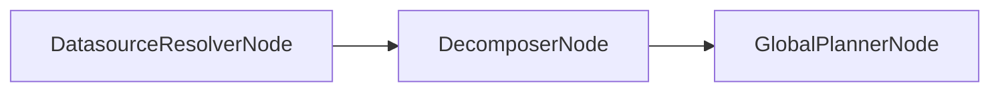

# DecomposerNode

## Overview

- Decomposes the user query into datasource‑scoped sub‑queries and combination operations.
- Produces deterministic IDs for sub‑queries and post‑combine ops.
- Sits after `DatasourceResolverNode` and before `GlobalPlannerNode`.
- Class: `DecomposerNode`
- Source: `packages/core/src/nl2sql/pipeline/nodes/decomposer/node.py`

---

## Responsibilities

- Invoke the LLM to produce `DecomposerResponse`.
- Filter sub‑queries by resolved/allowed/unsupported datasources.
- Stabilize IDs using a hash of sub‑query content.
- Normalize and sort combine groups and post‑combine operations.

---

## Position in Execution Graph

Upstream:
- `DatasourceResolverNode`

Downstream:
- `GlobalPlannerNode`

Trigger conditions:
- Executed only when `resolver_route` returns `continue`.



---

## Inputs

From `GraphState`:

- `user_query` (str, required)
- `datasource_resolver_response` (`DatasourceResolverResponse`, required)

Validation performed:

- Raises if no resolved datasources are available.
- Filters out sub‑queries that reference missing, restricted, or unsupported datasources.

---

## Outputs

Mutations to `GraphState`:

- `decomposer_response` (`DecomposerResponse`)
- `reasoning` (completion status)
- `errors` on failure

Side effects:

- None beyond LLM invocation.

---

## Internal Flow (Step-by-Step)

1. Validate resolver response; raise if no resolved datasources.
2. Build `resolved_payload` and `schema_version_map`.
3. Invoke LLM chain with `user_query` and resolved datasources.
4. For each LLM sub‑query:
   - Validate datasource existence and RBAC allowance.
   - Assign deterministic ID via `_stable_id()`.
   - Attach schema version.
5. Remap combine groups to stable sub‑query IDs.
6. Assign deterministic IDs to post‑combine ops.
7. Sort sub‑queries, combine groups, and post‑combine ops.
8. Return `DecomposerResponse`.
9. On exception, emit `ORCHESTRATOR_CRASH` error.

---

## Contracts & Interfaces

Implements a LangGraph node callable:

```
def __call__(self, state: GraphState) -> Dict[str, Any]
```

Key contracts:

- `DecomposerResponse`
- `SubQuery`
- `UnmappedSubQuery`
- `PostCombineOp`

---

## Determinism Guarantees

- Stable IDs are generated via SHA‑256 hash of sub‑query content.
- Ordering of outputs is explicitly sorted.
- LLM output is non‑deterministic unless configured deterministically.

---

## Error Handling

Emits `PipelineError` with:

- `ORCHESTRATOR_CRASH` on exceptions.

Logs failures via `logger.error`.

---

## Retry + Idempotency

- No internal retry logic.
- Idempotent for fixed LLM output; otherwise LLM variability can change output.

---

## Performance Characteristics

- One LLM call per pipeline execution.
- Hashing and sorting are in‑memory and low cost.

---

## Observability

- Logger: `decomposer`
- Adds a reasoning entry on completion or failure.

---

## Configuration

- LLM configuration for agent name `decomposer` via `llm.yaml`.

---

## Extension Points

- Modify `DECOMPOSER_PROMPT` for different decomposition strategies.
- Replace or wrap node in `build_graph()` for custom behavior.

---

## Known Limitations

- No fallback when LLM fails.
- Output quality depends on LLM configuration and prompt.

---

## Related Code

- `packages/core/src/nl2sql/pipeline/nodes/decomposer/node.py`
- `packages/core/src/nl2sql/pipeline/nodes/decomposer/schemas.py`
