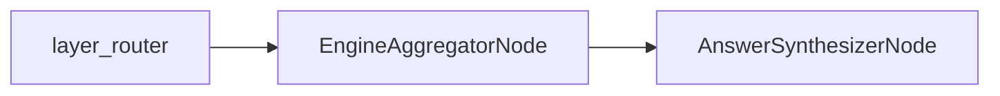

# EngineAggregatorNode

## Overview

- Executes the `ExecutionDAG` over persisted artifacts using the aggregation engine.
- Exists to combine scan results deterministically into final result sets.
- Sits after `layer_router` and before `AnswerSynthesizerNode`.
- Class: `EngineAggregatorNode`
- Source: `packages/core/src/nl2sql/pipeline/nodes/aggregator/node.py`

---

## Responsibilities

- Load scan artifacts from `artifact_refs`.
- Execute combine and post‑operation nodes in DAG order.
- Produce `AggregatorResponse` with terminal results.

---

## Position in Execution Graph

Upstream:
- `layer_router` (after all scan artifacts are available)

Downstream:
- `AnswerSynthesizerNode`

Trigger conditions:
- Router dispatches to aggregator when no pending scan nodes remain.



---

## Inputs

From `GraphState`:

- `global_planner_response.execution_dag` (required)
- `artifact_refs` (required)

Validation performed:

- None in node; aggregation service raises on missing artifacts.

---

## Outputs

Mutations to `GraphState`:

- `aggregator_response` (`AggregatorResponse`)
- `reasoning` and `errors`

Side effects:

- Reads artifacts from artifact store.

---

## Internal Flow (Step-by-Step)

1. Read `execution_dag` and `artifact_refs`.
2. Invoke `AggregationService.execute(dag, artifact_refs)`.
3. Build `AggregatorResponse` with `terminal_results`.
4. Return success reasoning.
5. On exception, emit `AGGREGATOR_FAILED`.

---

## Contracts & Interfaces

Implements a LangGraph node callable:

```
def __call__(self, state: GraphState) -> Dict[str, Any]
```

Key contracts:

- `AggregatorResponse`
- `ExecutionDAG`

---

## Determinism Guarantees

- Deterministic for a fixed DAG and artifact inputs.
- Aggregation order follows DAG layers and ordered inputs.

---

## Error Handling

Emits `PipelineError` with:

- `AGGREGATOR_FAILED`

Logs failures via `logger.error`.

---

## Retry + Idempotency

- No internal retry logic.
- Idempotent for a fixed DAG and artifacts.

---

## Performance Characteristics

- Reads Parquet artifacts and executes joins/aggregations in Polars/DuckDB.
- Cost grows with artifact size and DAG complexity.

---

## Observability

- Logger: `aggregator`
- Adds reasoning entries for success and failure.

---

## Configuration

- Uses `PolarsDuckdbEngine`; no direct settings consumed by the node.

---

## Extension Points

- Replace aggregation engine by modifying node to use a different `AggregationService`.
- Replace node in `build_graph()` for alternate aggregation behavior.

---

## Known Limitations

- Fails if required artifacts are missing.
- No streaming or partial aggregation.

---

## Related Code

- `packages/core/src/nl2sql/pipeline/nodes/aggregator/node.py`
- `packages/core/src/nl2sql/aggregation/aggregator.py`
