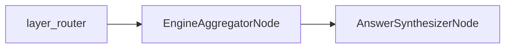

# EngineAggregatorNode

## Overview

- Executes the `ExecutionDAG` over persisted artifacts using the aggregation engine.
- Exists to combine scan results deterministically into final result sets.
- Sits after `layer_router` and before `AnswerSynthesizerNode`.
- Class: `EngineAggregatorNode`
- Source: `packages/nl2sql/src/nl2sql/pipeline/nodes/aggregator/node.py`

---

## Responsibilities

- Load scan artifacts from `artifact_refs`.
- Execute combine and post‑operation nodes in DAG order.
- Produce `AggregatorResponse` with terminal results.

---

## Position in Execution Graph

Upstream:
- `layer_router` (after all scan artifacts are available)

Downstream:
- `AnswerSynthesizerNode`

Trigger conditions:
- Router dispatches to aggregator when no pending scan nodes remain.


```mermaid
flowchart LR
    Router[layer_router] --> Aggregator[EngineAggregatorNode] --> Synth[AnswerSynthesizerNode]
```

---

## Inputs

From `GraphState`:

- `global_planner_response.execution_dag` (required)
- `artifact_refs` (required)

Validation performed:

- None in node; aggregation service raises on missing artifacts.

---

## Outputs

Mutations to `GraphState`:

- `aggregator_response` (`AggregatorResponse`)
- `reasoning` and `errors`

Side effects:

- Reads artifacts from artifact store.

---

## Internal Flow (Step-by-Step)

1. Read `execution_dag` and `artifact_refs`.
2. Invoke `AggregationService.execute(dag, artifact_refs)`.
   - A `join`/`compare` combine resolves each join key against its frame's columns. A key written with a side or sub-query prefix (`right.customer`, `sq_2.customer`) resolves to the bare column when only that exists; an unknown key is left for polars to report.
   - A post-combine op (`PolarsDuckdbEngine.post_op`) applies every field it carries, in SQL's order: the reshaping its `operation` names (`aggregate` groups with polars' `group_by`, `project` selects `expected_schema`), then its `filters` (after an aggregate they filter the aggregated rows, as HAVING does), its `order_by`, and its `limit`. A `filter` op with `order_by` and `limit`, as the decomposer's prompt used to show, keeps all three.
   - Before polars is asked for any column, a post-combine op's attributes (`group_by`, `metrics`, `project`'s `expected_schema`, `filters`, `order_by`) are checked against the combined frame. An attribute the frame does not have is refused with the columns it does have, and a side-qualified one (`right.customer`) with the reason — see *No anti-join* below.
3. Build `AggregatorResponse` with `terminal_results`.
4. Return success reasoning.
5. On exception, emit `AGGREGATOR_FAILED`.

### No anti-join: what "bought X but never Y" does here

`CombineGroup.operation` is one of `standalone`, `compare`, `join` and `union`.
`join` and `compare` are both **inner** joins (`how="inner"` in
`PolarsDuckdbEngine.combine`), and `FilterSpec` has no null or existence
operator, so there is **no way to express "present on the left and absent on
the right"**. This is a capability gap in the plan language, not a bug in the
engine.

Asked "Which customers bought jazz tracks but never rock?", the model
decomposes it into the two sets and then reaches for a right-hand column to
negate against — `right.customer`. That column does not exist: an inner join
keyed on the shared column drops the right-hand copy, and the other right-hand
columns are suffixed `_right`. Every tier 2 run has failed this question, and
what reached the caller was polars' own `unable to find column
"right.customer"; valid columns: ["customer"]`.

Resolving the prefix away would be worse. `right.customer` would become
`customer`, the filter would run against the **intersection**, and the answer
would be the customers who bought *both* genres — wrong, and silently so. So
the attribute check refuses the question and says why:

```
Aggregator failed: Post-combine operation references 'right.customer', which
the combined result does not have. Available columns: customer. A column
qualified by side does not survive the combine: ... it cannot be expressed:
the plan language has no anti-join or set-difference operation ... so the
question is refused rather than answered with the intersection.
```

The same gap has a second shape: the decomposer sometimes emits the two
sub-queries **uncombined**, and `AggregationService.execute` then returns two
terminal result sets, which the run reports as "expected one result set, got 2"
(`2026-09-22_27cad30`). Both are the same missing operation.

Closing it properly means adding an anti-join (or `except`) to
`CombineGroup.operation`, the decomposer prompt, the DAG and the engine. That
is a feature, not a fix, and is deliberately not done here.

---

## Contracts & Interfaces

Implements a LangGraph node callable:

```
def __call__(self, state: GraphState) -> Dict[str, Any]
```

Key contracts:

- `AggregatorResponse`
- `ExecutionDAG`

---

## Determinism Guarantees

- Deterministic for a fixed DAG and artifact inputs.
- Aggregation order follows DAG layers and ordered inputs.

---

## Error Handling

Emits `PipelineError` with:

- `AGGREGATOR_FAILED`

Logs failures via `logger.error`.

---

## Retry + Idempotency

- No internal retry logic.
- Idempotent for a fixed DAG and artifacts.

---

## Performance Characteristics

- Reads Parquet artifacts and executes joins/aggregations in Polars/DuckDB.
- Cost grows with artifact size and DAG complexity.

---

## Observability

- Logger: `aggregator`
- Adds reasoning entries for success and failure.

---

## Configuration

- Uses `PolarsDuckdbEngine`; no direct settings consumed by the node.

---

## Extension Points

- Replace aggregation engine by modifying node to use a different `AggregationService`.
- Replace node in `build_graph()` for alternate aggregation behavior.

---

## Known Limitations

- Fails if required artifacts are missing.
- No streaming or partial aggregation.
- Several post-combine ops on one combine group are siblings, not a chain: each reads the combine's output and is its own terminal result.

---

## Related Code

- `packages/nl2sql/src/nl2sql/pipeline/nodes/aggregator/node.py`
- `packages/nl2sql/src/nl2sql/aggregation/aggregator.py`
