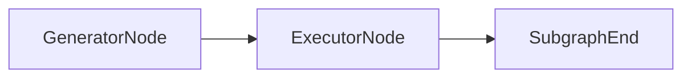

# ExecutorNode

## Overview

- Delegates SQL execution to an executor service based on datasource capabilities.
- Persists results via the artifact store and returns `ExecutorResponse`.
- Sits after `GeneratorNode` in the SQL agent subgraph.
- Class: `ExecutorNode`
- Source: `packages/core/src/nl2sql/pipeline/nodes/executor/node.py`

---

## Responsibilities

- Validate required execution inputs (SQL and datasource ID).
- Resolve executor via `ExecutorRegistry`.
- Build and submit `ExecutorRequest`.
- Return executor response and propagate errors.

---

## Position in Execution Graph

Upstream:
- `GeneratorNode`

Downstream:
- Subgraph end (artifacts returned to control graph).

Trigger conditions:
- Executed when SQL generation succeeds.



---

## Inputs

From `SubgraphExecutionState`:

- `generator_response.sql_draft` (required)
- `sub_query.datasource_id` (required)
- `sub_query.schema_version` (optional)
- `trace_id`, `subgraph_name`, `user_context`

From `NL2SQLContext`:

- `ds_registry`
- `tenant_id`

Validation performed:

- Missing SQL → `MISSING_SQL`
- Missing datasource ID → `MISSING_DATASOURCE_ID`
- No executor for datasource → `INVALID_STATE`

---

## Outputs

Mutations to `SubgraphExecutionState`:

- `executor_response` (`ExecutorResponse`)
- `errors` and `reasoning`

Side effects:

- Executes SQL against datasource via executor service.
- Persists results to artifact store.

---

## Internal Flow (Step-by-Step)

1. Validate SQL and datasource ID.
2. Resolve executor via `ExecutorRegistry`.
3. Build `ExecutorRequest` with trace/subgraph identifiers and schema version.
4. Execute request and return `ExecutorResponse`.
5. On exception, emit `EXECUTOR_CRASH`.

---

## Contracts & Interfaces

Implements a LangGraph node callable:

```
def __call__(self, state: SubgraphExecutionState) -> Dict[str, Any]
```

Key contracts:

- `ExecutorRequest`
- `ExecutorResponse`

---

## Determinism Guarantees

- Deterministic request construction.
- Execution results depend on external datasource state and are not deterministic.

---

## Error Handling

Emits `PipelineError` with:

- `MISSING_SQL`
- `MISSING_DATASOURCE_ID`
- `INVALID_STATE`
- `EXECUTOR_CRASH`

---

## Retry + Idempotency

- No internal retry logic.
- Idempotency depends on datasource and query semantics.

---

## Performance Characteristics

- External I/O dominates (database execution).
- Artifact persistence writes Parquet results.

---

## Observability

- Logger: `executor`
- Propagates executor response reasoning and errors.

---

## Configuration

- `tenant_id` from settings.
- Executor selection based on adapter capabilities.

---

## Extension Points

- Register new executors in `ExecutorRegistry`.
- Replace node in `build_sql_agent_graph()` to alter execution behavior.

---

## Known Limitations

- Executes in‑process by default (sandbox not used in SQL executor).
- No built‑in retries on transient execution failures.

---

## Related Code

- `packages/core/src/nl2sql/pipeline/nodes/executor/node.py`
- `packages/core/src/nl2sql/execution/executor/sql_executor.py`
