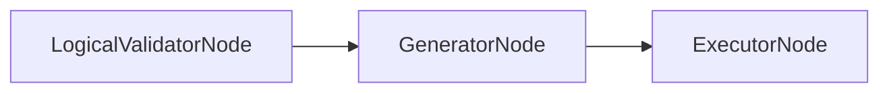

# GeneratorNode

## Overview

- Converts the AST plan into SQL using `sqlglot`.
- Enforces adapter row limits and dialect selection.
- Sits between `LogicalValidatorNode` and `ExecutorNode`.
- Class: `GeneratorNode`
- Source: `packages/core/src/nl2sql/pipeline/nodes/generator/node.py`

---

## Responsibilities

- Convert `PlanModel` expressions into `sqlglot` expressions.
- Build a SQL query with ordered selects, joins, filters, groupings, and limits.
- Apply adapter dialect and row limit.

---

## Position in Execution Graph

Upstream:
- `LogicalValidatorNode`

Downstream:
- `ExecutorNode`

Trigger conditions:
- Executed when logical validation passes.



---

## Inputs

From `SubgraphExecutionState`:

- `ast_planner_response.plan` (required)
- `sub_query.datasource_id` (required)

From `NL2SQLContext`:

- `ds_registry` (adapter dialect and row limits)

Validation performed:

- Raises if datasource ID or plan is missing.

---

## Outputs

Mutations to `SubgraphExecutionState`:

- `generator_response` (`GeneratorResponse` with `sql_draft`)
- `reasoning`
- `errors` on failure

Side effects:

- Adapter registry access for dialect/limits.

---

## Internal Flow (Step-by-Step)

1. Validate presence of datasource ID and plan.
2. Resolve adapter and dialect.
3. Compute effective limit from plan/adapter row limit.
4. Traverse AST with `SqlVisitor` to build `sqlglot` expression tree.
5. Render SQL with `query.sql(dialect=...)`.
6. Return `GeneratorResponse` with SQL and reasoning.
7. On exception, emit `SQL_GEN_FAILED`.

---

## Contracts & Interfaces

Implements a LangGraph node callable:

```
def __call__(self, state: SubgraphExecutionState) -> Dict[str, Any]
```

Key contracts:

- `GeneratorResponse`
- `PlanModel` / `Expr`

---

## Determinism Guarantees

- Deterministic for a fixed AST and adapter dialect.
- Ordering is enforced via ordinals and sorted lists.

---

## Error Handling

Emits `PipelineError` with:

- `SQL_GEN_FAILED`

Logs exceptions via `logger.exception`.

---

## Retry + Idempotency

- No internal retry logic.
- Idempotent for a fixed plan.

---

## Performance Characteristics

- In‑memory AST traversal and SQL rendering.
- Cost grows with AST size.

---

## Observability

- Logger: `generator`
- Adds reasoning entries with the generated SQL.

---

## Configuration

- Adapter `row_limit` and `dialect` from datasource config.

---

## Extension Points

- Extend `SqlVisitor` for new expression kinds.
- Replace node in `build_sql_agent_graph()` for alternate generation strategies.

---

## Known Limitations

- No SQL optimization beyond AST structure.
- No dialect fallback if adapter misconfigured.

---

## Related Code

- `packages/core/src/nl2sql/pipeline/nodes/generator/node.py`
