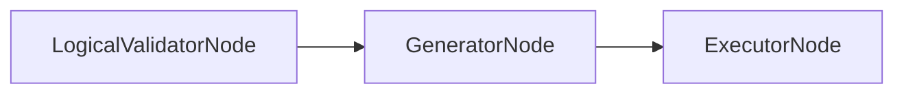

# GeneratorNode

## Overview

- Converts the AST plan into SQL using `sqlglot`.
- Enforces adapter row limits and dialect selection.
- Sits between `LogicalValidatorNode` and `ExecutorNode`.
- Class: `GeneratorNode`
- Source: `packages/nl2sql/src/nl2sql/pipeline/nodes/generator/node.py`

---

## Responsibilities

- Convert `PlanModel` expressions into `sqlglot` expressions.
- Build a SQL query with ordered selects, joins, filters, groupings, and limits.
- Apply adapter dialect and row limit.

---

## Position in Execution Graph

Upstream:
- `LogicalValidatorNode`

Downstream:
- `ExecutorNode`

Trigger conditions:
- Executed when logical validation passes.


```mermaid
flowchart LR
    Validator[LogicalValidatorNode] --> Generator[GeneratorNode] --> Executor[ExecutorNode]
```

---

## Inputs

From `SubgraphExecutionState`:

- `ast_planner_response.plan` (required)
- `sub_query.datasource_id` (required)

From `NL2SQLContext`:

- `ds_registry` (adapter dialect and row limits)

Validation performed:

- Raises if datasource ID or plan is missing.

---

## Outputs

Mutations to `SubgraphExecutionState`:

- `generator_response` (`GeneratorResponse` with `sql_draft`)
- `reasoning`
- `errors` on failure

Side effects:

- Adapter registry access for dialect/limits.

---

## Internal Flow (Step-by-Step)

1. Validate presence of datasource ID and plan.
2. Resolve adapter and dialect.
3. Compute effective limit from plan/adapter row limit.
4. Traverse AST with `SqlVisitor` to build `sqlglot` expression tree.
   - Every operator becomes the node sqlglot's parser would build (`+` -> `exp.Add`, `*` -> `exp.Mul`, `IS NOT` -> `NOT ... IS ...`, and so on), wherever it is nested. An operator with no mapping raises; it is never rendered as a function named after the operator.
   - An operand that is itself an operator is parenthesised, because sqlglot prints a hand-built tree without adding the parentheses its parser would have seen (`(a + b) * c` would otherwise print as `a + b * c`).
   - `/` is sqlglot's true division, so on SQLite it renders as `CAST(a AS REAL) / b` rather than integer division.
5. Attach joins. The first table by ordinal is the `FROM` table. `left_alias`/`right_alias` do not say which table is new: each join attaches whichever side is not yet in scope, taking the lowest-ordinal join that touches a table already in scope, so joins may be listed in any order. When the new table is the join's left side, `left`/`right` outer joins are mirrored so the same table is preserved. Joined tables keep their `schema_name`/`database` qualifiers.
6. Render SQL with `query.sql(dialect=...)`.
7. Return `GeneratorResponse` with SQL and reasoning.
8. On exception, emit `SQL_GEN_FAILED`.

---

## Contracts & Interfaces

Implements a LangGraph node callable:

```
def __call__(self, state: SubgraphExecutionState) -> Dict[str, Any]
```

Key contracts:

- `GeneratorResponse`
- `PlanModel` / `Expr`

---

## Determinism Guarantees

- Deterministic for a fixed AST and adapter dialect.
- Ordering is enforced via ordinals and sorted lists.

---

## Error Handling

Emits `PipelineError` with:

- `SQL_GEN_FAILED`

A malformed join graph is a planning error, not something to guess around. `SQL_GEN_FAILED` is raised when a join names an undeclared alias, when a join connects two tables that are both already in scope, when a join cannot be reached from the `FROM` table, or when a declared table is never joined.

Logs exceptions via `logger.exception`.

---

## Retry + Idempotency

- No internal retry logic.
- Idempotent for a fixed plan.

---

## Performance Characteristics

- In‑memory AST traversal and SQL rendering.
- Cost grows with AST size.

---

## Observability

- Logger: `generator`
- Adds reasoning entries with the generated SQL.

---

## Configuration

- Adapter `row_limit` and `dialect` from datasource config.

---

## Extension Points

- Extend `SqlVisitor` for new expression kinds.
- Replace node in `build_sql_agent_graph()` for alternate generation strategies.

---

## Known Limitations

- No SQL optimization beyond AST structure.
- `PlanModel.distinct` and `PlanModel.offset` are not rendered.
- No dialect fallback if adapter misconfigured.

---

## Related Code

- `packages/nl2sql/src/nl2sql/pipeline/nodes/generator/node.py`
