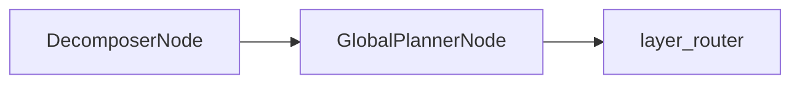

# GlobalPlannerNode

## Overview

- Builds a deterministic `ExecutionDAG` from decomposer output.
- Creates scan, combine, and post‑combine nodes with explicit edges.
- Sits between `DecomposerNode` and `layer_router`.
- Class: `GlobalPlannerNode`
- Source: `packages/core/src/nl2sql/pipeline/nodes/global_planner/node.py`

---

## Responsibilities

- Translate `SubQuery` objects into `scan` nodes.
- Construct `combine` nodes for join/union/compare groups.
- Construct `post_*` nodes for filter/aggregate/project/sort/limit operations.
- Create edges between nodes and validate references.
- Compute deterministic `ExecutionDAG` ordering, content hash, and dag_id.

---

## Position in Execution Graph

Upstream:
- `DecomposerNode`

Downstream:
- `layer_router`

Trigger conditions:
- Always executed after successful decomposition.



---

## Inputs

From `GraphState`:

- `decomposer_response.sub_queries`
- `decomposer_response.combine_groups`
- `decomposer_response.post_combine_ops`

Validation performed:

- Validates edges reference existing node IDs.
- Fails if post‑combine ops reference unknown combine groups.

---

## Outputs

Mutations to `GraphState`:

- `global_planner_response` (`GlobalPlannerResponse` with `ExecutionDAG`)
- `reasoning` on success
- `errors` on failure

Side effects:

- None beyond in‑memory DAG construction.

---

## Internal Flow (Step-by-Step)

1. Extract `sub_queries`, `combine_groups`, `post_combine_ops`.
2. For each sub‑query, build a `scan` `LogicalNode` with `RelationSchema` from expected schema.
3. For each combine group, create a `combine` node and edges from inputs.
4. For each post‑combine op, create a `post_*` node and edge from its target combine.
5. Validate that all edges reference known nodes.
6. Build `ExecutionDAG` with sorted nodes/edges.
7. Compute `content_hash` and `dag_id`.
8. Return `GlobalPlannerResponse`.
9. On exception, emit `PLANNER_FAILED` error.

---

## Contracts & Interfaces

Implements a LangGraph node callable:

```
def __call__(self, state: GraphState) -> Dict[str, Any]
```

Key contracts:

- `ExecutionDAG`
- `LogicalNode`, `LogicalEdge`
- `RelationSchema`, `ColumnSpec`
- `GlobalPlannerResponse`

---

## Determinism Guarantees

- Nodes and edges are sorted before DAG creation.
- `ExecutionDAG._layered_toposort()` produces stable layer ordering.
- `content_hash` is a deterministic hash of nodes/edges/version.

---

## Error Handling

Emits `PipelineError` with:

- `PLANNER_FAILED` on exceptions

Logs failures via `logger.error`.

---

## Retry + Idempotency

- No internal retry logic.
- Deterministic for a given decomposer response.

---

## Performance Characteristics

- Pure in‑memory graph construction and hashing.
- Complexity scales with number of sub‑queries and combine ops.

---

## Observability

- Logger: `global_planner`
- Adds a reasoning entry on success or failure.

---

## Configuration

- No direct settings read in this node.

---

## Extension Points

- Extend DAG semantics by modifying `kind_map` and `attributes` mapping.
- Replace node in `build_graph()` for custom DAG construction.

---

## Known Limitations

- Assumes `expected_schema` is present to build `RelationSchema`.
- No schema validation at DAG construction time.
- No support for custom node kinds without code changes.

---

## Related Code

- `packages/core/src/nl2sql/pipeline/nodes/global_planner/node.py`
- `packages/core/src/nl2sql/pipeline/nodes/global_planner/schemas.py`
