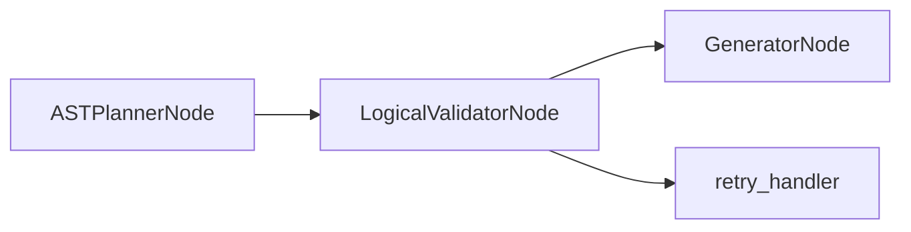

# LogicalValidatorNode

## Overview

- Validates the AST plan (`PlanModel`) against schema and RBAC policies.
- Exists to enforce correctness and security before SQL generation.
- Sits between `ASTPlannerNode` and `GeneratorNode` in the SQL agent subgraph.
- Class: `LogicalValidatorNode`
- Source: `packages/core/src/nl2sql/pipeline/nodes/validator/node.py`

---

## Responsibilities

- Validate query type (READ‑only).
- Validate ordinals, aliases, joins, and column references.
- Enforce RBAC table access using strict datasource namespacing.
- Validate literal values against column stats (when available).

---

## Position in Execution Graph

Upstream:
- `ASTPlannerNode`

Downstream:
- `GeneratorNode` on success
- `retry_handler` on retryable errors

Trigger conditions:
- Executed when an AST plan is present.



---

## Inputs

From `SubgraphExecutionState`:

- `ast_planner_response.plan` (required)
- `relevant_tables` (required)
- `user_context` (required for RBAC)
- `sub_query.datasource_id` (required for namespacing)
- `sub_query.expected_schema` (optional validation)

Validation performed:

- Query type must be `READ`.
- Ordinals must be contiguous.
- Aliases must be unique.
- Joins must match known relationships.
- Column references must exist and be unambiguous.

---

## Outputs

Mutations to `SubgraphExecutionState`:

- `logical_validator_response` (`LogicalValidatorResponse`)
- `errors` and `reasoning`

Side effects:

- None beyond in‑memory validation.

---

## Internal Flow (Step-by-Step)

1. If plan is missing, emit `MISSING_PLAN` and stop.
2. Run `_validate_static()` for structural checks.
3. Run `_validate_policy()` for RBAC enforcement.
4. If any errors are `ERROR`/`CRITICAL`, return with errors.
5. Otherwise return success reasoning.
6. On exception, emit `VALIDATOR_CRASH`.

---

## Contracts & Interfaces

Implements a LangGraph node callable:

```
def __call__(self, state: SubgraphExecutionState) -> Dict[str, Any]
```

Key contracts:

- `LogicalValidatorResponse`
- `PipelineError`

---

## Determinism Guarantees

- Deterministic for a fixed plan and schema snapshot.
- No randomness in validation logic.

---

## Error Handling

Emits `PipelineError` with:

- `MISSING_PLAN`
- `INVALID_PLAN_STRUCTURE`
- `SECURITY_VIOLATION`
- `TABLE_NOT_FOUND`, `COLUMN_NOT_FOUND`
- `JOIN_TABLE_NOT_IN_PLAN`
- `VALIDATOR_CRASH`

---

## Retry + Idempotency

- No internal retry logic.
- Retry decisions are made by the subgraph router based on error severity.

---

## Performance Characteristics

- In‑memory validation over AST and schema context.
- Complexity grows with AST size and number of tables/joins.

---

## Observability

- Logger: `logical_validator`
- Emits reasoning entries and logs debug traces.

---

## Configuration

- `settings.logical_validator_strict_columns` controls severity of missing column errors.

---

## Extension Points

- Extend validation rules by modifying `_validate_static()` or `_validate_policy()`.
- Replace node in `build_sql_agent_graph()` for custom validation.

---

## Known Limitations

- Validation relies on retrieved schema context; missing tables can cause false negatives.
- No cross‑schema disambiguation beyond plan inputs.

---

## Related Code

- `packages/core/src/nl2sql/pipeline/nodes/validator/node.py`
