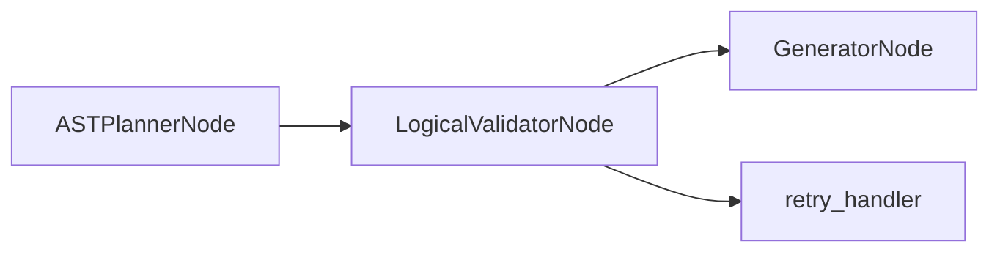

# LogicalValidatorNode

## Overview

- Validates the AST plan (`PlanModel`) against schema and RBAC policies.
- Exists to enforce correctness and security before SQL generation.
- Sits between `ASTPlannerNode` and `GeneratorNode` in the SQL agent subgraph.
- Class: `LogicalValidatorNode`
- Source: `packages/nl2sql/src/nl2sql/pipeline/nodes/validator/node.py`

---

## Responsibilities

- Validate ordinals, aliases, joins, and column references.
- Enforce RBAC table access using strict datasource namespacing.

Literal filter values are **not** validated against a column's sampled values.
The adapter records at most five sample values per text column, which is a
retrieval hint, not the column's domain; treating it as an allowlist rejected
correct filters on any higher-cardinality column. Safety comes from the RBAC
table allowlist and from schema resolution, neither of which depends on stats.

Column resolution is delegated to `sqlglot`'s optimizer. The node converts the
plan into a throw‑away `sqlglot` expression tree (reusing the generator's
`SqlVisitor`) and runs `sqlglot.optimizer.qualify.qualify()` against a schema
built from `relevant_tables`. The LLM contract is unchanged: the planner still
emits a `PlanModel`, never SQL.

---

## Position in Execution Graph

Upstream:
- `ASTPlannerNode`

Downstream:
- `GeneratorNode` on success
- `retry_handler` on retryable errors

Trigger conditions:
- Executed when an AST plan is present.


```mermaid
flowchart LR
    Planner[ASTPlannerNode] --> Validator[LogicalValidatorNode] --> Generator[GeneratorNode]
    Validator --> RetryHandler[retry_handler]
```

---

## Inputs

From `SubgraphExecutionState`:

- `ast_planner_response.plan` (required)
- `relevant_tables` (required)
- `user_context` (required for RBAC)
- `sub_query.datasource_id` (required for namespacing)
- `sub_query.expected_schema` (optional validation)

Validation performed:

- Ordinals must be contiguous.
- Aliases must be unique.
- Joins must match known relationships.
- Column references must exist and be unambiguous.

---

## Outputs

Mutations to `SubgraphExecutionState`:

- `logical_validator_response` (`LogicalValidatorResponse`, carrying `errors`,
  `reasoning` and `checks`)
- `errors` and `reasoning`

`checks` is a `List[ValidationCheck]` (`name`, `passed`, `message`) recording what
was validated, not only what failed. The names are fixed and always in this order:

| name | meaning |
| --- | --- |
| `plan_present` | A plan reached the validator. The only check emitted when it did not. |
| `structure_and_schema` | Tables, columns and joins resolve against the retrieved schema. |
| `policy` | Every table in the plan is allowed for the caller's role. |

On failure the check's `message` is the first corresponding error's message.

Side effects:

- None beyond in‑memory validation.

---

## Internal Flow (Step-by-Step)

1. If plan is missing, emit `MISSING_PLAN` and stop.
2. Run `_validate_static()` for structural checks:
   - `_resolve_plan_tables()` maps each plan alias to its schema columns and
     emits `TABLE_NOT_FOUND` for unknown tables. This stays hand-written
     because `qualify()` silently ignores relations absent from its schema.
   - `_distinct_function()` rejects a `func` expr named `DISTINCT` with
     `INVALID_PLAN_STRUCTURE`: `COUNT(DISTINCT x)` is `distinct: true` on the
     COUNT expr, and `SELECT DISTINCT` is `PlanModel.distinct`.
   - `_unsupported_functions()` rejects every other `func` name that is not a
     plain identifier (`^[A-Za-z_][A-Za-z0-9_]*$`) naming a function in
     `ast_planner.functions.ALLOWED_FUNCTIONS` (read-only aggregates and
     scalar functions, any case), with `UNSUPPORTED_FUNCTION` at `ERROR`
     severity, so the refiner retries with the list in the message.
     `func_name` becomes the function's name in the SQL, so this is what keeps
     model text such as `SELECT 1); DELETE FROM T; --` out of it.
   - `_date_operations()` rejects a date function whose unit is not `year`,
     `quarter`, `month` or `day`, or whose shape is not `(unit literal, date)`,
     with `INVALID_PLAN_STRUCTURE`; the message states the portable forms.
   - `_validate_columns()` builds the plan's `sqlglot` tree and runs
     `qualify(..., validate_qualify_columns=True)`. On failure each distinct
     column reference is re-probed so every bad reference is reported, and
     `_describe_column_failure()` rewrites the optimizer's SQL-oriented text
     into plan-oriented feedback the refiner can act on. ORDER BY terms are
     wrapped in `exp.Ordered` first (`generator.node.ordered()`): sqlglot only
     wraps an argument it has to *parse*, and a bare function node in
     `Order.expressions` makes `qualify()` raise.
3. Run `_validate_policy()` for RBAC enforcement. This always runs, even when
   static validation failed or raised — the security check is never skipped.
   Each forbidden table yields a `CRITICAL` `SECURITY_VIOLATION` whose message
   is "You do not have permission to see the data this question requires."
   (it names nothing), with `details` = `{datasource_id, table, roles}` for the
   trace, and a warning log line. `RBAC_REFUSAL_NAMES_TABLES=true` puts the role
   and table in the message instead. An unknown role, or no role, allows no
   table and is refused the same way. The decision reads only the policy and
   the plan's table list, never the model's reasoning.
4. If any errors are `ERROR`/`CRITICAL`, return with errors.
5. Otherwise return success reasoning.
6. On exception, emit `VALIDATOR_CRASH`.

---

## Contracts & Interfaces

Implements a LangGraph node callable:

```
def __call__(self, state: SubgraphExecutionState) -> Dict[str, Any]
```

Key contracts:

- `LogicalValidatorResponse`
- `ValidationCheck`
- `PipelineError`

---

## Determinism Guarantees

- Deterministic for a fixed plan and schema snapshot.
- No randomness in validation logic.

---

## Error Handling

Emits `PipelineError` with:

- `MISSING_PLAN`
- `INVALID_PLAN_STRUCTURE`
- `UNSUPPORTED_FUNCTION`
- `SECURITY_VIOLATION`
- `TABLE_NOT_FOUND`, `COLUMN_NOT_FOUND`
- `JOIN_TABLE_NOT_IN_PLAN`
- `VALIDATOR_CRASH`

---

## Retry + Idempotency

- No internal retry logic.
- Retry decisions are made by the subgraph router based on error severity.

---

## Performance Characteristics

- In‑memory validation over AST and schema context.
- Complexity grows with AST size and number of tables/joins.

---

## Observability

- Logger: `logical_validator`
- Emits reasoning entries and logs debug traces.

---

## Configuration

- `settings.logical_validator_strict_columns` controls severity of missing column errors.

---

## Extension Points

- Extend validation rules by modifying `_validate_static()` or `_validate_policy()`.
- Column-resolution semantics follow `sqlglot`'s optimizer; changing them means
  changing the schema handed to `qualify()`, not walking the AST by hand.
- Replace node in `build_sql_agent_graph()` for custom validation.

---

## Known Limitations

- Validation relies on retrieved schema context; missing tables can cause false negatives.
- No cross‑schema disambiguation beyond plan inputs.

---

## Related Code

- `packages/nl2sql/src/nl2sql/pipeline/nodes/validator/node.py`
- `packages/nl2sql/src/nl2sql/pipeline/nodes/generator/node.py` (`SqlVisitor`, reused to build the validation tree)
