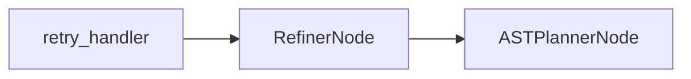

# RefinerNode

## Overview

- Generates corrective feedback for planning failures using an LLM.
- Exists to improve planner outputs in retry loops.
- Sits between `retry_handler` and `ASTPlannerNode` in the SQL agent subgraph.
- Class: `RefinerNode`
- Source: `packages/core/src/nl2sql/pipeline/nodes/refiner/node.py`

---

## Responsibilities

- Summarize planning errors and reasoning context.
- Invoke LLM to generate feedback.
- Emit `PLAN_FEEDBACK` warnings to drive retry.

---

## Position in Execution Graph

Upstream:
- `retry_handler`

Downstream:
- `ASTPlannerNode`

Trigger conditions:
- Executed when retry handler routes to refinement.



---

## Inputs

From `SubgraphExecutionState`:

- `errors`
- `reasoning`
- `relevant_tables`
- `ast_planner_response.plan` (optional)
- `sub_query.intent`

Validation performed:

- If no LLM configured, emits `MISSING_LLM`.

---

## Outputs

Mutations to `SubgraphExecutionState`:

- `refiner_response` (`RefinerResponse`)
- `errors` (includes `PLAN_FEEDBACK` warning)
- `reasoning`

Side effects:

- LLM invocation.

---

## Internal Flow (Step-by-Step)

1. If no LLM configured, emit `MISSING_LLM` and stop.
2. Serialize relevant tables and failed plan.
3. Build error and reasoning strings.
4. Invoke LLM with refinement prompt.
5. Emit `PLAN_FEEDBACK` warning and return `RefinerResponse`.
6. On exception, emit `REFINER_FAILED`.

---

## Contracts & Interfaces

Implements a LangGraph node callable:

```
def __call__(self, state: SubgraphExecutionState) -> Dict[str, Any]
```

Key contracts:

- `RefinerResponse`
- `PipelineError` (`PLAN_FEEDBACK`, `MISSING_LLM`, `REFINER_FAILED`)

---

## Determinism Guarantees

- Non‑deterministic unless LLM configured deterministically.

---

## Error Handling

Emits `PipelineError` with:

- `MISSING_LLM`
- `PLAN_FEEDBACK` (warning)
- `REFINER_FAILED`

Logs failures via `logger.error`.

---

## Retry + Idempotency

- No internal retry logic.
- Idempotency depends on LLM determinism.

---

## Performance Characteristics

- LLM call dominates latency.
- Serialization of inputs is in‑memory.

---

## Observability

- Logger: `refiner`
- Adds reasoning entries with feedback content.

---

## Configuration

- LLM configuration for agent name `refiner` via `llm.yaml`.

---

## Extension Points

- Modify `REFINER_PROMPT` for different refinement behavior.
- Replace node in `build_sql_agent_graph()` for alternate retry strategies.

---

## Known Limitations

- No fallback if LLM unavailable.
- Feedback quality depends on LLM and prompt.

---

## Related Code

- `packages/core/src/nl2sql/pipeline/nodes/refiner/node.py`
