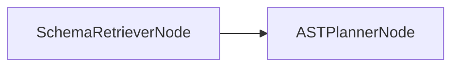

# SchemaRetrieverNode

## Overview

- Retrieves schema context for a sub‑query using staged vector search and authoritative snapshots.
- Exists to constrain planning to relevant tables/columns while remaining schema‑grounded.
- Sits at the entry of the SQL agent subgraph.
- Class: `SchemaRetrieverNode`
- Source: `packages/core/src/nl2sql/pipeline/nodes/schema_retriever/node.py`

---

## Responsibilities

- Build a semantic query from sub‑query intent, filters, group_by, expected_schema, metrics.
- Retrieve candidate tables/columns/relationships from `VectorStore`.
- Resolve authoritative tables from `SchemaStore`.
- Fall back to full schema snapshot when retrieval returns no candidates.

---

## Position in Execution Graph

Upstream:
- SQL agent subgraph entry.

Downstream:
- `ASTPlannerNode`

Trigger conditions:
- Always executed as the subgraph entry node.



---

## Inputs

From `SubgraphExecutionState`:

- `sub_query` (required): includes intent, filters, group_by, expected_schema, metrics, schema_version.

From `NL2SQLContext`:

- `vector_store` (optional)
- `schema_store` (required for authoritative resolution)

Validation performed:

- If `sub_query` missing, returns empty `relevant_tables`.
- If no candidates from vector store, falls back to full snapshot.

---

## Outputs

Mutations to `SubgraphExecutionState`:

- `relevant_tables` (list of `Table`)
- `reasoning` and `warnings` in fallback paths

Side effects:

- Vector store queries.
- Schema store reads.

---

## Internal Flow (Step-by-Step)

1. Build semantic query with `_build_semantic_query()`.
2. Retrieve table/metric chunks via `retrieve_schema_context()`.
3. If no table chunks, retrieve columns via `retrieve_column_candidates()`.
4. If tables are identified, retrieve columns/relationships via `retrieve_planning_context()`.
5. Resolve schema snapshot via `_resolve_snapshot()`.
6. Build `Table` objects with `_build_tables_from_snapshot()`.
7. If no tables were found, return full snapshot with warning.
8. On exception, log error and return empty `relevant_tables`.

---

## Contracts & Interfaces

Implements a LangGraph node callable:

```
def __call__(self, state: SubgraphExecutionState) -> Dict[str, Any]
```

Key contracts:

- `Table` / `Column` (node schema)
- `SchemaSnapshot` (authoritative source)

---

## Determinism Guarantees

- Deterministic snapshot resolution for a fixed `schema_version`.
- Vector retrieval ranking may be non‑deterministic (MMR).

---

## Error Handling

- Exceptions are caught and logged via `logger.error`.
- Returns empty `relevant_tables` with error reasoning; no `PipelineError` is emitted.

---

## Retry + Idempotency

- No internal retry logic.
- Idempotent for fixed vector retrieval output; vector ranking may vary.

---

## Performance Characteristics

- Depends on vector store retrieval latency and schema store reads.
- In‑memory processing of candidates and snapshot tables.

---

## Observability

- Logger: `schema_retriever`
- Emits reasoning and warnings on fallback paths.

---

## Configuration

- No direct settings used in this node.
- Vector store configuration is set in `NL2SQLContext`.

---

## Extension Points

- Modify semantic query construction to include additional signals.
- Replace node in `build_sql_agent_graph()` for alternative retrieval strategies.

---

## Known Limitations

- No tenant scoping in vector retrieval.
- No caching of retrieved tables across retries.
- Fallback to full schema can be expensive for large schemas.

---

## Related Code

- `packages/core/src/nl2sql/pipeline/nodes/schema_retriever/node.py`
- `packages/core/src/nl2sql/indexing/vector_store.py`
