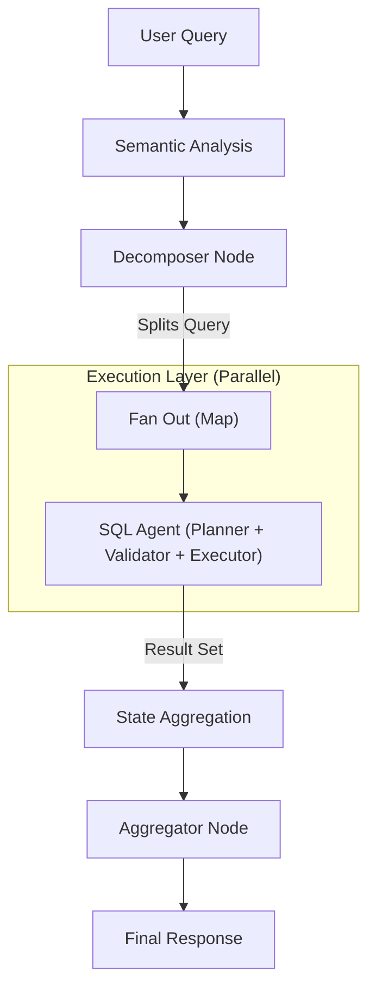

# System Overview

The **NL2SQL Platform** is a modular, agentic system designed to convert natural language questions into accurate, authorized SQL queries across multiple database engines.

## Core Philosophy

The system is built on three pillars:

1. **Agentic Workflow**: Instead of a "one-shot" generation, we use a multi-step **SQL Agent** that plans, validates, and refines queries.
2. **Map-Reduce Routing**: Complex queries are decomposed and routed to the most relevant datasources (Map), then executed in parallel, and finally aggregated (Reduce).
3. **Plugin Architecture**: The core engine is database-agnostic. Connectivity is handled by "Adapters" (Plugins) that strictly implement the `nl2sql-adapter-sdk`.

## High-Level Architecture

The system follows a directed graph execution flow, orchestrating several specialized AI Agents.

### 1. Semantic Analysis & Decomposition

The entry point. It understands the user's intent ("Compare sales in US and EU") and identifies which datasources contain the relevant data. If necessary, it splits the query into sub-questions (e.g., "Get US sales", "Get EU sales").

### 2. The SQL Agent

For *each* relevant datasource, a dedicated **SQL Agent** is spawned. This is where the core logic lives. It iteratively plans a query, validates it against security policies, generates SQL, and verifies execution feasibility.

[Read more about the SQL Agent](./sql_agent.md).

### 3. Aggregation (Reduce)

Once all agents complete their work, the **Aggregator Node** synthesizes the results. It can perform cross-database operations (like calculating the difference between the two sub-queries) and formats the final answer for the user.
