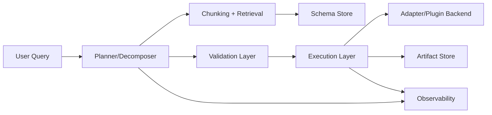
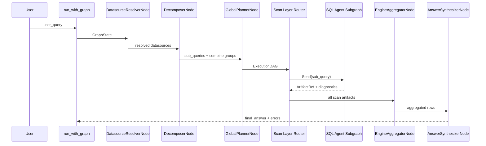

# Architecture Overview

NL2SQL is a **multi-stage orchestration pipeline** built on LangGraph. A single request flows through control-plane nodes (resolution, decomposition, planning), capability-driven subgraphs (SQL agents), and an aggregation layer. The system is wired by `NL2SQLContext`, which instantiates registries, stores, and policy enforcement.

## Key runtime components

- `NL2SQLContext` initializes registries, stores, and policy enforcement.
- `build_graph()` compiles the LangGraph control-plane pipeline.
- `run_with_graph()` executes the pipeline with cancellation and timeout.
- `GraphState` is the shared mutable state across pipeline nodes (see `graph_state.md`).

## System topology

```mermaid
flowchart TD
    UserQuery[User Query] --> Runtime[run_with_graph()]
    Runtime --> Graph[build_graph()]
    Graph --> Resolver[DatasourceResolverNode]
    Resolver --> Decomposer[DecomposerNode]
    Decomposer --> Planner[GlobalPlannerNode]
    Planner --> Router[Scan Layer Router]
    Router --> Subgraph[SQL Agent Subgraph]
    Subgraph --> Router
    Router --> Aggregator[EngineAggregatorNode]
    Aggregator --> Synthesizer[AnswerSynthesizerNode]

    subgraph Context[NL2SQLContext]
        DS[DatasourceRegistry]
        LLM[LLMRegistry]
        VS[VectorStore]
        SS[SchemaStore]
        RBAC[RBAC]
        AS[ArtifactStore]
    end
```

## Subsystem architecture



## Major subsystems (and responsibilities)

- **Planner / Decomposer**: `DecomposerNode` produces stable, semantically-scoped sub-queries; `GlobalPlannerNode` produces a deterministic `ExecutionDAG`.
- **Schema Store**: `SchemaStore` persists versioned schema snapshots with fingerprints.
- **Chunking + Retrieval**: `SchemaChunkBuilder` produces typed chunks; `VectorStore` provides staged retrieval for routing and planning context.
- **Validation layer**: `LogicalValidatorNode` enforces schema correctness and RBAC.
- **Execution layer**: `ExecutorNode` routes to capability-driven executor services (e.g., SQL executor).
- **Adapter / Plugin backend**: adapters implement `DatasourceAdapterProtocol` and are discovered via entry points.
- **Artifact store**: executor results are persisted as Parquet artifacts and referenced by `ArtifactRef`.
- **Observability**: structured logs, OpenTelemetry metrics, and audit events.

## End-to-end flow



## Determinism

Determinism guarantees and non-determinism sources are documented in `determinism.md`.

## Source references

- Graph construction: `packages/core/src/nl2sql/pipeline/graph.py`
- Runtime execution: `packages/core/src/nl2sql/pipeline/runtime.py`
- Shared state: `packages/core/src/nl2sql/pipeline/state.py`
- Context initialization: `packages/core/src/nl2sql/context.py`
