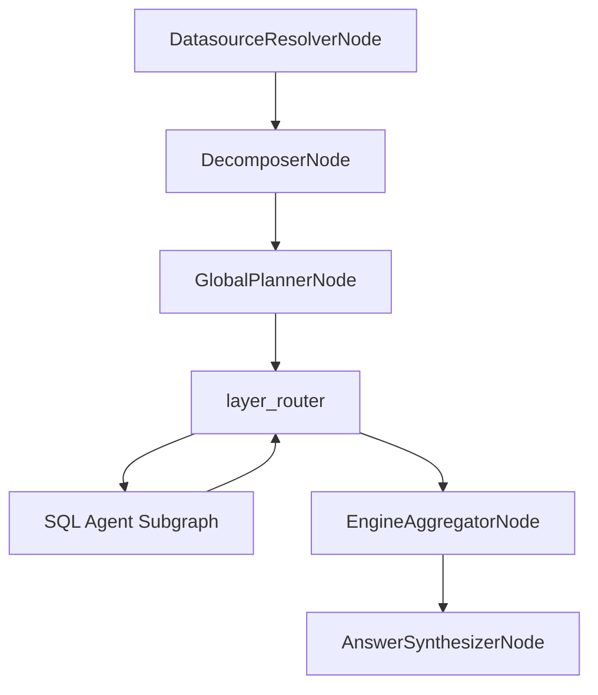
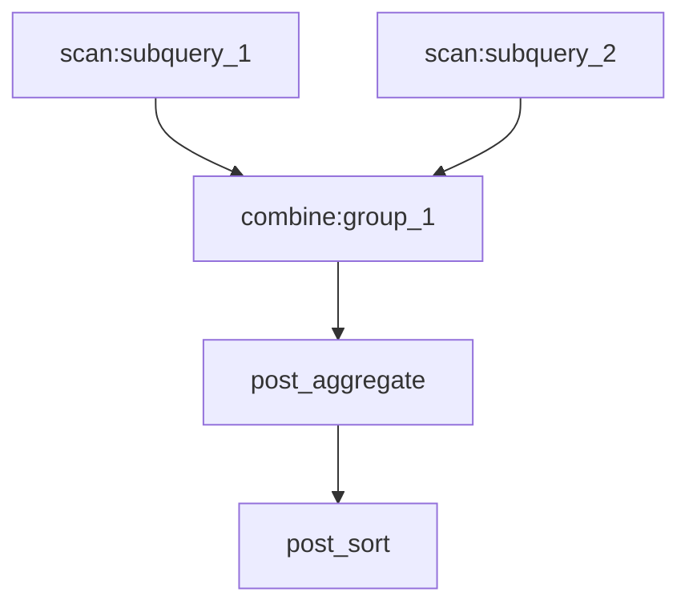
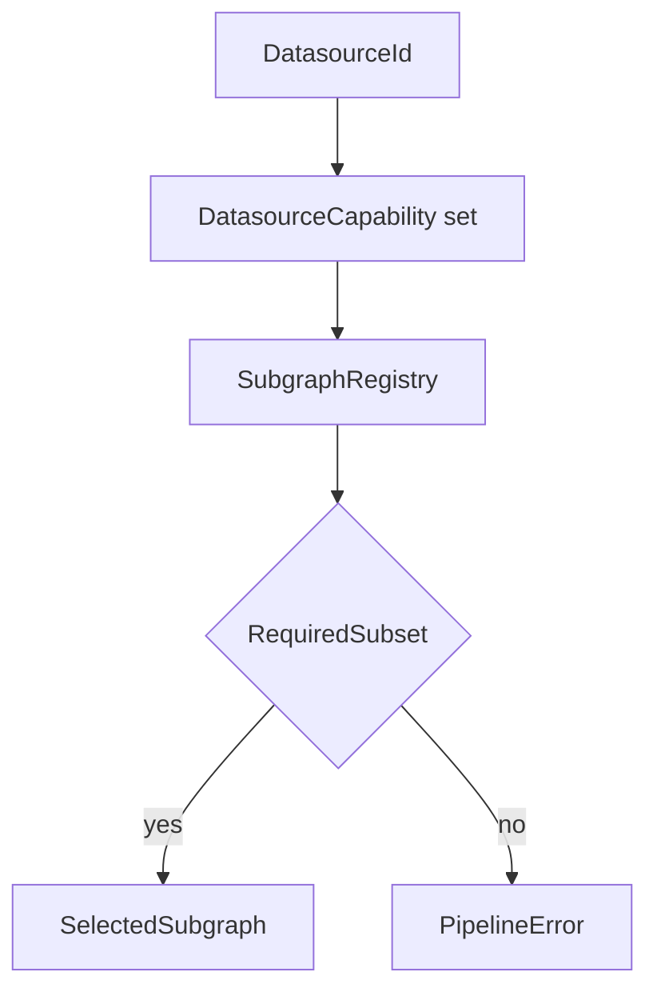
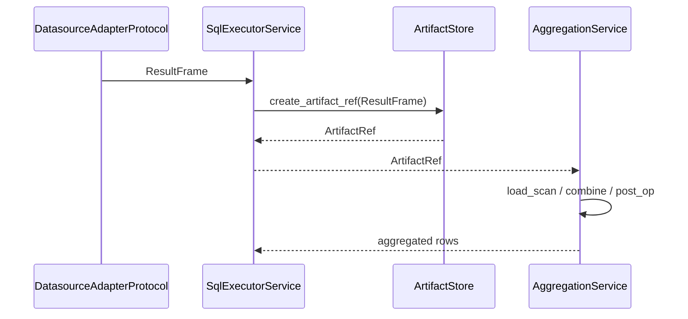

# Pipeline Architecture

This document consolidates the LangGraph pipeline architecture as implemented in code. It describes the control graph, logical DAG, routing, and execution/aggregation flow. Node and subgraph details live in their respective sections.

## End-to-end flow

### Control graph nodes

- [DatasourceResolverNode](nodes/datasource_resolver_node.md)
- [DecomposerNode](nodes/decomposer_node.md)
- [GlobalPlannerNode](nodes/global_planner_node.md)
- `layer_router` (routing function, not a node class)
- [EngineAggregatorNode](nodes/engine_aggregator_node.md)
- [AnswerSynthesizerNode](nodes/answer_synthesizer_node.md)

### Entry points

- `build_graph(ctx)` builds the control graph in `nl2sql.pipeline.graph`.
- `run_with_graph(ctx, user_query, ...)` executes the graph with timeouts and cancellation in `nl2sql.pipeline.runtime`.

## Control graph and logical DAG

The system uses two orchestration layers:

- **Control graph (LangGraph `StateGraph`)**: runtime nodes and routing.
- **Logical DAG (`ExecutionDAG`)**: deterministic compute plan produced by the global planner.

`ExecutionDAG.layers` are computed deterministically by `_layered_toposort()` and consumed by the router to dispatch scan nodes.

### ExecutionDAG node kinds (actual)

`ExecutionDAG` nodes are `LogicalNode` instances with:

- `kind`: `scan`, `combine`, `post_filter`, `post_aggregate`, `post_project`, `post_sort`, `post_limit`
- `inputs`: upstream node IDs
- `output_schema`: `RelationSchema` (column specs)
- `attributes`: operation-specific metadata (e.g., join keys, filters, metrics)

## Routing and subgraph selection

`build_scan_layer_router()` selects the next scan layer with missing artifacts and dispatches subgraphs in parallel using `Send()`. Scan node IDs are matched against `SubQuery.id` for datasource routing; otherwise datasource ID is resolved from node attributes.

Subgraph selection is capability-based via `resolve_subgraph()`:

If no compatible subgraph is found, routing raises `PipelineError` and terminates the pipeline.

## SQL agent subgraph lifecycle

The only registered subgraph today is `sql_agent` (`build_sql_agent_graph()`).

See `subgraphs/sql_agent.md` for full lifecycle, retry semantics, and node wiring.

## Execution, artifacts, and aggregation

Executors produce `ResultFrame` objects, which are persisted via `ArtifactStore` and referenced by `ArtifactRef`. Aggregation reads artifacts and applies the logical DAG.

Aggregation uses `AggregationService(PolarsDuckdbEngine())` and executes layers sequentially.

## State model

Shared and subgraph state models are defined in `graph_state.md`. The pipeline uses:

- `GraphState` for control graph execution and aggregation.
- `SubgraphExecutionState` for subgraph-local execution.
- `wrap_subgraph()` to merge subgraph outputs back into `GraphState`.

## Determinism

Determinism guarantees and non-determinism sources are centralized in `determinism.md`.

## Known limitations (current)

- `PhysicalValidatorNode` is implemented but not wired into the SQL agent graph.
- Execution sandbox exists but SQL executor runs in-process by default.
- Circuit breakers are not uniformly wired across all execution paths.

## Observability hooks (current)

Observability stack and callback behavior are documented in `../observability/stack.md`.

## Source references

- Graph builder: `packages/core/src/nl2sql/pipeline/graph.py`
- Runtime: `packages/core/src/nl2sql/pipeline/runtime.py`
- Routing: `packages/core/src/nl2sql/pipeline/routes.py`
- Subgraph wrapper: `packages/core/src/nl2sql/pipeline/graph_utils.py`
- SQL agent graph: `packages/core/src/nl2sql/pipeline/subgraphs/sql_agent.py`
- Execution DAG models: `packages/core/src/nl2sql/pipeline/nodes/global_planner/schemas.py`
- Aggregation service: `packages/core/src/nl2sql/aggregation/aggregator.py`
