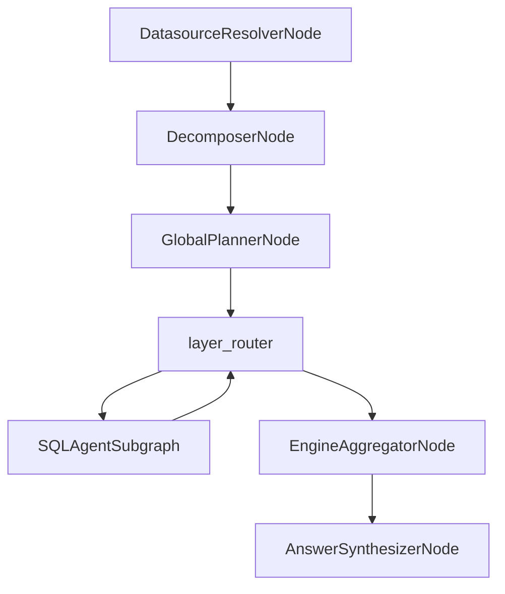
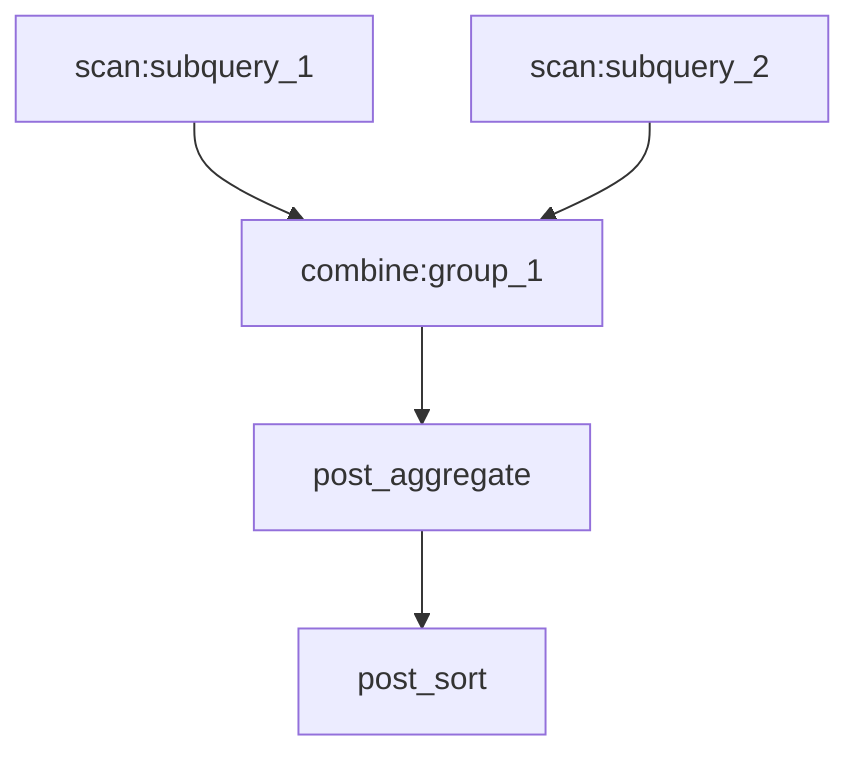
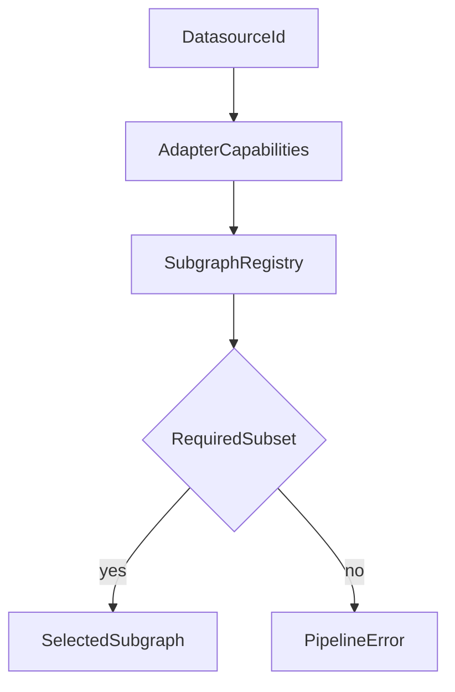
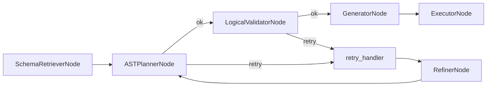
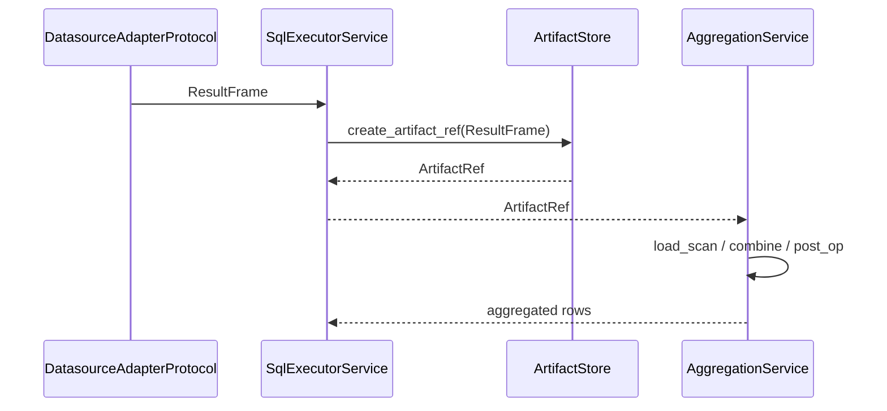

# Pipeline Architecture

This document consolidates the LangGraph pipeline architecture as implemented in code. It describes the control graph, logical DAG, SQL agent subgraph, execution/aggregation flow, and current limitations.

## End-to-end flow

### Control graph nodes

- [DatasourceResolverNode](nodes/datasource_resolver_node.md)
- [DecomposerNode](nodes/decomposer_node.md)
- [GlobalPlannerNode](nodes/global_planner_node.md)
- `layer_router` (routing function, not a node class)
- [EngineAggregatorNode](nodes/engine_aggregator_node.md)
- [AnswerSynthesizerNode](nodes/answer_synthesizer_node.md)

### Entry points

- `build_graph(ctx)` builds the control graph in `nl2sql.pipeline.graph`.
- `run_with_graph(ctx, user_query, ...)` executes the graph with timeouts and cancellation in `nl2sql.pipeline.runtime`.

## Control graph and logical DAG

The system uses two orchestration layers:

- **Control graph (LangGraph `StateGraph`)**: runtime nodes and routing.
- **Logical DAG (`ExecutionDAG`)**: deterministic compute plan produced by the global planner.

`ExecutionDAG.layers` are computed deterministically by `_layered_toposort()` and consumed by the router to dispatch scan nodes.

### ExecutionDAG node kinds (actual)

`ExecutionDAG` nodes are `LogicalNode` instances with:

- `kind`: `scan`, `combine`, `post_filter`, `post_aggregate`, `post_project`, `post_sort`, `post_limit`
- `inputs`: upstream node IDs
- `output_schema`: `RelationSchema` (column specs)
- `attributes`: operation-specific metadata (e.g., join keys, filters, metrics)

## Routing and subgraph selection

`build_scan_layer_router()` selects the next scan layer with missing artifacts and dispatches subgraphs in parallel using `Send()`. Scan node IDs are matched against `SubQuery.id` for datasource routing; otherwise datasource ID is resolved from node attributes.

Subgraph selection is capability-based via `resolve_subgraph()`:

If no compatible subgraph is found, routing raises `PipelineError` and terminates the pipeline.

## SQL agent subgraph lifecycle

The only registered subgraph today is `sql_agent` (`build_sql_agent_graph()`):

### Node responsibilities

- [SchemaRetrieverNode](nodes/schema_retriever_node.md): staged vector retrieval + snapshot resolution.
- [ASTPlannerNode](nodes/ast_planner_node.md): LLM-based AST planning (`PlanModel`).
- [LogicalValidatorNode](nodes/logical_validator_node.md): schema + RBAC validation of AST.
- [GeneratorNode](nodes/generator_node.md): compile AST to SQL via `sqlglot`.
- [ExecutorNode](nodes/executor_node.md): execute SQL via executor registry and persist artifacts.
- [RefinerNode](nodes/refiner_node.md): LLM feedback for retry.

### Retry semantics

`retry_handler` applies exponential backoff with jitter. Maximum retries are controlled by `Settings.sql_agent_max_retries`. Only retryable errors trigger the loop.

Retry stop conditions (from `check_planner` and `check_logical_validation`):

- Non-retryable errors → terminate subgraph.
- Retry count exhausted → terminate subgraph.
- Planner returns no plan and no retryable errors → terminate subgraph.

### Physical validation

`PhysicalValidatorNode` exists but is **not wired** in the SQL agent graph (its edge is commented out).

## Execution, artifacts, and aggregation

Executors produce `ResultFrame` objects, which are persisted via `ArtifactStore` and referenced by `ArtifactRef`. Aggregation reads artifacts and applies the logical DAG.

Aggregation uses `AggregationService(PolarsDuckdbEngine())` and executes layers sequentially.

## State model

### `GraphState`

Shared control-graph state includes:

- `trace_id`, `user_query`, `user_context`
- resolver/decomposer/planner/aggregator/synthesizer responses
- `artifact_refs` keyed by `ExecutionDAG` node ID
- `subgraph_outputs`, `errors`, `reasoning`, `warnings`

### `SubgraphExecutionState`

Subgraph-local state includes:

- `sub_query`, `relevant_tables`, `user_context`
- planner/validator/generator/executor responses
- retry counters and error diagnostics

`wrap_subgraph()` merges subgraph outputs back into `GraphState`.

### Subgraph payload wiring

`build_scan_payload()` injects `decomposer_response` and `datasource_resolver_response` into the subgraph wrapper. `wrap_subgraph()` uses `subgraph_id` to resolve the matching `SubQuery` and construct `SubgraphExecutionState`.

## Determinism guarantees

- Sub-query and post-op IDs are hashed deterministically in `DecomposerNode`.
- `ExecutionDAG._layered_toposort()` produces stable scan layers.
- Aggregation processes layers in deterministic order.

### Non-determinism sources

- LLM outputs in decomposer/planner are model-dependent and can vary unless configured deterministically.
- Vector retrieval ranking is not part of the control graph but can influence planner input.

## Failure modes and limitations (current)

### Failure modes

- No allowed datasources → `resolver_route` ends the pipeline early.
- No compatible subgraph → router raises `PipelineError`.
- Missing artifacts → aggregation errors.
- Planner/validator failures → retry loop (if retryable).

### Limitations

- `PhysicalValidatorNode` not wired.
- Execution sandbox exists but SQL executor runs in-process by default.
- Circuit breakers are not uniformly wired across all execution paths.
- No human-in-the-loop steps are wired.

## Observability hooks (current)

- `run_with_graph()` accepts callbacks (e.g., `PipelineMonitorCallback`).
- Audit events emitted on LLM completion via `EventLogger`.
- Metrics via `configure_metrics()` when callbacks are provided.

Pipeline callbacks are only invoked when passed into `run_with_graph(..., callbacks=...)`.

## Source references

- Graph builder: `packages/core/src/nl2sql/pipeline/graph.py`
- Runtime: `packages/core/src/nl2sql/pipeline/runtime.py`
- Routing: `packages/core/src/nl2sql/pipeline/routes.py`
- Subgraph wrapper: `packages/core/src/nl2sql/pipeline/graph_utils.py`
- SQL agent graph: `packages/core/src/nl2sql/pipeline/subgraphs/sql_agent.py`
- Execution DAG models: `packages/core/src/nl2sql/pipeline/nodes/global_planner/schemas.py`
- Aggregation service: `packages/core/src/nl2sql/aggregation/aggregator.py`
