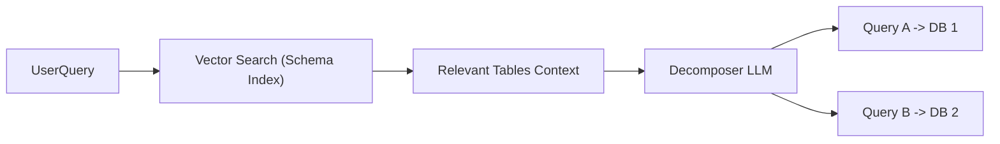

# Routing Strategy

The platform operates in a specific "Map-Reduce" pattern to handle multi-datasource environments.

## The Challenge

A user might ask: *"Compare the sales in our US Store (Postgres) vs. the EU Store (MySQL)."*

This request cannot be solved by a single database query. It requires:

1. Identifying that two different databases are involved.
2. Splitting the question into two independent sub-queries.
3. Routing each sub-query to the correct engine.

## The Solution: Decomposer Node

The **Decomposer Node** is responsible for this logic.

### 1. Vector Search (Indexing)

Before runtime, we "Index" all datasources. This creates embeddings for:

* Table Names
* Column Descriptions
* Sample Data (Few-Shot examples)

When a query arrives, we first search this index to find which tables are semantically relevant.

### 2. Decomposition

The LLM is presented with the user question and the *list of potentially relevant tables*. It is asked to:

1. Determine if the query is ambiguous or multi-part.
2. If so, split it.
3. Assign each split query to a specific `datasource_id`.

### 3. Fan-Out (Map)

The system then spawns parallel execution branches. Each branch receives:

* The simplified sub-query.
* The specific `datasource_id`.
* The schema context for that datasource.
