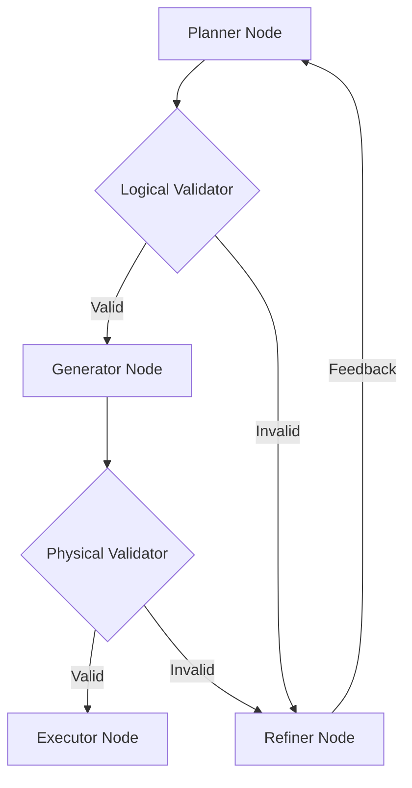

# The SQL Agent

The **SQL Agent** is the core execution engine of the platform. For every relevant datasource identified by the routing layer, a dedicated SQL Agent is instantiated.

Unlike traditional text-to-SQL systems that attempt to generate SQL in one shot, the SQL Agent treats the problem as a **multi-step reasoning process**.

## Execution Pipeline

The pipeline is modeled as a state machine:

### 1. Planner Node

* **Input**: User Query, Schema Context (Tables).
* **Role**: Reasoning & Planning.
* **Output**: A recursive Abstract Syntax Tree (AST), *not* SQL.
* **Why?**: Generating an AST allows us to validate structure and intent *before* committing to a specific SQL dialect syntax.

### 2. Logical Validator Node

* **Input**: `PlanModel` (AST).
* **Checks**:
  * **Structure**: Are joins valid? Do column aliases exist?
  * **Authorization (RBAC)**: Does the user have permission to access the referenced tables?
* **Outcome**: If invalid, the error is sent to the **Refiner**.

### 3. Generator Node

* **Input**: Validated `PlanModel`.
* **Role**: Compiler.
* **Output**: Dialect-specific SQL string (e.g., T-SQL, PostgreSQL).
* **Mechanism**: Uses the Visitor pattern to traverse the AST and emit SQL compatible with the specific adapter's capabilities.

### 4. Physical Validator Node

* **Input**: Generated SQL String.
* **Checks**:
  * **Semantic**: Performs a "Dry Run" (if supported) to check for runtime errors (e.g., function mismatches).
  * **Performance**: Estimates query cost/rows to prevent database overload.
* **Outcome**: If dry run fails or cost is too high, it loops back to **Refiner**.

### 5. Executor Node

* **Input**: Validated SQL.
* **Role**: Execution.
* **Output**: Raw result set.

### 6. Refiner Node

* **Input**: Validation Errors + Failed Plan.
* **Role**: Error Recovery.
* **Mechanism**: Uses an LLM to analyze *why* the plan failed and provides specific instructions to the Planner for the next attempt.
