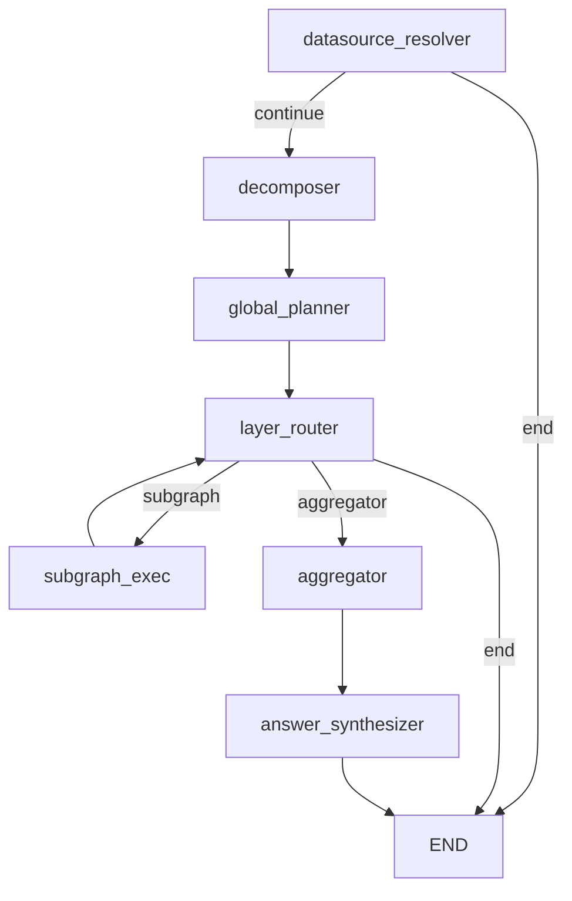

# Main Pipeline Graph

## Overview
- Purpose: orchestrates the end-to-end NL2SQL pipeline as a LangGraph state machine.
- Why it exists architecturally: central control plane that wires global nodes, subgraphs, and aggregation into a single execution DAG.
- When it is invoked: via `run_with_graph()` runtime entry point.

Defining function: `build_graph()`  
Source file path: `packages/core/src/nl2sql/pipeline/graph.py`

---

## Boundary Definition

This graph is the top-level orchestrator. It encapsulates datasource resolution, decomposition, global planning, routing to subgraphs, aggregation, and answer synthesis. It does NOT implement subgraph internals (SQL planning/execution), per-node business logic, or adapter-specific execution; those are delegated to nodes and registered subgraphs.

---

## Entry Conditions

Required state:
- `GraphState.user_query` must be provided.
- `GraphState.trace_id` is auto-generated if not provided.

Preconditions:
- `NL2SQLContext` must be initialized with registries/services used by nodes (vector store, LLM registry, datasource registry, schema store, RBAC).

Triggering parent graph:
- None. This is the root graph invoked by `run_with_graph()` in `pipeline/runtime.py`.

---

## Exit Conditions

Successful completion criteria:
- Reaches `END` after `answer_synthesizer` when aggregation and synthesis finish without fatal interruptions.

Failure exits:
- `datasource_resolver` can short-circuit to `END` via `resolver_route` when no datasource is resolved/allowed.
- `layer_router` can return `END` if no `execution_dag` or layers are present.
- `layer_router` raises `PipelineError` when no compatible subgraph exists for a datasource; this propagates as an exception from the router function.

Partial completion behavior:
- If routing cannot schedule any scan-layer work but `execution_dag` exists, it routes to `aggregator` directly.
- Errors added to `GraphState.errors` do not automatically stop the graph; the graph relies on routing logic and node behavior for termination.

---

## Internal Node Composition

Execution order (nominal path):
- `datasource_resolver` — `DatasourceResolverNode` — `packages/core/src/nl2sql/pipeline/nodes/datasource_resolver/node.py` — resolve candidate datasources and RBAC.
- `decomposer` — `DecomposerNode` — `packages/core/src/nl2sql/pipeline/nodes/decomposer/node.py` — decompose query into sub-queries.
- `global_planner` — `GlobalPlannerNode` — `packages/core/src/nl2sql/pipeline/nodes/global_planner/node.py` — build execution DAG.
- `layer_router` — inline lambda + `routes.build_scan_layer_router` — `packages/core/src/nl2sql/pipeline/routes.py` — route each scan layer to a subgraph or aggregator.
- `<subgraph nodes>` — via `wrap_subgraph()` — `packages/core/src/nl2sql/pipeline/graph_utils.py` — invoke registered subgraphs per scan node.
- `aggregator` — `EngineAggregatorNode` — `packages/core/src/nl2sql/pipeline/nodes/aggregator/node.py` — execute aggregation DAG.
- `answer_synthesizer` — `AnswerSynthesizerNode` — `packages/core/src/nl2sql/pipeline/nodes/answer_synthesizer/node.py` — produce final answer.

Mermaid diagram (main pipeline only):

---

## State Contract

State model: `GraphState` (`packages/core/src/nl2sql/pipeline/state.py`).

Field ownership, reducers, and lifecycle are defined in `../graph_state.md`.

---

## Step-by-Step Execution Flow

1. `datasource_resolver` resolves candidate datasources using vector search and RBAC.
2. `resolver_route` decides:
   - `continue` if allowed datasources exist.
   - `end` if none exist or response missing.
3. `decomposer` uses the LLM to produce `SubQuery` objects and combine groups.
4. `global_planner` builds a deterministic `ExecutionDAG` from sub-queries and combines.
5. `layer_router` inspects the DAG and current `artifact_refs`:
   - If no DAG or layers, returns `END`.
   - If next scan layer is empty, routes to `aggregator`.
   - For each scan node, resolves a compatible subgraph and sends `build_scan_payload`.
6. Each subgraph execution returns `artifact_refs`, `subgraph_outputs`, and `errors` to `GraphState`.
7. `layer_router` is re-entered until all scan-layer nodes produce artifacts.
8. `aggregator` executes the DAG using the stored `artifact_refs`.
9. `answer_synthesizer` summarizes aggregated results into a final answer.
10. Graph reaches `END`.

---

## Determinism Guarantees

Determinism guarantees and non-determinism sources are documented in `../determinism.md`.

---

## Error Propagation

Failure domains, retry scope, and recovery limitations are centralized in `../failure_recovery.md`.

---

## Retry + Recovery

See `../failure_recovery.md` for retry scope and recovery behavior.

---

## Performance Characteristics

- Blocking calls include LLM requests in `decomposer` and `answer_synthesizer`.
- `global_planner` and `aggregator` are CPU-bound (DAG construction and local aggregation).
- Subgraph executions are dispatched per scan layer and can run in parallel via LangGraph routing.
- Overall pipeline is executed within a thread pool controlled by `settings.sandbox_exec_workers` and guarded by `settings.global_timeout_sec`.

---

## Observability

- Each node uses `nl2sql.common.logger.get_logger()` with node-specific names.
- `GraphState.trace_id` is propagated into subgraph IDs and executor requests, but no code binds it into logging context (`trace_context` is defined but not used).
- `run_with_graph()` accepts LangGraph callbacks via `config={"callbacks": callbacks}`.
- No explicit metrics or tracing spans are emitted in the graph code.

---

## Configuration

- `GLOBAL_TIMEOUT_SEC` controls total pipeline timeout (`settings.global_timeout_sec`).
- `SANDBOX_EXEC_WORKERS` controls thread pool size (`settings.sandbox_exec_workers`).
- Subgraph selection is governed by datasource capabilities in the subgraph registry.

---

## Extension Points

- Add new subgraphs by extending `build_subgraph_registry()` and providing a `SubgraphSpec`.
- Insert additional nodes in `build_graph()` by adding nodes/edges to the `StateGraph`.
- Customize routing by replacing `build_scan_layer_router()` or `resolver_route()`.

---

## Known Limitations

- `execute` parameter in `build_graph()` is accepted but not used in graph construction.
- Errors accumulated in `GraphState.errors` do not alter routing unless explicit routes inspect them.
- No trace/span propagation into logging context, despite trace context helpers existing.
- Merge reducers for `artifact_refs`/`subgraph_outputs` overwrite on key conflicts without ordering guarantees.

---

## Related Code

- Subgraph definition: `packages/core/src/nl2sql/pipeline/graph.py`
- Routing utilities: `packages/core/src/nl2sql/pipeline/routes.py`, `packages/core/src/nl2sql/pipeline/graph_utils.py`
- State model: `packages/core/src/nl2sql/pipeline/state.py`
- Node implementations:
  - `packages/core/src/nl2sql/pipeline/nodes/datasource_resolver/node.py`
  - `packages/core/src/nl2sql/pipeline/nodes/decomposer/node.py`
  - `packages/core/src/nl2sql/pipeline/nodes/global_planner/node.py`
  - `packages/core/src/nl2sql/pipeline/nodes/aggregator/node.py`
  - `packages/core/src/nl2sql/pipeline/nodes/answer_synthesizer/node.py`
