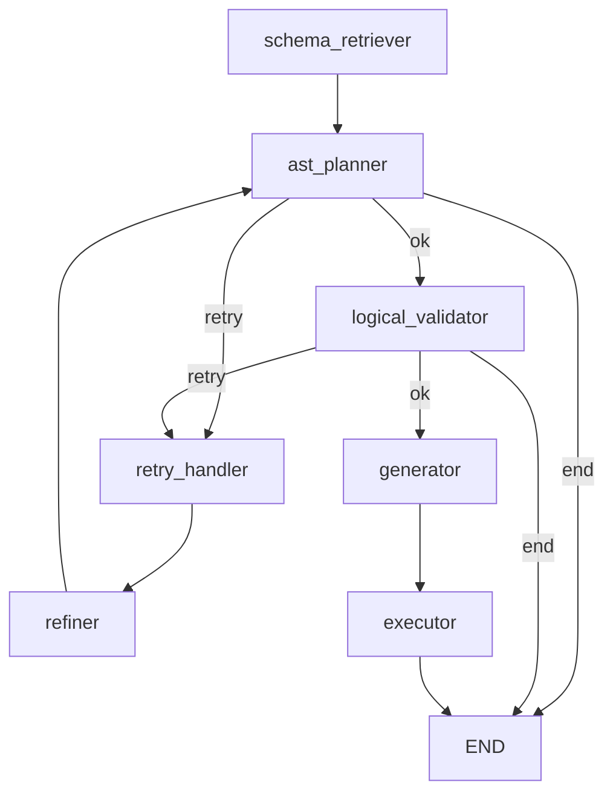

# SQL Agent Subgraph

## Overview
- Purpose: plan, validate, generate, and execute SQL for a single sub-query.
- Why it exists architecturally: isolates SQL-capable execution into a reusable subgraph that can be scheduled per scan node in the global execution DAG.
- When it is invoked: when `layer_router` resolves a datasource with `SUPPORTS_SQL` capability and sends a scan-layer payload.

Defining function: `build_sql_agent_graph()`  
Source file path: `packages/core/src/nl2sql/pipeline/subgraphs/sql_agent.py`

---

## Boundary Definition

This subgraph encapsulates the SQL planning and execution loop for a single `SubQuery`. It does NOT perform cross-subquery aggregation, answer synthesis, or datasource resolution; those responsibilities are owned by the main pipeline graph and upstream nodes.

---

## Entry Conditions

Required state:
- `SubgraphExecutionState.trace_id`
- `SubgraphExecutionState.sub_query` (must include `id`, `datasource_id`, and `intent`)

Preconditions:
- `sub_query.datasource_id` must map to a registered adapter/executor.
- Schema store and vector store may be used if configured; otherwise schema retrieval falls back to full schema snapshot.

Triggering parent graph:
- `layer_router` in the main pipeline graph sends `build_scan_payload()` to the subgraph via `wrap_subgraph()`.

---

## Exit Conditions

Successful completion criteria:
- Reaches `END` after `executor` and produces `executor_response`.

Failure exits:
- `check_planner` returns `end` when planner output is missing and retries are exhausted or errors are non-retryable.
- `check_logical_validation` returns `end` when validation errors are non-retryable or retries are exhausted.
- Cancellation (`is_cancelled()`) forces `end` in router checks and in retry handler.

Partial completion behavior:
- If planner or logical validation errors are retryable and retry budget remains, execution loops via `retry_handler` → `refiner` → `ast_planner`.

---

## Internal Node Composition

Execution order (nominal path):
- `schema_retriever` — `SchemaRetrieverNode` — `packages/core/src/nl2sql/pipeline/nodes/schema_retriever/node.py` — retrieve relevant schema tables/columns.
- `ast_planner` — `ASTPlannerNode` — `packages/core/src/nl2sql/pipeline/nodes/ast_planner/node.py` — create SQL AST plan.
- `logical_validator` — `LogicalValidatorNode` — `packages/core/src/nl2sql/pipeline/nodes/validator/node.py` — validate plan correctness and policy constraints.
- `generator` — `GeneratorNode` — `packages/core/src/nl2sql/pipeline/nodes/generator/node.py` — generate SQL text from AST.
- `executor` — `ExecutorNode` — `packages/core/src/nl2sql/pipeline/nodes/executor/node.py` — execute SQL and produce artifacts.
- `retry_handler` — `retry_node()` — `packages/core/src/nl2sql/pipeline/subgraphs/sql_agent.py` — apply exponential backoff and increment retry count.
- `refiner` — `RefinerNode` — `packages/core/src/nl2sql/pipeline/nodes/refiner/node.py` — generate feedback for the planner.

Mermaid diagram (sql_agent only):

---

## State Contract

State model: `SubgraphExecutionState` (`packages/core/src/nl2sql/pipeline/state.py`).

Field ownership, reducers, and lifecycle are defined in `../graph_state.md`.

---

## Step-by-Step Execution Flow

1. `schema_retriever` builds a semantic query from `sub_query` and retrieves relevant schema context; if none found, it falls back to full schema snapshot.
2. `ast_planner` runs an LLM planning chain to produce `PlanModel`.
3. `check_planner` routes:
   - `ok` if a plan exists.
   - `retry` if errors are retryable and retry budget remains.
   - `end` if errors are non-retryable or retries exhausted.
4. `logical_validator` validates the plan for structural and policy compliance.
5. `check_logical_validation` routes:
   - `ok` when no blocking errors exist.
   - `retry` when retryable errors exist and retry budget remains.
   - `end` when errors are non-retryable or retries exhausted.
6. `generator` converts the plan to SQL for the target datasource dialect.
7. `executor` runs SQL via the datasource adapter and returns artifacts/errors.
8. If routed to retry: `retry_handler` waits with exponential backoff and jitter, then increments `retry_count`.
9. `refiner` uses LLM feedback to enrich error context, then loops back to `ast_planner`.
10. Subgraph terminates at `END`.

---

## Determinism Guarantees

Determinism guarantees and non-determinism sources are documented in `../determinism.md`.

---

## Error Propagation

Failure domains, retry scope, and recovery limitations are centralized in `../failure_recovery.md`.

---

## Retry + Recovery

See `../failure_recovery.md` for retry scope and recovery behavior.

---

## Performance Characteristics

- Blocking LLM calls: `ASTPlannerNode` and `RefinerNode`.
- External I/O: vector store retrieval and schema store access in `SchemaRetrieverNode`; datasource execution in `ExecutorNode`.
- CPU-bound steps: SQL generation via sqlglot in `GeneratorNode`.
- Retry loop introduces sleep-based delays on failures.

---

## Observability

- Node-specific loggers are used (`schema_retriever`, `planner`, `logical_validator`, `generator`, `executor`, `refiner`).
- `trace_id` is stored in state and forwarded to executor requests; logging context is not explicitly set.
- No explicit metrics or tracing spans are emitted by the subgraph code.

---

## Configuration

- `SQL_AGENT_MAX_RETRIES`
- `SQL_AGENT_RETRY_BASE_DELAY_SEC`
- `SQL_AGENT_RETRY_MAX_DELAY_SEC`
- `SQL_AGENT_RETRY_JITTER_SEC`

---

## Extension Points

- Modify `build_sql_agent_graph()` to insert, remove, or rewire nodes and edges.
- Add new subgraphs by registering additional `SubgraphSpec` entries in `build_subgraph_registry()`.
- Replace node implementations via dependency injection in `NL2SQLContext`.

---

## Known Limitations

- `physical_validator` node is instantiated but not wired; physical validation is unreachable.
- Generator and executor errors are not routed into the retry loop; failures proceed to `executor` or terminate at `END`.
- No subgraph-specific metrics or trace spans are emitted.
- Retry loop only considers planner and logical validation errors.

---

## Related Code

- Subgraph definition: `packages/core/src/nl2sql/pipeline/subgraphs/sql_agent.py`
- Subgraph registry: `packages/core/src/nl2sql/pipeline/subgraphs/registry.py`
- State model: `packages/core/src/nl2sql/pipeline/state.py`
- Node implementations:
  - `packages/core/src/nl2sql/pipeline/nodes/schema_retriever/node.py`
  - `packages/core/src/nl2sql/pipeline/nodes/ast_planner/node.py`
  - `packages/core/src/nl2sql/pipeline/nodes/validator/node.py`
  - `packages/core/src/nl2sql/pipeline/nodes/generator/node.py`
  - `packages/core/src/nl2sql/pipeline/nodes/executor/node.py`
  - `packages/core/src/nl2sql/pipeline/nodes/refiner/node.py`
- Tests:
  - `packages/core/tests/unit/test_sql_agent_subgraph.py`
  - `packages/core/tests/unit/test_subgraph_registry.py`
