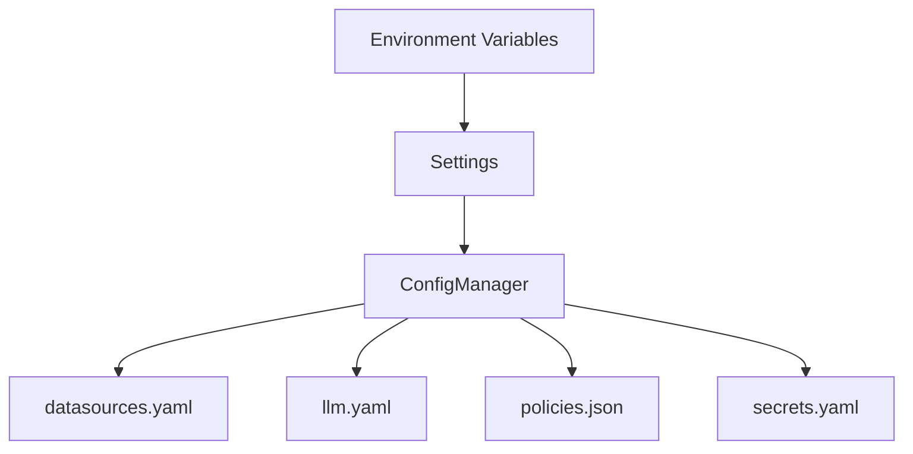

# Configuration System

Configuration is split into **environment variables** and **file-based configuration**. `Settings` loads environment variables and points to the config files. `ConfigManager` loads and validates each file.

## Settings and environment variables

`Settings` (Pydantic) loads environment variables with defaults such as:

- `LLM_CONFIG`, `DATASOURCE_CONFIG`, `POLICIES_CONFIG`, `SECRETS_CONFIG`
- `VECTOR_STORE`, `VECTOR_STORE_COLLECTION`
- `TENANT_ID`
- `SCHEMA_STORE_BACKEND`, `SCHEMA_STORE_PATH`
- `RESULT_ARTIFACT_BACKEND`, `RESULT_ARTIFACT_BASE_URI`

## Config manager flow

## Secrets resolution

`SecretManager` supports provider-based resolution (e.g., `env`). `ConfigManager` resolves secrets recursively across config objects before registries are initialized.

## Source references

- Settings: `packages/core/src/nl2sql/common/settings.py`
- ConfigManager: `packages/core/src/nl2sql/configs/manager.py`
- SecretManager: `packages/core/src/nl2sql/secrets/manager.py`
