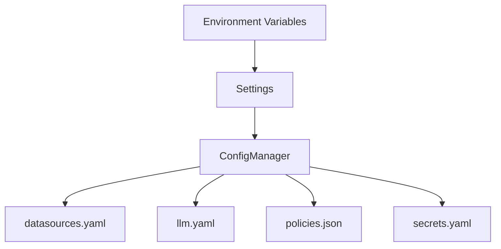

# Configuration System

Configuration is split into **environment variables** (runtime settings) and **file-based configuration** (datasources, LLMs, policies, secrets). `Settings` loads env vars; `ConfigManager` validates file formats and resolves secrets.

## Settings (environment variables)

### Paths

| Env var | Default | Description |
| --- | --- | --- |
| `OPENAI_API_KEY` | `—` | API key for OpenAI provider (optional if using other providers). |
| `LLM_CONFIG` | `configs/llm.yaml` | Path to the LLM config file. |
| `DATASOURCE_CONFIG` | `configs/datasources.yaml` | Path to the datasource config file. |
| `BENCHMARK_CONFIG` | `configs/benchmark_suite.yaml` | Path to the benchmark suite file. |
| `SAMPLE_QUESTIONS` | `configs/sample_questions.yaml` | Path to the sample questions file. |
| `POLICIES_CONFIG` | `configs/policies.json` | Path to the RBAC policies file. |
| `SECRETS_CONFIG` | `configs/secrets.yaml` | Path to the secrets config file. |
| `VECTOR_STORE` | `./chroma_db` | Persist directory for the vector store. |
| `VECTOR_STORE_COLLECTION` | `nl2sql_store` | Collection name for schema embeddings. |

### Storage

| Env var | Default | Description |
| --- | --- | --- |
| `SCHEMA_STORE_BACKEND` | `sqlite` | Schema store backend identifier. |
| `SCHEMA_STORE_PATH` | `data/schema_store.db` | SQLite database path for schema store persistence. |
| `SCHEMA_STORE_MAX_VERSIONS` | `3` | Max schema versions retained per datasource. |
| `RESULT_ARTIFACT_BACKEND` | `local` | Artifact backend: `local`, `s3`, `adls`. |
| `RESULT_ARTIFACT_BASE_URI` | `./artifacts` | Base URI or path for artifact storage. |
| `RESULT_ARTIFACT_PATH_TEMPLATE` | `<tenant_id>/<request_id>/<subgraph_name>/<dag_node_id>/<schema_version>/part-00000.parquet` | Template for artifact paths. |
| `RESULT_ARTIFACT_S3_BUCKET` | `—` | S3 bucket for artifact storage. |
| `RESULT_ARTIFACT_S3_PREFIX` | `—` | S3 prefix for artifact storage. |
| `RESULT_ARTIFACT_ADLS_ACCOUNT` | `—` | ADLS storage account name. |
| `RESULT_ARTIFACT_ADLS_CONTAINER` | `—` | ADLS container name. |
| `RESULT_ARTIFACT_ADLS_CONNECTION_STRING` | `—` | ADLS connection string, if using key-based auth. |

### Execution

| Env var | Default | Description |
| --- | --- | --- |
| `GLOBAL_TIMEOUT_SEC` | `60` | Global timeout in seconds for pipeline execution. |
| `SANDBOX_EXEC_WORKERS` | `4` | Max workers for latency-sensitive execution pool. |
| `SANDBOX_INDEX_WORKERS` | `2` | Max workers for throughput-heavy indexing pool. |

### Behavior

| Env var | Default | Description |
| --- | --- | --- |
| `SCHEMA_VERSION_MISMATCH_POLICY` | `warn` | Action on schema version mismatch: `warn`, `fail`, `ignore`. |
| `SQL_AGENT_MAX_RETRIES` | `3` | Max retry attempts for SQL agent refinement. |
| `SQL_AGENT_RETRY_BASE_DELAY_SEC` | `1.0` | Base delay for SQL agent retries (seconds). |
| `SQL_AGENT_RETRY_MAX_DELAY_SEC` | `10.0` | Max delay for SQL agent retries (seconds). |
| `SQL_AGENT_RETRY_JITTER_SEC` | `0.5` | Max jitter added to SQL agent retry delays (seconds). |
| `LOGICAL_VALIDATOR_STRICT_COLUMNS` | `false` | Treat missing columns as errors in logical validation. |
| `TENANT_ID` | `default_tenant` | Default tenant ID for requests. |

### Limits

| Env var | Default | Description |
| --- | --- | --- |
| `DEFAULT_ROW_LIMIT` | `10000` | Default row limit for SQL execution safeguards. |
| `DEFAULT_MAX_BYTES` | `10485760` | Default max bytes limit for SQL execution safeguards. |
| `DEFAULT_STATEMENT_TIMEOUT_MS` | `30000` | Default statement timeout for SQL execution safeguards. |

### Routing

| Env var | Default | Description |
| --- | --- | --- |
| `ROUTER_L1_THRESHOLD` | `0.4` | Distance threshold for Layer 1 vector search. |
| `ROUTER_L2_THRESHOLD` | `0.6` | Relaxed distance threshold for Layer 2 voting. |

### Observability

| Env var | Default | Description |
| --- | --- | --- |
| `OBSERVABILITY_EXPORTER` | `none` | Exporter for metrics/traces: `none`, `console`, `otlp`. |
| `OTEL_EXPORTER_OTLP_ENDPOINT` | `—` | Endpoint for OTLP exporter. |
| `AUDIT_LOG_PATH` | `logs/audit_events.log` | Path to the persistent audit log file. |

### Environment file loading

| Env var | Default | Description |
| --- | --- | --- |
| `ENV_FILE_PATH` | `—` | Path to a specific `.env` file to load. |
| `ENV` | `—` | Environment name used to load `.env.{ENV}`. |
| `APP_ENV` | `—` | Alternate environment name used to load `.env.{APP_ENV}`. |

## Config manager flow

## Secret resolution

`SecretManager` resolves secret references (`${provider:key}`):

- Default provider: `env`
- Two-phase loading: secrets are resolved before registries initialize

## Configuration file contracts

- `configs/datasources.yaml`: datasource IDs, connection types, and options.
  See [Datasource config](datasources.md).
- `configs/llm.yaml`: model/provider settings per agent name.
  See [LLM config](llm.md).
- `configs/policies.json`: RBAC policies and allowed tables/datasources.
  See [Policies config](policies.md).
- `configs/secrets.yaml`: optional secret providers.
  See [Secrets config](secrets.md).

## Source references

- Settings: `packages/core/src/nl2sql/common/settings.py`
- ConfigManager: `packages/core/src/nl2sql/configs/manager.py`
- SecretManager: `packages/core/src/nl2sql/secrets/manager.py`
