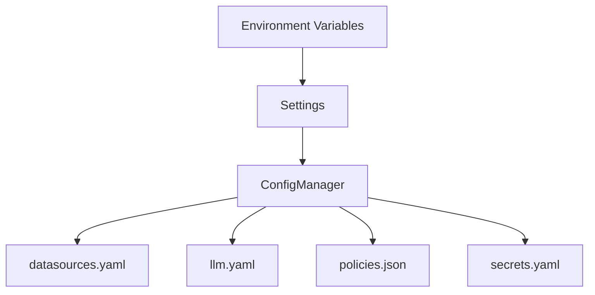

# Configuration System

Configuration is split into **environment variables** (runtime settings) and **file-based configuration** (datasources, LLMs, policies, secrets). `Settings` loads env vars; `ConfigManager` validates file formats and resolves secrets.

## Settings (environment variables)

Key settings include:

- **Paths**: `LLM_CONFIG`, `DATASOURCE_CONFIG`, `POLICIES_CONFIG`, `SECRETS_CONFIG`, `VECTOR_STORE`
- **Storage**: `SCHEMA_STORE_BACKEND`, `SCHEMA_STORE_PATH`, `RESULT_ARTIFACT_BACKEND`, `RESULT_ARTIFACT_BASE_URI`
- **Execution**: `GLOBAL_TIMEOUT_SEC`, `SANDBOX_EXEC_WORKERS`, `SANDBOX_INDEX_WORKERS`
- **Behavior**: `SCHEMA_STORE_MAX_VERSIONS`, `SCHEMA_VERSION_MISMATCH_POLICY`, `SQL_AGENT_MAX_RETRIES`
- **Observability**: `OBSERVABILITY_EXPORTER`, `OTEL_EXPORTER_OTLP_ENDPOINT`, `AUDIT_LOG_PATH`

## Config manager flow

## Secret resolution

`SecretManager` resolves secret references (`${provider:key}`):

- Default provider: `env`
- Two-phase loading: secrets are resolved before registries initialize

## Configuration file contracts

- `configs/datasources.yaml`: datasource IDs, connection types, and options.
- `configs/llm.yaml`: model/provider settings per agent name.
- `configs/policies.json`: RBAC policies and allowed tables/datasources.
- `configs/secrets.yaml`: optional secret providers.

## Source references

- Settings: `packages/core/src/nl2sql/common/settings.py`
- ConfigManager: `packages/core/src/nl2sql/configs/manager.py`
- SecretManager: `packages/core/src/nl2sql/secrets/manager.py`
