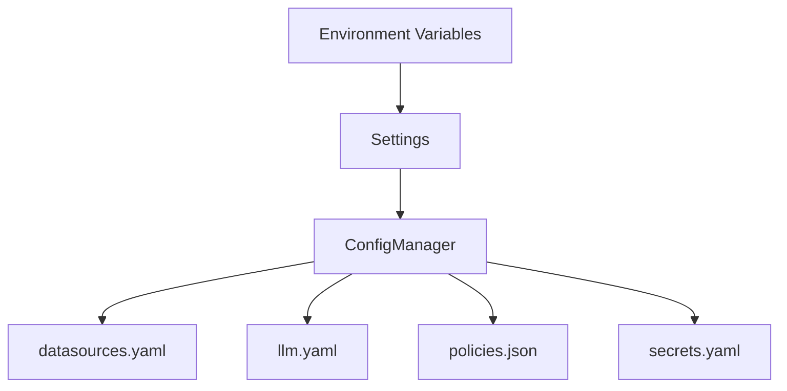

# Configuration System

Configuration is split into **environment variables** (runtime settings) and **file-based configuration** (datasources, LLMs, policies, secrets). `Settings` loads env vars; `ConfigManager` validates file formats and resolves secrets.

## Settings (environment variables)

### Paths

| Env var | Default | Description |
| --- | --- | --- |
| `OPENAI_API_KEY` | `—` | OpenAI API key. Used for chat when `provider: openai`, and for embeddings when `EMBEDDING_PROVIDER=openai` (the default). |
| `EMBEDDING_PROVIDER` | `openai` | Embedding backend: `openai` (needs `OPENAI_API_KEY`) or `local` (key-free ONNX `all-MiniLM-L6-v2` bundled with chromadb). |
| `EMBEDDING_MODEL` | `text-embedding-3-small` | OpenAI embedding model. Ignored when `EMBEDDING_PROVIDER=local`. |
| `LLM_CONFIG` | `configs/llm.yaml` | Path to the LLM config file. |
| `DATASOURCE_CONFIG` | `configs/datasources.yaml` | Path to the datasource config file. |
| `SAMPLE_QUESTIONS` | `configs/sample_questions.yaml` | Path to the sample questions file (a map of datasource id to questions). They are indexed into each datasource's `schema.datasource` entry. `ROUTING_EXAMPLES`, the name `.env` files generated before 2026-09-21 wrote, is accepted as well. |
| `POLICIES_CONFIG` | `configs/policies.json` | Path to the RBAC policies file. |
| `SECRETS_CONFIG` | `configs/secrets.yaml` | Path to the secrets config file. |
| `VECTOR_STORE` | `./chroma_db` | Persist directory for the vector store. |
| `VECTOR_STORE_COLLECTION` | `nl2sql_store` | Collection name for schema embeddings. |

`NL2SQLContext` validates the vector store configuration before it loads secrets or
builds the datasource and LLM registries. A blank `VECTOR_STORE_COLLECTION`, or a blank
`VECTOR_STORE` with no explicit `vector_store_path` argument, raises `ValueError` at
construction time instead of failing later during setup.

### Embeddings

`EMBEDDING_PROVIDER` selects how schema chunks are embedded during `nl2sql index`
and how queries are embedded during retrieval:

| Value | Model | Dimensions | API key |
| --- | --- | --- | --- |
| `openai` (default) | `EMBEDDING_MODEL`, default `text-embedding-3-small` | 1536 | `OPENAI_API_KEY` required |
| `local` | `all-MiniLM-L6-v2` (ONNX, bundled with chromadb) | 384 | none |

Notes on the `local` provider:

- **No extra dependency.** The model ships with `chromadb`, which is already a
  transitive dependency through `langchain-chroma`.
- **One-time download.** The first indexing run downloads roughly 79 MB of ONNX
  model files into a local cache directory. Expect a pause of up to a few
  minutes; a log line is emitted before the download starts.
- **Embeddings only.** This removes the API key requirement from the embedding
  step. It does not make querying key-free — answering a question still needs a
  chat model (OpenAI or OpenRouter).

**Switching providers requires a re-index.** The two providers produce vectors of
different dimensionality, so an existing Chroma collection cannot be read with the
other provider. Retrieving from a store whose persisted vectors disagree with the
configured provider raises `EmbeddingDimensionMismatchError` naming both
providers. The check runs on the read path only, so the fix is simply to re-run
`nl2sql index` (indexing clears the collection first); alternatively, point
`VECTOR_STORE` at a separate directory per provider.

### Storage

| Env var | Default | Description |
| --- | --- | --- |
| `SCHEMA_STORE_BACKEND` | `sqlite` | Schema store backend identifier. |
| `SCHEMA_STORE_PATH` | `data/schema_store.db` | SQLite database path for schema store persistence. |
| `SCHEMA_STORE_MAX_VERSIONS` | `3` | Max schema versions retained per datasource. |
| `RESULT_ARTIFACT_BACKEND` | `local` | Artifact backend: `local`, `s3`, `adls`. |
| `RESULT_ARTIFACT_BASE_URI` | `./artifacts` | Base URI or path for artifact storage. |
| `RESULT_ARTIFACT_PATH_TEMPLATE` | `<tenant_id>/<request_id>.parquet` | Artifact path relative to the backend root. Placeholders available: `<tenant_id>`, `<request_id>`, `<schema_version>`. |
| `RESULT_ARTIFACT_S3_BUCKET` | `—` | S3 bucket for artifact storage. |
| `RESULT_ARTIFACT_S3_PREFIX` | `—` | S3 prefix for artifact storage. |
| `RESULT_ARTIFACT_ADLS_ACCOUNT` | `—` | ADLS storage account name. |
| `RESULT_ARTIFACT_ADLS_CONTAINER` | `—` | ADLS container name. |
| `RESULT_ARTIFACT_ADLS_CONNECTION_STRING` | `—` | ADLS connection string, if using key-based auth. |

### Execution

| Env var | Default | Description |
| --- | --- | --- |
| `GLOBAL_TIMEOUT_SEC` | `60` | Global timeout in seconds for pipeline execution. The caller is answered within about a second of the limit; the run's worker thread winds down in the background (see `../execution/isolation.md`). |

### Behavior

| Env var | Default | Description |
| --- | --- | --- |
| `SCHEMA_VERSION_MISMATCH_POLICY` | `warn` | Action on schema version mismatch: `warn`, `fail`, `ignore`. |
| `SCHEMA_RETRIEVAL_FULL_SNAPSHOT_MAX_TABLES` | `15` | When a datasource's schema has at most this many tables, the schema retriever skips vector retrieval and passes the full schema snapshot (every table, every column) to the planner. Set to `0` to always use vector retrieval. |
| `SQL_AGENT_MAX_RETRIES` | `3` | Max retry attempts for SQL agent refinement. |
| `SQL_AGENT_RETRY_BASE_DELAY_SEC` | `1.0` | Base delay for SQL agent retries (seconds). |
| `SQL_AGENT_RETRY_MAX_DELAY_SEC` | `10.0` | Max delay for SQL agent retries (seconds). |
| `SQL_AGENT_RETRY_JITTER_SEC` | `0.5` | Max jitter added to SQL agent retry delays (seconds). |
| `LOGICAL_VALIDATOR_STRICT_COLUMNS` | `false` | Treat missing columns as errors in logical validation. |
| `RBAC_REFUSAL_NAMES_TABLES` | `false` | Name the role and the forbidden table in the refusal the user sees. Off, the message is "You do not have permission to see the data this question requires."; the table and role are always in the log and the run trace. `nl2sql setup --demo` writes `true` into `.env.demo`. See [Security Model](../security/model.md#strict-refusal). |
| `TENANT_ID` | `default_tenant` | Default tenant ID for requests. |

### Observability

| Env var | Default | Description |
| --- | --- | --- |
| `OBSERVABILITY_EXPORTER` | `none` | Exporter for metrics/traces: `none`, `console`, `otlp`. |
| `OTEL_EXPORTER_OTLP_ENDPOINT` | `—` | Endpoint for OTLP exporter. |
| `LLM_PRICES` | `{}` | Optional per-model prices per million tokens, as JSON, e.g. `{"gpt-4o": {"input": 2.5, "cached_input": 1.25, "output": 10}}`. `cached_input` defaults to `input`. With no price for a model, `QueryResult.usage` reports tokens only and `cost` is `null`. No prices are built in. |
| `TRACE_MODE` | `on_failure` | When to write a run trace: `off`, `on_failure` (errors, a retry, or an incomplete run) or `always`. `nl2sql demo` writes `always` into `.env.demo`. See [Debugging a Run](../observability/debugging.md). |
| `TRACE_DIR` | `traces` | Directory run traces are written to, relative to the working directory. |
| `TRACE_SAMPLE_ROWS` | `50` | Result rows kept in a trace. |
| `TRACE_MAX_FIELD_CHARS` | `20000` | Longest string kept in a node's recorded inputs and outputs; LLM prompts and responses are never cut. |

### Environment file loading

| Env var | Default | Description |
| --- | --- | --- |
| `ENV_FILE_PATH` | `—` | Path to a specific `.env` file to load. |
| `ENV` | `—` | Environment name used to load `.env.{ENV}`. |
| `APP_ENV` | `—` | Alternate environment name used to load `.env.{APP_ENV}`. |

From Python, `NL2SQL(env="demo")` sets `ENV` and `NL2SQL(env_file=path)` sets
`ENV_FILE_PATH`, reloading settings before any configuration path is resolved.

## Config manager flow

```mermaid
flowchart TD
    Env[Environment Variables] --> Settings[Settings]
    Settings --> ConfigManager[ConfigManager]
    ConfigManager --> Datasources[datasources.yaml]
    ConfigManager --> LLM[llm.yaml]
    ConfigManager --> Policies[policies.json]
    ConfigManager --> Secrets[secrets.yaml]
```

## Secret resolution

`SecretManager` resolves secret references (`${provider:key}`):

- Default provider: `env`
- Two-phase loading: secrets are resolved before registries initialize

## Configuration file contracts

- `configs/datasources.yaml`: datasource IDs, connection types, and options.
  See [Datasource config](datasources.md).
- `configs/llm.yaml`: model/provider settings per agent name.
  See [LLM config](llm.md).
- `configs/policies.json`: RBAC policies and allowed tables/datasources.
  See [Policies config](policies.md).
- `configs/secrets.yaml`: optional secret providers.
  See [Secrets config](secrets.md).

## Source references

- Settings: `packages/nl2sql/src/nl2sql/common/settings.py`
- ConfigManager: `packages/nl2sql/src/nl2sql/configs/manager.py`
- SecretManager: `packages/nl2sql/src/nl2sql/secrets/manager.py`
