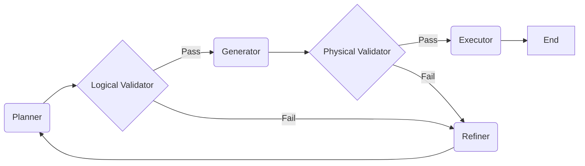

# Agents & Subgraphs

While Nodes are the building blocks, **Subgraphs** define the control flow and agentic behaviors.

## The SQL Agent (ReAct Loop)

The core "thinking" engine for a single datasource is encapsulated in the **SQL Agent Subgraph**. It implements a **ReAct (Reasoning + Acting)** loop pattern.

### Flow Diagram

### Self-Correction Mechanism

The `RefinerNode` acts as the feedback mechanism. It is only invoked when a validation or execution step fails.

1. **Error Capture**: The state collects `PipelineError` objects.
2. **Retry Handler**: Checks `retry_count`. Max retries: **3**.
3. **Refinement**: The Refiner consumes the Error + Original Plan and outputs **Feedback**.
4. **Re-Planning**: The Planner receives this feedback and generates a new `plan_v2`.

### Execution Subgraph

The `SQL Agent` is wrapped inside an **Execution Subgraph**, which handles:

1. **Initialization**: Loading vector stores and adapters.
2. **Formatting**: Converting raw execution results into a standardized dictionary for the Aggregator.

::: nl2sql.pipeline.subgraphs.sql_agent.build_sql_agent_graph
::: nl2sql.pipeline.subgraphs.execution.build_execution_subgraph
