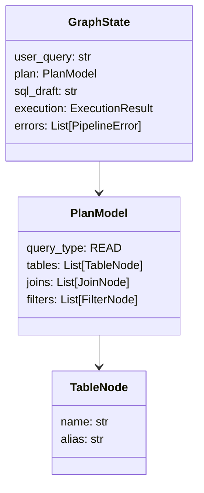

# Architecture

The NL2SQL Platform is built on a **State-Machine** architecture using [LangGraph](https://langchain-ai.github.io/langgraph/). This allows for deterministic execution flows with the flexibility of agentic loops (retries, self-correction).

## The Graph State

Central to the architecture is the `GraphState` object, which simulates a shared memory space for all nodes. It is passed from node to node, accumulating context, plans, and results.

::: nl2sql.pipeline.state.GraphState

## Data Flow Lifecycle

1. **Ingestion**: User query enters the pipeline.
2. **Semantic Analysis**:
    * Query is canonicalized (spelling correction, lowercasing).
    * Intent is classified (SQL Generation vs General Chat).
3. **Decomposition (The Router)**:
    * The **DecomposerNode** analyzes the complexity.
    * Retrieves relevant Schema and Examples from the Vector Store.
    * Determines if the query needs to be split (Multi-Datasource) or routed to a single source.
4. **SQL Agent Loop (Per Datasource)**:
    * If valid, a **PlannerNode** creates an Abstract Syntax Tree (AST) plan.
    * **LogicalValidator** checks the AST for security and structure.
    * **GeneratorNode** converts AST to Dialect-Specific SQL.
    * **PhysicalValidator** performs a dry-run and cost estimation.
    * **ExecutorNode** runs the query sandbox.
    * *Errors at any stage trigger the **RefinerNode** for self-correction.*
5. **Aggregation**:
    * **AggregatorNode** collects results from all execution branches.
    * Synthesizes a final answer or passes through raw data (Fast Path).

## Entity Relationship

The platform models SQL concepts using Pydantic models to ensure type safety before any SQL is generated.

