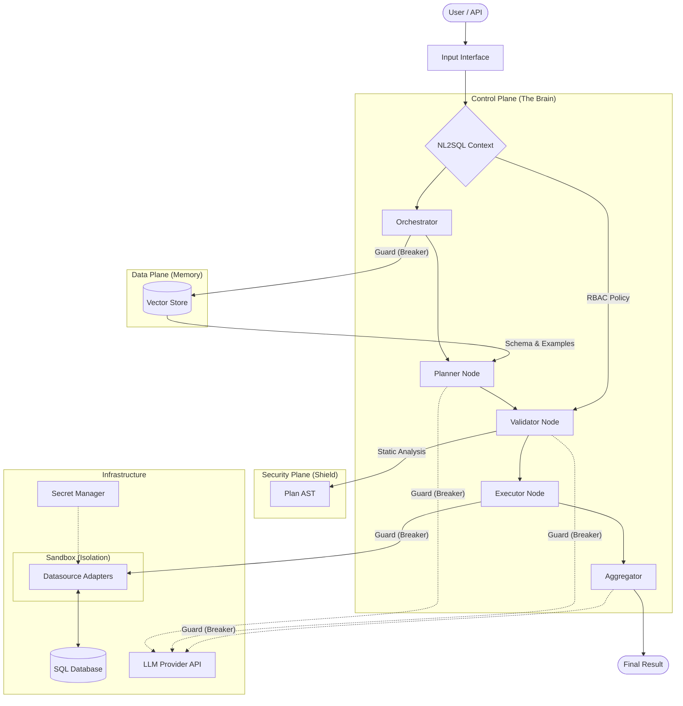

# System Architecture

The NL2SQL Platform is a production-grade engine designed to safely bridge Natural Language and SQL Databases. It is built on a modular, valid-by-construction architecture.

## 1. The Control Plane (Pipeline)

The core execution engine is built on **[LangGraph](https://langchain-ai.github.io/langgraph/)**. It models the text-to-SQL process as a deterministic State Machine, allowing for:

* **Cyclic Graphs**: Enabling "Refinement Loops" where agents can self-correct errors.
* **State Management**: Passing a shared `GraphState` between nodes.

**Key Components:**

* **[Nodes & Pipeline](nodes.md)**: The atomic building blocks (Planner, Validator, Generator).
* **[SQL Agent Subgraph](sql_agent.md)**: The "ReAct" reasoning loop that handles the planning and correction logic.
* **Resilience**: Integrated **Circuit Breakers** and **Retries** to ensure robust execution.

## 2. The Data Plane (Retrieval)

The platform uses a **Retrieval Augmented Generation (RAG)** architecture to manage complexity. We do not dump the entire database schema into the LLM context.

**Key Components:**

* **[Indexing & Retrieval](indexing.md)**: How schemas and examples are stored in the Vector Store.
* **Dynamic Context**: The `Orchestrator` retrieves only the relevant tables and similar SQL examples at runtime.

## 3. The Reliability Plane (Defense in Depth)

We assume that failures **will** happen. The system uses a layered defense strategy to maintain stability during outages or crashes.

**Key Components:**

* **[Reliability & Fault Tolerance](reliability.md)**: Comprehensive guide to Circuit Breakers, Sandboxing, and Retries.
* **Circuit Breakers**: "Fail Fast" guards to prevent cascading failures when external services are down.
* **Sandboxing**: Process isolation to prevent worker crashes from killing the orchestrator.

## 4. The Security Plane (The Shield)

Security is not an afterthought; it is architected into the "Firewall" layer of the pipeline.

**Key Components:**

* **[Security Architecture](../safety/security.md)**: Detailed breakdown of the Validator, RBAC Policies, and Secret Management.
* **Valid-by-Construction**: The system generates an Abstract Syntax Tree (AST) first, validates it, and only then compiles it to SQL.

## 5. Infrastructure

The platform is designed to be cloud-agnostic and operationally robust.

**Key Components:**

* **[Environments](environment.md)**: Configuration management via `.env` files.
* **[Adapters](../adapters/index.md)**: The connectivity layer that abstracts specific database dialects (Postgres, MSSQL, etc.).
* **[Sandboxed Execution](reliability.md#2-sandboxing-crash-isolation)**: Isolated process pools for executing untrusted SQL and performing heavy schema introspection.
